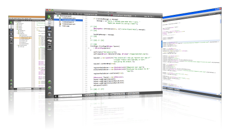
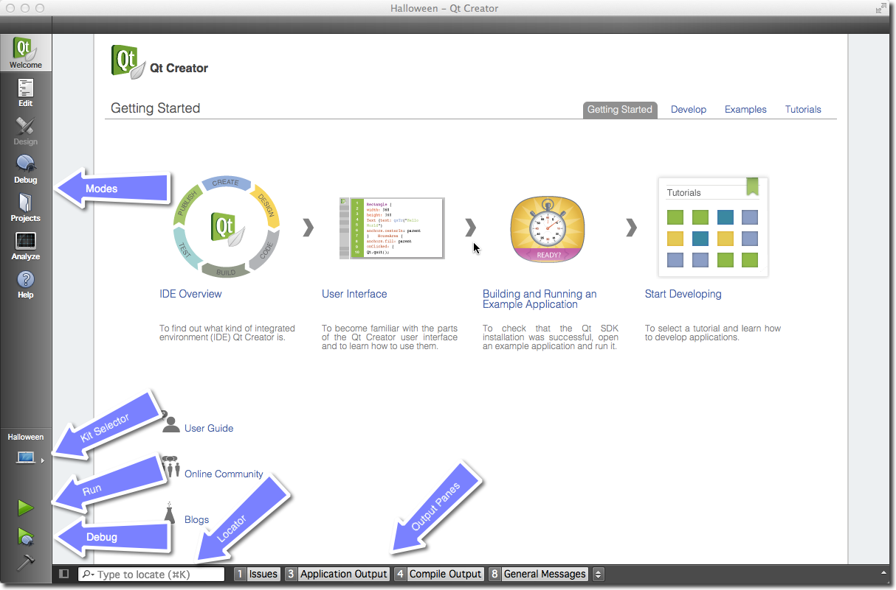
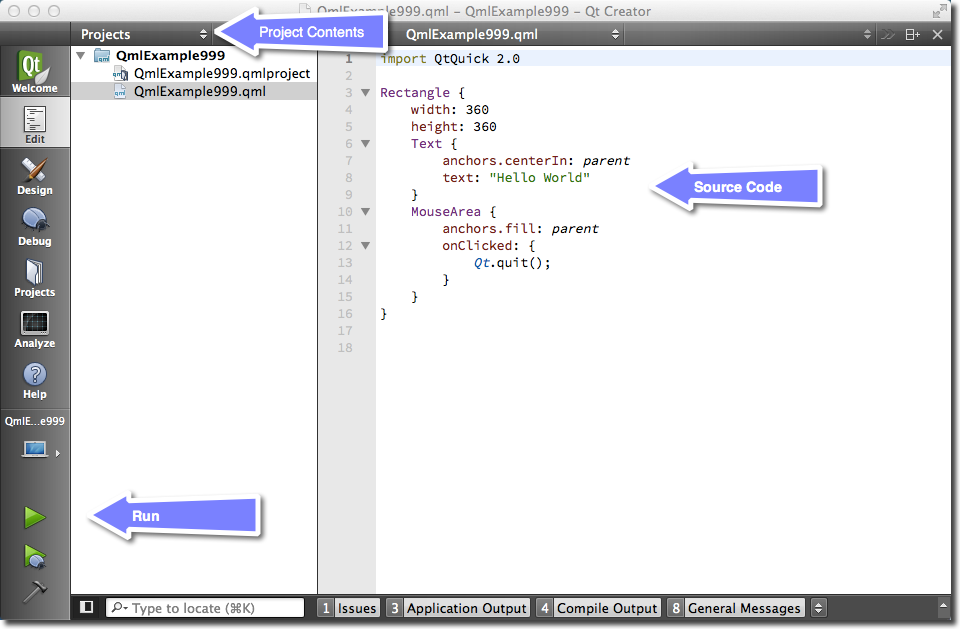
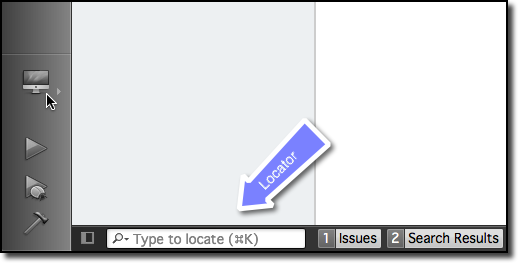
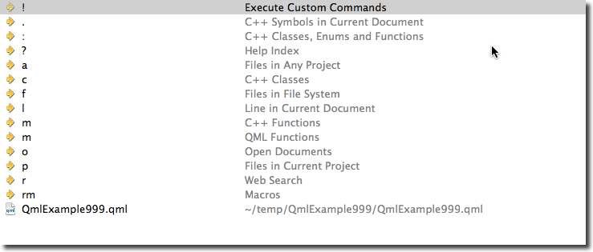

==============
Qt Creator IDE
==============

.. sectionauthor:: `jryannel <https://github.com/jryannel>`_

.. issues:: ch03

Qt Creator는 Qt의 기본 통합 개발 환경(IDE)입니다. 그리고 Qt 개발자를 위해 Qt 개발자에 의해 작성되었습니다. 이 IDE는 모든 주요 데스크탑 플랫폼(Windows/Mac/Linux)에서 사용할 수 있습니다. 심지어는 임베디드 장치에서 Qt Creator를 사용하는 고객을 본 적도 있습니다. Qt Creator는 효율적인 사용자 인터페이스를 제공하며 개발자의 생산성을 향상시켜줍니다. Qt Creator는 Qt Quick 사용자 인터페이스를 실행하는 것 뿐만 아니라, C++ 코드와 함께 컴파일하거나 크로스 컴파일러를 이용해 다른 기기용으로 컴파일하는데 사용될 수 있습니다.

.. note::

    본 장의 소스 코드는 `assets 폴더 <../../assets>`_ 에서 다운로드할 수 있습니다.

사용자 인터페이스
=================

.. issues:: ch03

Qt Creator를 시작하면 *Welcome* 화면이 여러분을 기다리고 있습니다. Qt Creator로 개발하는데 도움이 될만한 중요한 힌트와 최근에 작업했던 프로젝트를 여기에서 찾을 수 있습니다. 그리고 비어있는 세션 목록도 있습니다. 세션은 참고용으로 저장된 프로젝트의 모음입니다. 이것은 대규모 프로젝트에서 여러 고객을 상대할 때 유용하게 사용할 수 있습니다.

왼편에는 모드 선택기(mode-selector)가 있습니다. 모드 선택기는 여러분의 작업 흐름에 따른 일반적인 단계를 포함하고 있습니다.

* Welcome 모드: 개발의 시작
* Edit 모드: 코드에 집중합니다.
* Design 모드: UI 디자인에 집중합니다.
* Debug 모드: 실행 중인 애플리케이션에 대한 정보를 가져옵니다.
* Projects 모드: 프로젝트의 실행 및 빌드 설정을 변경합니다.
* Analyze 모드: 메모리 누수 감지 및 프로파일링
* Help 모드: 쉽게 접근하는 Qt 문서

모드 선택기 아래에는 실제 프로젝트 설정 선택기와 실행/디버그 버튼이 있습니다.

여러분은 대부분의 경우 중앙의 코드 편집기를 사용하는 edit 모드에 있을 것입니다. 때때로 프로젝트를 설정해야 할 때 projects 모드에 들어갈 것이구요. 그 다음 ``Run`` 버튼을 누르십시오. Qt Creator는 실행 하기 전에 프로젝트가 빌드되지 않았다면 빌드한 후 실행할 것입니다.

하단에는 이슈, 애플리케이션 메시지, 컴파일 메시지 및 기타 메시지의 출력 창이 있습니다.

Qt Kit 등록하기
===============

.. issues:: ch03

Qt Creator를 처음 사용할 때 가장 어려운 부분은 아마도 Qt Kit일 것입니다. 하나의 Qt Kit은 Qt 버전, 컴파일러, 장치 및 기타 설정의 집합입니다. 그것은 프로젝트를 빌드할 때 어떤 개발 도구의 조합을 사용할 지 식별하는데 사용됩니다. 데스크탑을 위한 일반적인 kit은 GCC 컴파일러, Qt 버전(예를 들어 Qt 5.1.1)과 장치("데스크탑")를 포함합니다. 여러분이 프로젝트를 막 생성하면 Qt Creator는 프로젝트를 빌드하기 전에 해당 프로젝트에 대한 kit을 지정할 것을 요청합니다. Kit을 생성하기 위해서는 설치된 컴파일러와 등록된 Qt 버전이 필요합니다. Qt 버전은 ``qmake`` 실행 파일의 경로를 지정하여 등록됩니다. 그러면 Qt Creator는 ``qmake`` 를 통해 Qt 버전을 식별하는데 필요한 정보를 가져옵니다.

Kit을 추가하고 Qt 버전을 등록하는 것은 :menuselection:`Settings --> Build & Run` 메뉴에서 이루어집니다. 거기에서 어떤 컴파일러가 등록되었는지도 볼 수 있을 것입니다.

.. note::

	먼저 여러분의 Qt Creator에 올바른 Qt 버전이 등록되었는지 확인한 다음 컴파일러와 Qt 및 장치의 조합이 kit에 지정되었는지 확인하세요. Kit이 없다면 프로젝트를 빌드할 수 없습니다.

프로젝트 관리하기
=================

.. issues:: ch03

Qt Creator는 프로젝트의 소스 코드를 관리합니다. :menuselection:`File --> New File or Project` 메뉴를 통해 새로운 프로젝트를 생성할 수 있습니다. 프로젝트를 생성할 때 여러 개의 애플리케이션 템플릿 중에 하나를 선택할 수 있습니다. Qt Creator는 데스크탑 뿐만 아니라 모바일 애플리케이션 개발도 가능합니다. 위젯이나 Qt Quick 또는 Qt Quick Controls, 심지어는 Qt 라이브러리조차 사용하지 않는 베어본(bare-bone) 프로젝트도 가능합니다. 또한 HTLML5나 Python 프로젝트도 지원합니다. 초보자에게는 선택하는 것도 어려운 일이기에 다음과 같은 3가지 프로젝트 유형을 제시합니다.

* **Applications / Qt Quick 2.0 UI**: C++ 코드 없이 QML/JS만의 프로젝트를 생성합니다. 새로운 사용자 인터페이스를 스케치하거나 플러그인 형태로 제공되는 네이티브 파트에 새로운 UI 애플리케이션을 작성할 예정이라면 이 유형을 선택하세요.
* **Libraries / Qt Quick 2.0 Extension Plug-in**: Qt Quick UI를 위한 플러그인을 개발한다면 이 프로젝트 마법사를 사용하세요. 플러그인은 네이티브 요소로 Qt Quick을 확장할 때 사용됩니다.
* **Other Project / Empty Qt Project**: 빈 껍데기 프로젝트. C++로 처음부터 애플리케이션을 작성하려면 이 유형을 선택하세요. 여기서는 여러분이 구현하려는 것이 무엇인지 인지할 필요가 있다는 것을 명심하세요.

.. note::

	이 책의 첫 부분에서는 주로 Qt Quick 2.0 UI 프로젝트 유형을 사용합니다. 뒷 부분에 일부 C++ 측면을 기술하기 위해 빈 Qt 프로젝트 유형이나 이와 비슷한 것을 사용할 것입니다. Qt Quick을 고유의 네이티브 플러그인으로 확장하기 위해서는 *Qt Quick 2.0 Extension Plug-in* 마법사 유형을 사용합니다.

편집기 사용하기
===============

.. issues:: ch03

프로젝트를 열거나 새로운 프로젝트를 생성하면 Qt Creator는 edit 모드로 전환됩니다. 왼편에는 여러분의 프로젝트 파일이 있고 중앙에는 코드 편집기가 있습니다. 왼쪽에서 파일을 선택하면 편집기에 해당 파일이 열립니다. 편집기는 구문 강조(syntax highlighting)와 코드 자동 완성(code-completion), 빠른 수정(quick-fix) 기능을 제공합니다. 또한 코드 리팩터링(code refactoring)을 위한 몇가지 명령도 지원합니다. 편집기로 작업하다 보면 모든 것이 즉시 반응한다는 느낌을 갖게 됩니다. 이 모든 것이 개발 도구를 정말 멋지게 만들어준 Qt Creator의 개발자 덕분입니다.

Locator
=======

.. issues:: ch03

Locator는 Qt Creator의 핵심 구성 요소입니다. 이것을 통해 개발자는 소스 코드나 도움말에서 특정 위치로 빠르게 이동할 수 있습니다. Locator를 열려면 :kbd:`Ctrl+K` 를 누르세요.

왼쪽 아래에 팝업이 나타나며 옵션 목록이 표시됩니다. 만약 프로젝트 내에서 단순히 파일을 검색하는 것이라면 파일명의 첫 글자를 입력하면 됩니다. Locator는 와일드 카드(wild-card)를 허용합니다. 그래서 `*main.qml`` 와 같은 검색 조건도 동작합니다. 그렇지 않으면 특정 컨텐츠 유형을 검색하기 위해 검색어에 접두사를 붙일 수도 있습니다.

이걸 한 번 해보세요. 예를 들어 QML 요소인 Rectangle에 대한 도움말을 열기 위해, locator를 열고 ``? rectangle`` 을 입력해보세요. 여러분이 입력하는 동안 locator는 여러분이 찾고 있는 참고 문서를 발견할 때까지 추천 결과를 업데이트할 것입니다.

디버깅
======

.. issues:: ch03

Qt Creator는 C++ 뿐만 아니라 QML 디버깅도 지원합니다.

.. note::

	흠, 제가 디버깅 기능을 그렇게 많이 사용하지 않았다는 것을 이제야 알았습니다. 저는 이것이 좋은 신호가 되길 바랍니다. 이 부분에 대한 설명은 누군가의 도움이 필요하네요. 그 동안은 `Qt Creator documentation <http://http://doc.qt.io/qtcreator/index.html>`_ 문서를 참고해주세요.

단축키
======

.. issues:: ch03

단축키는 사용하기 좋은 시스템과 전문가용 시스템을 구분짓는 기능입니다. 전문가는 애플리케이션 앞에서 수백 시간을 소비합니다. 그렇기에 단축키는 여러분의 작업 흐름을 빠르게 만드는데 중요한 역할을 합니다. 다행히도 Qt Creator 개발자들도 이에 동감하고 문자 그대로 수백 개의 단축키를 추가했습니다.

몇 가지 기본적인 단축키 모음부터 시작해보세요(Windows 표기법을 따름).

* :kbd:`Ctrl+B` - 프로젝트 빌드
* :kbd:`Ctrl+R` - 프로젝트 실행
* :kbd:`Ctrl+Tab` - 열린 문서 간 전환
* :kbd:`Ctrl+K` - Locator 열기
* :kbd:`Esc` - 뒤로 가기 (여러 번 누르면 편집기로 돌아갑니다.)
* :kbd:`F2` - 커서가 위치한 심볼 따라가기
* :kbd:`F4` - 헤더와 소스 간 전환 (C++ 코드에만 유효한 기능입니다.)

단축키 리스트는 `Qt Creator shortcuts <http://doc.qt.io/qtcreator/creator-keyboard-shortcuts.html>`_ 문서를 참고하세요.

.. note::

	설정 메뉴에서 Qt Creator의 단축키를 편집할 수 있습니다.

	.. figure:: assets/creator-edit-shortcuts.png
		:scale: 50%

