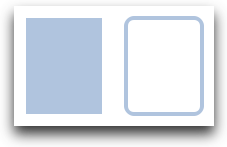
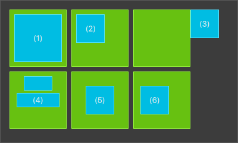

=================
Qt Quick 시작하기
=================

.. sectionauthor:: `jryannel <https://github.com/jryannel>`_

.. issues:: ch04

.. note::

    Last Build: |today|

    이번 장의 소스 코드는 `assets 폴더 <../../assets>`_ 에서 확인할 수 있습니다.

이번 장에서는 Qt5에서 사용되는 선언적인 사용자 인터페이스 언어인 QML을 간략히 살펴보겠습니다. 먼저 element의 트리(tree) 구조와 같은 QML 문법에 대해 이야기하고, 가장 중요한 기본 element에 대한 소개를 할 예정입니다. 그 다음 component라 불리는 자체 구성 요소(our own element)를 만드는 방법과 property를 조작해서 구성 요소를 어떻게 변화시키는지 살펴 보겠습니다. 마지막으로 레이아웃에서 element를 어떻게 함께 정렬하고 사용자의 입력을 받을 수 있는 element에 대해 알아보겠습니다.

QML 문법
========

.. issues:: ch04

.. index:: qmlscene, properties, scripting, binding, syntax

QML은 애플리케이션의 사용자 인터페이스를 기술하는데 사용되는 선언적 언어입니다. 사용자 인터페이스는 작은 요소로 나뉘어 element와 결합할 수 있습니다. QML은 이러한 사용자 인터페이스 element의 모양과 동작을 기술합니다. 이러한 사용자 인터페이스 기술서는 JavaScript 코드를 통해 단순한 동작 뿐만 아니라 복잡한 로직을 더할 수 있습니다. 이러한 관점에서 QML은 HTML과 JavaScript의 패턴과 유사하지만 애초부터 텍스트 문서가 아닌 사용자 인터페이스를 기술하기 위해 설계되었다는 점이 다릅니다.

QML은 가장 간단한 방법으로 element로 구성된 하나의 계층 구조를 기술합니다. 자식 element는 부모 element의 좌표 공간을 상속 받습니다. ``x,y`` 좌표는 항상 부모를 기준으로 합니다.

.. figure:: assets/scene.png

간단한 QML 파일의 예제를 보면서 다양한 구문을 살펴봅시다.

.. literalinclude:: src/concepts/RectangleExample.qml
    :start-after: M1>>
    :end-before: <<M1

* ``import`` 구문은 특정 버전의 모듈을 가져옵니다. 일반적으로 기본적인 element를 사용하기 위해 항상 *QtQuick 2.0* 을 가져옵니다.
* 한 줄 주석은 ``//`` 를 사용하고 여러 줄 주석의 경우에는 ``/* */`` 를 사용합니다. C/C++ 및 JavaScript와 비슷합니다.
* 모든 QML 파일은 HTML처럼 반드시 하나의 root element만을 가지고 있어야 합니다.
* 하나의 element는 타입(type) 이름과 그 뒤에 이어지는 ``{ }`` 에 의해 선언됩니다.
* Element들은 속성(property)을 가집니다. 속성은 ``name : value`` 와 같은 형태로 정의됩니다.
* QML 문서 내 임의의 element는 ``id`` (인용 부호가 없는 식별자)를 사용하여 접근할 수 있습니다.
* 하나의 element는 다른 element에 포함될 수 있습니다. 즉, 부모 element가 자식 element를 가질 수 있습니다. 부모 element는 ``parent`` 키워드를 사용해 접근할 수 있습니다.

.. tip::

    가끔 id나 ``parent`` 키워드를 사용해 특정 element에 접근하길 원할 때가 있습니다. 그래서 여러분의 root element를 ``id: root`` 라는 구문을 통해 "root" 로 지정하는 것은 좋은 습관입니다. 그러면 여러분은 QML 문서에서 root element가 어떻게 명명되었는지 고민할 필요가 없습니다.

.. hint::

    다음과 같이 OS의 명령행에서 Qt Quick 런타임을 사용해 예제를 실행할 수 있습니다::

        $ $QTDIR/bin/qmlscene RectangleExample.qml

    *$QTDIR* 는 여러분이 Qt를 설치한 위치로 바꿔주세요. *qmlscene* 실행 파일은 Qt Quick 런타임을 초기화하고 제공된 QML 파일을 해석합니다.

    Qt Creator에서 해당 프로젝트 파일을 열고 ``RectangleExample.qml`` 문서를 실행할 수 있습니다.

속성 (properties)
-----------------

.. issues:: ch04

Element는 element의 이름으로 선언되지만, 그 정의는 속성값을 지정하거나 사용자 속성을 생성하는 것으로 이루어집니다. 하나의 속성은 단순히 키-값(key-value)의 쌍입니다. 예를 들어 ``width : 100``, ``text: 'Greetings'``, ``color: '#FF0000'`` 와 같은 형식입니다. 속성은 잘 정의된 type을 가지며 초기값을 가질 수 있습니다.

.. literalinclude:: src/concepts/PropertiesExample.qml
    :start-after: M1>>
    :end-before: <<M1

속성의 다양한 기능을 살펴봅시다:

(1) ``id`` 는 속성과 같은 매우 특별한 값으로, QML 파일 (QML에서는 "문서"라고 부르는) 내의 element를 참조하는데 사용됩니다. ``id`` 는 문자열이 아닌 식별자이고 QML 문법의 일부분입니다. ``id`` 는 문서 내에서 고유해야 하고 다른 값으로 다시 설정될 수 없으며 다른 속성처럼 참조될 수도 없습니다. (마치 C++ 세상의 포인터처럼 동작합니다.)

(2) 하나의 속성은 그 유형에 따라 하나의 값으로 설정될 수 있습니다. 속성에 값이 지정되지 않으면 초기값이 선택됩니다. 속성의 초기값에 대한 자세한 정보는 각 element의 문서를 참조해야 합니다.

(3) 속성은 하나 혹은 그 이상의 다른 속성과 의존 관계를 가질 수 있습니다. 이를 *binding* 이라 부릅니다. 의존 관계에 있는 속성이 바뀌면 binding 된 속성도 변경됩니다. 그것은 마치 계약처럼 작동하며, 위 예제의 경우 ``height`` 는 항상 ``width`` 의 두 배가 되어야 합니다.

(4) 하나의 element에 사용자 속성을 추가하는 것은 ``property`` 한정자 뒤에 type, 이름 그리고 선택적으로 초기값을 지정하는 방식(``property <type> <name> : <value>``)으로 이루어집니다. 만약 초기값이 주어지지 않으면 시스템 초기값이 선택됩니다.

    .. note:: 속성 선언 앞에 ``default`` 키워드를 붙이면 하나의 속성을 기본 속성으로 선언할 수 있습니다. 이것은 예를 들어 자식 element를 추가할 때 사용할 수 있습니다. 화면에 표시되는 element라면 자식 element들은 기본 속성인 ``children`` 에 자동으로 추가됩니다.

(5) 속성을 선언하는 또 다른 중요한 방법은 ``alias`` 키워드를 사용하는 것입니다 (``property alias <name> : <reference>``). ``alias`` 키워드는 type 내에서 객체의 속성이나 객체 자체를 위부 범위(outer scope)로 전달할 수 있게 합니다. 나중에 내부 속성이나 element id를 root 레벨로 내보내기 위한 component를 정의할 때 이러한 테크닉을 사용할 수 있습니다. 속성의 alias는 타입(type)을 필요로 하지 않으며 참조된 속성이나 객체의 타입을 따릅니다.

(6) ``text`` 속성은 int type의 사용자 정의 속성인 ``times`` 에 의존 관계에 있습니다. 이 때 ``int`` type의 값은 자동으로 ``string`` type으로 변환됩니다. 표현식 자체는 binding의 또 다른 예이며, 그 결과로 해당 문자열은 ``times`` 속성이 바뀔 때마다 변경됩니다.

(7) 어떤 속성은 그룹 속성입니다. 이 기능은 속성이 좀 더 구조화되거나 관련 속성이 함께 묶여야 할 때 사용됩니다. 그룹 속성을 작성하는 또 다른 방법은 다음과 같습니다. ``font { family: "Ubuntu"; pixelSize: 24 }``

(8) 일부 속성은 element 그 자체에 첨부됩니다(attached). 이는 애플리케이션에서 하나만 존재하는 전역적인 element (예: 키보드 입력)에 대해 적용됩니다. 사용 방법은 다음과 같습니다. ``<Element>.<property>: <value>``

(9) 모든 속성에 대해 signal handler를 제공할 수 있습니다. 이 handler는 해당 속성이 변경된 후에 호출됩니다. 예를 들어 이 예제에서는 height가 변할 때마다 내장 콘솔을 사용해서 시스템에 메시지를 기록하려고 한다는 것을 알 수 있습니다.

.. warning:: Element id는 여러분의 문서(예를 들어 현재 파일) 안의 element를 참조하는 데에만 사용해야 합니다. QML은 동적 범위 지정(dynamic-scoping)이라는 메커니즘을 제공하는데, 이 때 나중에 로드된 문서가 앞서 로드된 문서의 element id를 덮어 씁니다. 이것은 앞서 로드된 문서의 element id가 덮어 써지지 않는다면 계속 참조하는 것을 가능케 합니다. 이는 마치 전역 변수를 만드는 것과 같습니다. 하지만 이러한 특성을 이용한 코드는 실제로 프로그램이 실행 순서에 의존하는 나쁜 코드로 이어집니다. 불행히도 이러한 특성은 비활성화할 수 없습니다. 이런 메커니즘은 조심히 사용하거나 아예 사용하지 않는 것이 좋습니다. 문서의 root element에 있는 속성을 사용하여 바깥 세상으로 element를 노출시키는 것이 좋습니다.

스크립팅
--------

.. issues:: ch04

QML과 JavaScript(ECMAScript라고도 함)는 최고의 친구입니다. *JavaScript* 장에서 우리는 이들의 깊은 우정에 대해 자세히 알아볼 예정입니다. 여기서는 여러분에게 이 둘의 관계에 대해 간략히 언급만 하겠습니다.

.. literalinclude:: src/concepts/ScriptingExample.qml
    :start-after: M1>>
    :end-before: <<M1

(1) ``onTextChanged`` 는 text가 변경되었을 때 불리는 handler이고, 여기서는 스페이스바가 눌려져 text가 변경될 때마다 현재 text를 출력합니다.

(2) Text element가 스페이스바 키를 받으면(사용자가 키보드에서 스페이스바를 눌렀기 때문에), JavaScript 함수인 ``increment()`` 를 호출합니다.

(3) JavaScript 함수는 ``function <name>(<parameters>) { ... }`` 형태로 정의됩니다. 여기서는 ``spacePressed`` 의 값을 증가시킵니다. ``spacePressed`` 가 증가할 때마다 binding 된 속성 또한 변경될 것입니다.

.. note::

    QML의 ``:`` (binding)과 JavaScript ``=`` (할당)의 차이점은 binding은 일종의 계약이고 binding이 살아있는 동안 그 계약은 유지되는 반면, JavaScript의 할당 (``=``) 은 일회성으로 값을 지정하는 것입니다.
    Binding의 수명은 해당 속성에 새로운 binding이 설정되거나 JavaScript 코드에 의해 값이 할당될 때 종료됩니다. 예를 들어 text 속성을 빈 문자로 설정하는 key handler는 스페이스바에 의해 증가하던 동작을 멈추게 만들 것입니다::

        Keys.onEscapePressed: {
            label.text = ''
        }

    ESC키를 누른 후에는 스페이스바를 눌러도 더 이상 ``text`` 가 갱신되지 않을 것입니다. ``text``  속성에 대한 이전의 binding (*text: "Space pressed: " + spacePresses + " times"*)이 제거되었기 때문입니다.

    이와 같이 속성을 변경하는 전략이 충돌할 경우 (binding에 의해 어떤 속성값에 따라 text가 변경되는데 JavaScript 할당을 통해 text가 초기화되기도 하는) 에는 binding을 사용할 수 없습니다! 할당에 의해 binding이 제거(깨진 계약입니다!)되므로 두 속성이 변경되는 과정 중에 할당문을 사용하도록 수정해야 합니다.

기본 elements
=============

.. issues:: ch04

.. index:: Item, Rectangle, Text, MouseArea, Image, gradients

Element는 visual element와 non-visual element로 구분할 수 있습니다. Visual element(``Rectangle`` 과 같은)는 기하학적 구조를 가지며 일반적으로 화면 상의 한 영역을 차지합니다. Non-visual element(``Timer`` 와 같은)는 visual element를 조작하는데 필요한 일반적인 기능을 제공합니다.

여기서 우리는 기본적인 visual element에 초점을 맞출 예정입니다. 이러한 element에는 ``Item`` 과 ``Rectangle``, ``Text``, ``Image``, ``MouseArea`` 등이 있습니다.

Item Element
------------

.. issues:: ch04

``Item`` 은 모든 visual element의 base element입니다. 다른 모든 visual element는 ``Item`` 을 상속 받습니다. 그 자체로는 아무것도 그리지 않지만 모든 visual element에게 공통으로 필요한 모든 속성을 정의하고 있습니다.

.. list-table::
    :widths: 20,80
    :header-rows: 1

    *   - Group
        - Properties
    *   - Geometry
        - 좌측 상단 위치를 정의하는 ``x`` 와 ``y``, element 영역의 크기를 지정하는 ``width`` 와 ``height``, 그리고 암묵적으로 지정된 스택 순서(stacking order)를 올리거나 내리기 위한 ``z``
    *   - Layout handling
        - 다른 element와의 상대적인 위치와 둘 간의 ``margins`` 을 지정하기 위한 ``anchors`` (left, right, top, bottom, vertical and horizontal center)
    *   - Key handling
        - 첨부된 ``Key`` 와 ``KeyNavigation`` 속성은 키 처리를 가능케 하고, ``focus`` 속성은 처음 키 입력을 받을 element를 지정할 수 있도록 해줍니다.
    *   - Transformation
        - *x,y,z* 좌표 공간에서 ``transformOrigin`` 지점으로부터 크기(``scale``)와 위치(``rotate``)가 어떻게 변하는지(``transform``)를 명시할 수 있습니다.
    *   - Visual
        - 투명도를 조절하는 ``opacity``, element를 보이거나 감추는 ``visible``, 페인팅 영역을 element의 경계로 제한하는 ``clip``, 렌더링 품질을 향상시키는 ``smooth``
    *   - State definition
        - ``states`` 리스트 속성은 설정 가능한 state의 리스트를 의미하고 ``state`` 속성은 현재 상태를 가리킵니다. ``transitions`` 리스트 속성은 상태 변경 동작에 생기를 불어 넣습니다.

서로 다른 속성에 대한 이해를 돕기 위해, 이번 장 전체에 걸쳐 element이 다뤄지는 맥락에서 그것들을 소개하려고 노력할 것입니다. 이러한 기본 속성은 모든 visual element에서 사용 가능하고 이들 element 간에 동일하게 동작한다는 것을 기억하세요.

.. note::

    ``Item`` element는 종종 다른 element에 대한 container로 사용됩니다. 이것은 HTML의 *div* element와 유사합니다.

Rectangle Element
-----------------

.. issues:: ch04

``Rectangle`` 은 ``Item`` 을 확장해서 영역을 색상으로 채우는 기능을 제공합니다. 그리고 ``border.color`` 와 ``border.width``
로 정의되는 테두리도 지원합니다. ``radius`` 속성을 사용해서 모서리를 둥글게 만들 수도 있습니다.

.. literalinclude:: src/concepts/RectangleExample2.qml
    :start-after: M1>>
    :end-before: <<M1

.. note::

    유효한 색상값은 SVG 색상명에 나열된 색상입니다 (참조:  http://www.w3.org/TR/css3-color/#svg-color). QML에는 색상을 지정하는 여러가지 방법이 있는데, 그 중 가장 일반적인 방법은 RGB 문자열 ('#FF4444') 이나 색상 이름 (e.g. 'white') 을 명시하는 것입니다.

사각 영역을 색으로 채우고 테두리를 그리는 것에 더해 그라데이션을 지정하는 기능도 제공합니다.

.. literalinclude:: src/concepts/RectangleExample3.qml
    :start-after: M1>>
    :end-before: <<M1

그라데이션은 일련의 그라데이션 지점으로 정의됩니다. 각각의 지점은 위치와 색상을 가집니다. 위치는 y좌표상의 위치(0 = top, 1 = bottom)로 지정됩니다. ``GradientStop`` 의 색상은 해당 위치의 색상을 지정합니다.

.. note::

    *width/height* 가 설정되지 않은 rectangle은 화면 상에 아무것도 표시하지 않습니다. 이런 상황은 여러 rectangle의 width (height)값이 서로 다른 것들과 의존 관계에 놓여있거나 화면을 구성하는 로직에 문제가 생겼을 때 자주 발생합니다. 그러니 주의하세요!

.. note::

    각도가 있는 그라데이션은 만들 수 없습니다. 이를 위해서는 미리 정의된 이미지를 사용하는 것이 좋습니다. 한가지 가능성은 그라데이션 효과가 있는 rectangle을 단순히 회전시키는 것입니다. 하지만 회전된 rectangle의 기하학적 형태는 변경되지 않기 때문에 element의 좌표 공간과 화면에 보이는 영역이 일치하지 않아 혼란을 초래할 수 있습니다. 필자의 관점에서 이 경우에는 만들어진 그라데이션 이미지를 사용할 것을 권장합니다.

Text Element
------------

.. issues:: ch04

텍스트를 표시하기 위해 ``Text`` element를 사용할 수 있습니다. 가장 중요한 속성은 ``string`` type의 ``text`` 속성이겠죠. 이 element는 주어진 텍스트와 사용된 폰트를 바탕으로 초기 width와 height를 계산합니다. 폰트는 폰트 속성 그룹을 통해 설정할 수 있습니다 (예: ``font.family``, ``font.pixelSize`` 등등). 텍스트의 색상을 바꾸려면 color 속성을 사용하시면 됩니다.

.. literalinclude:: src/concepts/TextExample.qml
    :start-after: M1>>
    :end-before: <<M1

|

텍스트는 ``horizontalAlignment`` 와 ``verticalAlignment`` 속성을 사용해서 양 끝 혹은 가운데로 정렬할 수 있습니다. 부가적인 텍스트 렌더링 관련 기능으로 ``style`` 과 ``styleColor`` 속성을 사용할 수 있습니다. 이 속성을 이용해 텍스트를 outline, raised, sunken 모드 등으로 렌더링할 수 있습니다. 긴 텍스트의 경우에 *매우 ... 긴 텍스트* 와 같이 *생략* 할 위치를 정의해야 할 경우가 있습니다. ``elide`` 속성을 통해 이러한 동작을 수행할 수 있습니다. ``elide`` 속성은 텍스트에서 생략할 위치를 왼쪽, 오른쪽, 중간 중에서 선택할 수 있습니다. '...'와 같은 문자열을 추가하지 않고 전체 텍스트가 다 보이게 하고 싶다면 ``wrapMode`` 속성을 사용하여 텍스트가 자동으로 줄바꿈되도록 설정할 수 있습니다 (width가 명시적으로 설정된 경우에만 동작합니다)::

    Text {
        width: 40; height: 120
        text: 'A very long text'
        // '...' shall appear in the middle
        elide: Text.ElideMiddle
        // red sunken text styling
        style: Text.Sunken
        styleColor: '#FF4444'
        // align text to the top
        verticalAlignment: Text.AlignTop
        // only sensible when no elide mode
        // wrapMode: Text.WordWrap
    }

``Text`` element는 주어진 텍스트만을 표시합니다. 어떠한 배경 장식도 렌더링하지 않습니다. 게다가 렌더링된 텍스트를 제외하면 ``Text`` element 그 자체는 투명합니다. 필요에 따라 Text element의 뒤에 적절한 배경을 추가하여 전체적인 디자인을 완성할 수 있습니다.

.. note::

    ``Text`` 의 초기 width (height)는 텍스트 문자열과 폰트에 의해 결정된다는 것을 알아두세요. 텍스트와 width가 설정되지 않은 ``Text`` element는 초기 width가 0일 것이기 때문에 화면에 보이지 않을 것입니다.

.. note::

    종종 ``Text`` element를 배치할 때 ``Text`` element의 사각 영역 안에서 텍스트를 어떻게 정렬할지 혹은 element의 영역 그 자체를 어떻게 정렬할 것인지 구분할 필요가 있습니다. 전자를 위해서는 ``horizontalAlignment`` 와 ``verticalAlignment`` 속성을 사용해야 하고, 후자의 경우에는 element의 좌표 위치를 조정하거나 anchor를 사용해야 합니다.

Image Element
-------------

.. issues:: ch04

``Image`` element는 다양한 포맷(예: PNG, JPG, GIF, BMP, WEBP)의 이미지를 화면에 표시할 수 있습니다. *지원되는 전체 이미지 포맷은 Qt 문서를 참고하세요*. 이미지의 URL을 지정하는 ``source`` 속성과 크기 조정의 동작성을 제어하는 ``fillMode`` 속성이 있습니다.

.. literalinclude:: src/concepts/ImageExample.qml
    :start-after: M1>>
    :end-before: <<M1

.. figure:: assets/image.png

.. note::

    URL은 슬래시(/)로 시작하는 로컬 경로 ( "./images/home.png" )나 웹 링크 (예: "http://example.org/home.png")가 될 수 있습니다.

.. note::

    ``PreserveAspectCrop`` 을 사용하는 ``Image`` element는 이미지 데이터가 ``Image`` 영역 밖으로 렌더링되는 것을 피하기 위해 클리핑(clipping)을 적용할 수 있습니다. 기본적으로 클리핑은 비활성화되어 있습니다 (``clip : false``). 이미지 페인팅을 element의 사각 영역으로 제한하려면 클리핑을 활성화 (``clip : true``) 해야 합니다. 이는 모든 visual element에 사용할 수 있습니다.

.. tip::

    C++ 코드로 :qt5:`QQmlImageProvider <qqmlimageprovider>` 를 사용해 자기만의 image provider를 만들 수 있습니다. 이를 통해 즉시 로드되는 이미지나 별도의 쓰레드에서 로드되는 이미지를 추가할 수 있습니다.

MouseArea Element
-----------------

.. issues:: ch04

이러한 element들과 상호 작용하기 위해 종종 ``MouseArea`` 를 사용할 것입니다. 이것은 마우스 이벤트를 받을 수 있는 보이지 않는 사각 아이템입니다. 마우스 영역은 주로 사용자가 시각적인 부분과 상호 작용할 때 명령 내릴 visual item과 함께 사용됩니다.

.. literalinclude:: src/concepts/MouseAreaExample.qml
    :start-after: M1>>
    :end-before: <<M1

.. list-table::
    :widths: 50 50

    *   - .. figure:: assets/mousearea1.png
        - .. figure:: assets/mousearea2.png

.. note::

    이것은 Qt Quick의 중요한 측면입니다. 입력 처리는 시각적인 요소와 분리되어 있습니다. 이를 통해 사용자에게 보여질 인터페이스 element를 구현하고 상호 작용하는 영역은 뒤에 확장할 수 있습니다.

Components
==========

.. issues:: ch04

.. index:: components

Component는 하나의 재사용 가능한 element이며 QML은 component를 생성하는 다양한 방법을 제공합니다. 여기서 우리는 가장 간단한 방식 - 파일 기반 component - 을 살펴볼 예정입니다. 파일 기반 component는 하나의 파일에 QML element를 배치하고 element의 이름을 파일에 부여(예: ``Button.qml``)하는 것으로 생성됩니다. 여러분은 QtQuick 모듈의 다른 모든 element를 사용하는 것처럼 이 component를 사용할 수 있습니다. 이 경우에 다음과 같은 형태로 사용할 수 있습니다 ``Button { ... }``.

예를 들어 텍스트와 마우스 영역을 가진 사각형을 만들어봅시다. 이것은 단순한 버튼을 닮았지만 우리의 목적을 위해 더 복잡해질 필요는 없습니다.

.. literalinclude:: src/elements/InlinedComponentExample.qml
    :start-after: M1>>
    :end-before: <<M1

UI는 이와 같이 생겼을 것입니다. 왼편은 초기 상태의 UI이고, 오른편은 버튼을 클릭한 후의 모습입니다.

.. list-table::
    :widths: 50 50

    *   - .. figure:: assets/button_waiting.png
        - .. figure:: assets/button_clicked.png

이제 우리의 임무는 버튼 UI를 재사용 가능한 component로 뽑아내는 것입니다. 이를 위해 우리의 버튼이 제공할 API에 대해 잠시 생각해 보겠습니다. 다른 사람이 이 버튼을 어떻게 사용해야 할 지 상상해보세요. 아래는 제가 생각한 사용 예입니다:

.. code-block:: js

    // minimal API for a button
    Button {
        text: "Click Me"
        onClicked: { // do something }
    }

`text`` 속성을 사용해 텍스트를 설정하길 원하고 마우스 클릭 핸들러를 제공했으면 합니다. 그리고 버튼이 적절한 초기 크기를 가졌으면 합니다. 그리고 그 크기는 명시적으로 지정할 수 있어야 합니다 (예를 들어 ``width: 240`` 와 같은 방식으로).

이를 위해 ``Button.qml`` 파일을 만들고 버튼 UI의 내용을 복사합니다. 또한 사용자가 상위 레벨에서 변경하고 싶어할 속성들을 외부로 노출할 필요가 있습니다.

.. literalinclude:: src/elements/Button.qml
    :start-after: M1>>
    :end-before: <<M1

텍스트와 클릭 signal을 최상위 레벨에서 노출시켰습니다. 일반적으로 root element는 참조를 용이하게 하기 위해 id를 root로 지정합니다. 내부에 중첩된 QML element의 속성을 최상위 레벨로 내보내면 바깥 세상에서 이 속성을 사용할 수 있게 됩니다. 중요한 사실은 최상위 레벨의 속성만이 해당 파일 밖에 있는 다른 component에서 접근 가능하다는 것입니다.

파일에 간단히 선언만 하면 우리의 새로운 ``Button`` element를 사용할 수 있습니다. 그래서 앞선 예제를 약간 단순화할 수 있게 되었습니다.

.. literalinclude:: src/elements/ReusableComponentExample.qml
    :start-after: M1>>
    :end-before: <<M1

이제 여러분은 ``Button { ... }`` 을 사용해서 UI에 원하는 만큼 버튼을 사용할 수 있습니다. 실제 버튼은 더 복잡할 수 있습니다. 예를 들어 클릭할 때 피드백을 제공하거나 버튼을 더 멋지게 꾸며야 할 수도 있겠습니다.

.. note::

    개인적으로는 한 걸음 더 나아가서 root element를 Item으로 설정하는 것을 권장합니다. 이렇게 하면 사용자가 의도치 않게 우리가 설계한 버튼의 색상 바꾸는 것을 방지할 수 있고, 외부로 노출된 API에 대해 더 많은 제어를 할 수 있게 됩니다. 목적은 최소한의 API를 제공하는 것입니다. 실제 위 예제에 적용한다면 root인 ``Rectangle`` 을 ``Item`` 으로 바꾸고 rectangle을 root item에 종속된 element로 만들면 되겠습니다.

    |

    .. code-block:: js

        Item {
            id: root
            width: 116; height: 26

            property alias text: label.text
            signal clicked

            Rectangle {
                anchors.fill parent
                color: "lightsteelblue"
                border.color: "slategrey"
            }
            ...
        }

이러한 방식으로 일련의 재사용 가능한 component를 쉽게 만들 수 있습니다.

간단한 transformations
======================

.. issues:: ch04

.. index:: Transformation, Translation, Rotation, Scaling, ClickableImage Helper, Stacking order

Transformation은 객체의 형상을 조작합니다. QML Item은 일반적으로 이동, 회전, 크기 조정 등이 가능합니다. 이러한 동작에는 간단한 방법과 좀 더 발전된 방법이 있습니다.

간단한 transformation부터 시작합시다. 여기 우리의 출발점인 화면이 있습니다.

간단한 이동은 ``x,y`` 위치를 바꾸는 것으로 수행됩니다. 회전은 ``rotation`` 속성을 통해 이루어지구요. 그 값은 각도(0 .. 360)로 주어집니다. 크기는 ``scale`` 속성을 사용해 조절할 수 있는데 그 값이 1보다 작으면 크기가 작아지는 것을 의미하고 1보다 크면 커지는 것을 뜻합니다. 회전과 크기 조정이 내부의 좌표 공간을 바꾸지는 않습니다. 즉 item의 ``x,y`` 와 ``width/height`` 는 변하지 않습니다. 단지 페인팅 동작만 변경됩니다.

예제를 보여드리기 전에 작은 도우미 element인 ``ClickableImage`` 를 소개하려고 합니다. ``ClickableImage`` 는 단순히 마우스 영역을 가진 이미지입니다. 이것은 유용한 경험칙을 일깨워줍니다 - 코드를 세 번 복사하면 그 코드를 component로 뽑아 내십시오.

.. literalinclude:: src/transformation/ClickableImage.qml
    :start-after: M1>>
    :end-before: <<M1

.. figure:: assets/objects.png

클릭 가능한 이미지를 사용해서 세 개의 객체(상자, 원, 삼각형)를 표시하겠습니다. 각각의 객체는 클릭할 때 간단한 transformation을 수행합니다. 배경을 클릭하면 화면이 초기화됩니다.

.. literalinclude:: src/transformation/TransformationExample.qml
    :start-after: M1>>
    :end-before: <<M1

.. figure:: assets/objects_transformed.png

원은 클릭할 때마다 x 위치가 증가하고, 상자는 매 클릭시 회전할 것입니다. Tranformation의 조합을 보여주기 위해 삼각형은 클릭했을 때 회전과 동시에 크기가 작아질 것입니다. 스케일링과 회전 동작 시 anti-aliasing을 활성화하기 위해 ``antialiasing: true`` 로 설정했습니다. 성능상의 이유로 기본값은 off입니다 (클리핑 동작을 위한 ``clip`` 속성과 같은 이유입니다). 여러분의 환경에서 가장자리에 계단 현상(rasterized edge)이 나타난다면 smooth 옵션을 켜야할지도 모릅니다.

.. note::

    이미지의 크기를 조정할 때, 보다 나은 화질을 얻으려면 크기를 키우는 대신 줄이는 동작을 추천합니다. 큰 배율로 이미지를 확대하면 그로 인한 화질 저하(흐린 이미지)가 발생합니다. 이미지의 크기 조정시 높은 품질의 필터를 사용하려면 ``antialiasing : true`` 옵션을 고려해야 합니다.

배경의 ``MouseArea`` 는 전체 배경 영역을 차지하고 객체의 값들을 초기화시킵니다.

.. note::

    코드 상으로 앞에 명시된 element는 낮은 스태킹 순서(z-order라 불리는)를 가집니다. ``circle`` 을 길게 누르면 ``box`` 아래로 이동시킬 수 있습니다. Z-order는 Item의 ``z-property`` 에 의해 바꿀 수 있습니다.

    .. figure:: assets/objects_overlap.png

    이것은 ``box`` 가 코드 상으로 뒤에 명시되어있기 때문입니다. 마우스 영역도 똑같이 적용됩니다. 코드 뒷부분에 있는 마우스 영역은 앞에 있는 마우스 영역과 겹치게 됩니다 (그래서 뒷부분의 마우스 영역이 마우스 이벤트를 가로챕니다).

    기억하세요: *문서에서 element의 순서가 중요하다*.

Element 배치하기
================

.. issues:: ch04

.. index:: Row, Column, Grid, Repeater, Flow, Square Helper

항목을 배치하는데 사용되는 많은 QML element가 있습니다. 이것들을 positioner라고 부르며 다음은 QtQuick 모듈에서 제공하는 것들입니다 - ``Row``, ``Column``, ``Grid`` 그리고 ``Flow``. 아래에서 여러 예제 화면과 해당 예제를 구현한 코드를 확인할 수 있습니다.

.. todo: 4개의 이미지를 나란히 row, grid, column, flow 형태로 보여주는 이미지

.. note::

    세부 내용으로 들어가기 전에 몇가지 도우미 element를 소개하겠습니다. 빨강, 파랑, 녹색, 밝은, 어두운 사각형입니다. 이들 component는 48x48 픽셀의 색칠된 사각형입니다. 여기 참고용으로 ``RedSquare`` 의 소스 코드가 있습니다:

    .. literalinclude:: src/positioners/RedSquare.qml
        :start-after: M1>>
        :end-before: <<M1

    채우기 색상을 기준으로 좀 더 밝은 테두리 색상을 지정하기 위해 ``Qt.lighter(color)`` 를 사용합니다. 다음 예제에서 이러한 도우미 함수를 사용해 소스 코드를 좀 더 작고 가독성있게 만들어 보겠습니다. 기억하세요. 각각의 사각형은 초기값으로 48x48 픽셀의 크기를 가집니다.

``Column`` element는 자식 아이템들을 서로 쌓아 올려 하나의 열(column)로 정렬합니다. ``spacing`` 속성은 각 자식 element들 간의 거리를 지정하는데 사용됩니다.

.. literalinclude:: src/positioners/ColumnExample.qml
    :start-after: M1>>
    :end-before: <<M1

``Row`` element는 ``layoutDirection`` 속성에 따라 왼쪽에서 오른쪽, 혹은 오른쪽에서 왼쪽으로 자식 아이템들을 배치합니다. 여기서도 ``spacing`` 은 자식 아이템을 분리하는데 사용됩니다.

.. figure:: assets/row.png

.. literalinclude:: src/positioners/RowExample.qml
    :start-after: M1>>
    :end-before: <<M1

``Grid`` element는 ``rows`` 와 ``columns`` 속성에 따라 자식들을 그리드 형태로 정렬합니다. 이 때 자식의 숫자나 행 또는 열은 제한될 수 있습니다. 둘 중 하나가 설정되지 않았다면 다른 값은 자식 아이템의 갯수로 계산됩니다. 예를 들어 행을 3으로 설정하고 6개의 자식 아이템을 추가하면 열은 2가 됩니다. ``flow`` 와 ``layoutDirection`` 속성은 아이템이 그리드에 추가되는 순서를 제어하는데 사용되고, ``spacing`` 은 자식 아이템들을 분리하는 여백의 크기를 제어합니다.

.. figure:: assets/grid.png

.. literalinclude:: src/positioners/GridExample.qml
    :start-after: M1>>
    :end-before: <<M1

마지막 positioner는 ``Flow`` 입니다. 이것은 자식 아이템을 하나의 흐름(flow) 속에 추가합니다. 흘러가는 방향은 ``flow`` 와 ``layoutDirection`` 을 사용해 제어됩니다. 방향은 옆으로 흘러갈 수 있고 위에서 아래로 갈 수도 있습니다. 또한 왼쪽에서 오른쪽 혹은 그 반대 방향으로 갈 수도 있습니다. 아이템이 흐름 속에 더해질 때 필요에 따라 새로운 행이나 열을 형성하며 줄바꿈됩니다. 하나의 흐름이 작동하려면 width나 height가 있어야 합니다. 이것은 직접 설정할 수 있고 anchor에 의해 정해질 수도 있습니다.

.. figure:: assets/flow.png

.. literalinclude:: src/positioners/FlowExample.qml
    :start-after: M1>>
    :end-before: <<M1

Positioner와 함께 자주 사용되는 element는 ``Repeater`` 입니다. 마치 for-loop 처럼 동작하고 하나의 모델을 반복합니다. 가장 간단한 경우에 모델은 단순히 loop의 횟수를 지정하는 값입니다.

.. figure:: assets/repeater.png

.. literalinclude:: src/positioners/RepeaterExample.qml
    :start-after: M1>>
    :end-before: <<M1

이 repeater의 예에서 우리는 새로운 마법을 사용합니다. 우리는 우리만의 color 속성을 색상값의 배열을 사용해서 정의합니다. Repeater는 일련의 rectangle을 생성합니다 (모델에 정의된대로 16개). 각 loop 마다 repeater의 자식에 의해 정의된 rectangle을 만듭니다. 각 rectangle에서 우리는 JavaScript의 수학 함수 ``Math.floor(Math.random()*3)`` 를 사용하여 색상을 선택했습니다. 이 코드는 0에서 2까지의 범위에서 임의의 숫자를 뽑아 우리의 색상 배열로부터 색상값을 선택합니다. 앞서 언급했던 것처럼 JavaScript는 마치 유용한 표준 라이브러리처럼 Qt Quick의 핵심 부분입니다.  

Repeater는 ``index`` 속성을 repeater에 추가합니다. 그것은 loop의 현재 인덱스를 담고 있습니다. (0,1,..15). 우리는 이를 사용해서 인덱스을 기초로 어떠한 결정을 하거나 예제의 경우처럼 ``Text`` element를 시각화하는데 인덱스를 이용할 수도 있습니다.

.. note::

    큰 모델을 위해 보다 발전된 처리 방법과 delegate를 활용한 동적인 view는 뒤에 model-view 챕터에서 다룹니다. Repeater는 적은 양의 고정된 데이터를 표시할 때 가장 적합합니다.

아이템 레이아웃
===============

.. issues:: ch04

.. index:: anchors

.. todo:: do we need to remove all uses of anchors earlier?

QML 은 anchor를 사용해 아이템을 배치하는 유연한 방법을 제공합니다. Anchoring의 개념은 ``Item`` 의 기본 속성 중 일부이며 모든 visual QML element에서 사용할 수 있습니다. Anchor는 마치 계약처럼 작동하며 경쟁관계에 있는 좌표값의 변화보다 우선합니다. Anchor는 상대적인 표현이며 항상 anchor할 대상 element를 필요로 합니다.

.. figure:: assets/anchors.png

하나의 element에는 6개의 주요 anchor line(top, bottom, left, right, horizontalCenter, verticalCenter)이 있습니다. Text element에는 추가로 텍스트에 대한 baseline anchor가 있습니다. 각각의 anchor line에는 일종의 offset이 있습니다. Top, bottom, left, right의 경우에는 이것을 margin이라고 부릅니다. HorizontalCenter와 verticalCenter, baseline의 경우에는 offset이라고 부릅니다.

#. Element를 부모 element의 영역만큼 채웁니다

    .. literalinclude:: src/anchors/AnchorsExample.qml
        :start-after: M1>>
        :end-before: <<M1

#. Element를 부모의 왼쪽에 맞춥니다

    .. literalinclude:: src/anchors/AnchorsExample.qml
        :start-after: M2>>
        :end-before: <<M2

#. Element의 왼편을 부모의 오른편과 맞춥니다

    .. literalinclude:: src/anchors/AnchorsExample.qml
        :start-after: M3>>
        :end-before: <<M3

#. 가운데 정렬된 element. ``Blue1`` 는 부모와 좌우 중앙선을 일치시킵니다. ``Blue2`` 또한 ``Blue1`` 와 좌우 중앙선을 일치시키지만 상단을 ``Blue1`` 의 하단에 맞춥니다.

    .. literalinclude:: src/anchors/AnchorsExample.qml
        :start-after: M4>>
        :end-before: <<M4

#. Element를 부모의 정중앙에 위치시킵니다

    .. literalinclude:: src/anchors/AnchorsExample.qml
        :start-after: M5>>
        :end-before: <<M5

#. Element는 부모와 상하/좌우 중앙선을 서로 일치시키는데 좌우 중앙선은 왼쪽으로 일부 옮겨서 맞춥니다.

    .. literalinclude:: src/anchors/AnchorsExample.qml
        :start-after: M6>>
        :end-before: <<M6

.. note:: 우리의 사각형은 드래그가 가능하도록 개선되었습니다. 예제를 테스트해보시고 사각형 주위를 드래그해보세요. 여러분은 다음과 같은 동작을 확인할 수 있을 것입니다. (1)은 모든 방향이 anchor되어 있기에 드래그할 수 없으며 (1)의 부모는 전혀 anchor되지 않았기 때문에 드래그할 수 있습니다. (2)는 왼편만 anchor되어 있기 때문에 상하로는 드래그할 수 있습니다. (3)도 마찬가지입니다. (4)는 두 사각형 모두 좌우 중앙선이 맞춰져있기 때문에 상하로 드래그할 수 있습니다. (5)는 부모의 중앙에 고정되어 있기 때문에 드래그할 수 없습니다. (7)도 마찬가지입니다. Element를 드래그하는 것은 그것의 ``x,y`` 위치를 바꾸는 것입니다. Anchoring은 ``x,y`` 와 같은 좌표 공간 상의 변경보다 강력하기 때문에 드래그는 anchor line에 의해 제한됩니다. 뒤에 애니메이션을 다룰 때 이러한 효과에 대해 좀 더 살펴보겠습니다.

사용자 입력 처리
================

.. issues:: ch04

.. index:: TextInput, TextEdit, FocusScope, focus, Keys, KeyNavigation

우리는 이미 마우스 입력을 위해 ``MouseArea`` 를 사용해보았습니다. 여기서는 텍스트 입력을 위한 element를 살펴보겠습니다: ``TextInput`` and ``TextEdit``.

TextInput
---------

.. issues:: ch04

``TextInput`` 은 사용자로부터 한 줄의 텍스트를 입력받을 수 있게 합니다. 이 element는 ``validator``, ``inputMask``, ``echoMode`` 와 같은 입력 제약 조건을 지원합니다.

.. literalinclude:: src/input/TextInputExample.qml
    :start-after: M1>>
    :end-before: <<M1

.. figure:: assets/textinput.png

사용자는 ``TextInput`` 내부를 클릭해서 focus를 변경할 수 있습니다. 키보드로 focus를 전환할 수 있도록 하기 위해 ``KeyNavigation`` 첨부 속성(attached property)을 사용할 수 있습니다.

.. literalinclude:: src/input/TextInputExample2.qml
    :start-after: M1>>
    :end-before: <<M1

``KeyNavigation`` 첨부 속성은 정해진 키 네비게이션 기능을 지원합니다. Binding된 element id에 따라 주어진 키를 눌렀을 때 focus가 변경됩니다.

텍스트 입력 element는 깜빡이는 커서와 입력된 텍스트 외에는 시각적인 요소가 없습니다. 사용자가 이를 입력 요소로 인식할 수 있도록 하기 위해 간단한 사각형과 같은 시각적인 장식이 필요합니다. Element 안에 ``TextInput`` 을 넣을 때는 다른 사람이 접근할 수 있도록 주요 속성들을 노출해주어야 합니다.

우리는 이 코드를 재사용을 위해 ``TLineEditV1`` 이라는 자체 component로 옮깁니다.

.. literalinclude:: src/input/TLineEditV1.qml
    :start-after: M1>>
    :end-before: <<M1

.. note::

    ``TextInput`` 을 완전히 외부로 노출시키고 싶다면 ``property alias input: input`` 과 같이 element를 내보낼 수 있습니다. 첫번째 ``input`` 은 속성의 이름이고 두번째 input은 element의 id입니다.

``KeyNavigation`` 예제를 새로운 ``TLineEditV1`` component로 다시 작성합니다.

.. code-block:: js

    Rectangle {
        ...
        TLineEditV1 {
            id: input1
            ...
        }
        TLineEditV1 {
            id: input2
            ...
        }
    }

.. figure:: assets/textinput3.png

그리고 키 네비게이션을 위해 탭 키를 사용해보세요. Focus가 ``input2`` 로 바뀌지 않는 것을 알 수 있을 것입니다. 단순히 ``focus:true`` 만으로는 충분치 않습니다. TlineEditV1 (우리의 Rectangle) 내부의 최상위 아이템이 focus를 받았고 이 focus를 TextInput으로 전달하지 않았기 때문에 focus가 ``input2`` 로 옮겨지지 않아 문제가 발생합니다. 이를 방지하기 위해 QML은 FocusScope을 제공합니다.

FocusScope
----------

.. issues:: ch04

Focus scope은 해당 focus scope이 focus를 받았을때 마지막으로 ``focus:true`` 인 자식 element가 focus를 갖도록 합니다. 그래서 focus는 마지막으로 focus를 요청하는 자식 element에게 전달됩니다. Focus scope을 root element로 사용해서 TLineEdit의 두번째 버전인 TLineEditV2을 만들어 보겠습니다.

.. literalinclude:: src/input/TLineEditV2.qml
    :start-after: M1>>
    :end-before: <<M1

우리의 예제는 아래와 같은 형상을 가집니다:

.. code-block:: js

    Rectangle {
        ...
        TLineEditV2 {
            id: input1
            ...
        }
        TLineEditV2 {
            id: input2
            ...
        }
    }

이제 component 안의 자식 element가 올바르게 focus를 받기 때문에 탭키를 눌렀을 때 두 component 사이에서 focus가 잘 전환될 것입니다.

TextEdit
--------

.. issues:: ch04

``TextEdit`` 는 ``TextInput`` 와 매우 유사합니다. 대신 여러 줄의 텍스트 편집을 지원합니다. 텍스트 제한 속성은 없지만 텍스트가 페인팅될 크기 (``paintedHeight``, ``paintedWidth``)에 제한을 받습니다. 우리는 배경을 꾸밀 수 있고 focus scope을 사용해서 focus를 잘 전달하는 우리만의 component ``TTextEdit`` 를 만들었습니다.

.. literalinclude:: src/input/TTextEdit.qml
    :start-after: M1>>
    :end-before: <<M1

여러분은 이것을 ``TLineEdit`` component가 이미 제공되던 것처럼 사용할 수 있습니다.

.. literalinclude:: src/input/TextEditExample.qml
    :start-after: M1>>
    :end-before: <<M1

Keys Element
------------

.. issues:: ch04

첨부 속성인 ``Keys`` 는 특정 키를 눌렀을 때 코드를 실행할 수 있게 합니다. 예를 들어 방향키를 눌었을 때 사각형을 움직이거나 더하기, 빼기 키를 눌렀을 때 element의 크기를 조정하는 등의 구현을 할 수 있습니다.

.. literalinclude:: src/input/KeysExample.qml
    :start-after: M1>>
    :end-before: <<M1

.. figure:: assets/keys.png

고급 테크닉
===========

.. issues:: ch04

.. todo:: To be written

