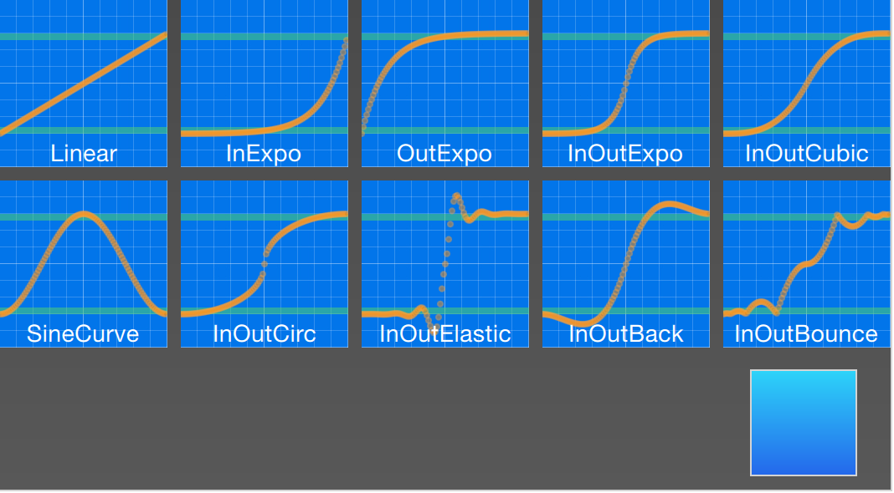
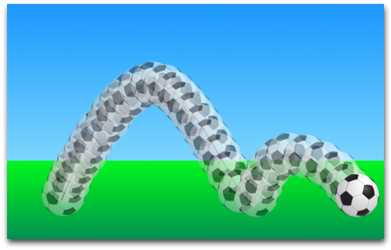
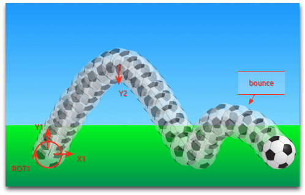
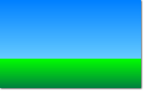
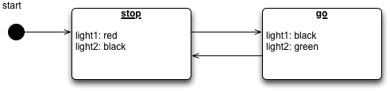
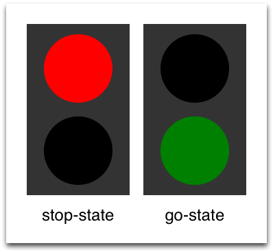

==================
부드러운 효과 주기
==================

.. sectionauthor:: `jryannel <https://github.com/jryannel>`_

.. index:: Animations, Easing Curves, Grouped Animations, States, Transitions, SequentialAnimation, ParallelAnimation, ColorAnimation, NumberAnimation, Transition, ClickableImage, Bouncing Ball

.. issues:: ch05

.. note::

    Last Build: |today|

    이번 장의 소스 코드는 `assets 폴더 <../../assets>`_ 에서 확인할 수 있습니다.

지금까지 우리는 간단한 그래픽 요소들을 살펴보고 그것들을 배치하거나 다루는 방법에 대해 알아보았습니다. 이 장은 속성값을 즉시 변경하는 것이 아니라 시간의 경과에 따라 값이 변경되는 방식(애니메이션)으로 이러한 변화를 제어하는 방법에 대해 설명합니다. 이 기술은 유려한 최신의 사용자 인터페이스를 위한 핵심 기반 기술 중 하나이며 state와 transition으로 사용자 인터페이스를 체계적으로 확장할 수 있게 합니다. 각 state는 일련의 속성 변화를 정의하고 state가 변경될 때 애니메이션과 결합될 수 있습니다. 이러한 state 변경을 transition이라 부릅니다.

애니메이션
==========

.. issues:: ch05

애니메이션은 속성의 변화에 적용됩니다. 애니메이션 효과는 속성 값이 어떤 값에서 다른 값으로 변화할 때 자연스러운 전환을 만들어내기 위한 보간 곡선(interpolation curve)을 정의합니다. 하나의 애니메이션은 애니메이션 효과를 주고자 하는 일련의 속성들과 보간 곡선을 위한 easing curve, 속성이 변화할 시간을 지정하는 duration으로 정의됩니다. Qt Quick에서 모든 애니메이션은 같은 타이머에 의해 제어되어 서로 동기화됩니다. 이는 애니메이션의 성능과 시각적 품질이 향상시킵니다.

.. note::

    애니메이션은 속성이 어떻게 변할지, 즉 보간값(value interpolation)을 제어합니다. 이것이 애니메이션의 핵심적인 개념입니다. QML은 element와 속성, 스크립팅을 기반으로 합니다. 모든 element은 수십 개의 속성을 제공하며 각각의 속성은 여러분이 애니메이션을 부여해주길 기다리고 있습니다. 이 책을 읽는 동안 여러분은 이것이 환상적인 경기장임을 알게 될 것입니다. 여러분이 만든 아름다운 애니메이션을 보면서 여러분의 창조적인 천재성에 감탄하는 자신을 발견하게 될 것입니다. 다음을 기억하세요: *애니메이션은 속성의 변화를 제어하고 모든 element는 여러분이 마음대로 다룰 수 있는 수십 개의 속성을 가지고 있습니다*.

    **여러분의 능력을 보여주세요!**

.. figure:: assets/animation_sequence.png

.. literalinclude:: src/animation/AnimationExample.qml
    :start-after: M1>>
    :end-before: <<M1

위의 예제는 ``x`` 와 ``rotation`` 속성에 적용된 간단한 애니메이션을 보여줍니다. 각 애니메이션은 4000 milliseconds (msecs)의 duration을 가지며 계속 반복됩니다. x에 대한 애니메이션은 객체의 x좌표를 점차 240px로 이동시킵니다. rotation에 대한 애니메이션은 현재 각도에서 360도까지 회전시킵니다. 두 애니메이션은 병렬로 실행되며 UI가 로드되자마자 시작합니다.

이제 ``to`` 와 ``duration`` 속성을 바꿔보면서 애니메이션과 친해질 수 있습니다. 또는 `opacity`` 나 ``scale`` 에 대해 또 다른 애니메이션을 추가할 수도 있겠습니다. 이들을 결합하면 객체가 깊은 공간 속으로 사라는 것과 같은 효과를 줄 수도 있습니다. 한 번 해보세요!

애니메이션 Elements
-------------------

.. issues:: ch05

여러 type의 animation element가 있으며, 각각은 특정 용도에 맞게 최적화되어 있습니다. 다음은 가장 흔히 사용되는 애니메이션의 리스트입니다:

* ``PropertyAnimation`` - 속성값의 변화에 애니메이션을 부여합니다
* ``NumberAnimation`` - qreal 형식의 값에 애니메이션을 부여합니다
* ``ColorAnimation`` - 색상값의 변화에 애니메이션을 부여합니다
* ``RotationAnimation`` - Rotation 값의 변화에 애니메이션을 부여합니다

이렇게 기본적이고 폭넓게 사용되는 animation element 외에, Qt Quick은 특정 용도를 위해 특화된 애니메이션도 제공합니다:

* ``PauseAnimation`` - 애니메이션을 멈추는 효과를 제공합니다
* ``SequentialAnimation`` - 순차적으로 애니메이션들이 수행되도록 합니다
* ``ParallelAnimation`` - 병렬적으로 애니메이션들이 수행되도록 합니다
* ``AnchorAnimation`` - Anchor의 변화에 애니메이션을 부여합니다
* ``ParentAnimation`` - 다른 부모 element를 갖게 될 때 애니메이션을 부여합니다
* ``SmoothedAnimation`` - 속성값이 부드럽게 변할 수 있도록 합니다
* ``SpringAnimation`` - 속성값이 통통 튀듯(spring-like) 변하게 합니다
* ``PathAnimation`` - 아이템이 경로를 따라 움직이도록 합니다
* ``Vector3dAnimation`` - QVector3d 값의 변화에 애니메이션을 부여합니다

뒤에서 우리는 일련의 애니메이션을 만드는 방법을 배울 것입니다. 더욱 복잡한 애니메이션을 구현하는 동안 어떤 속성을 변경하거나 애니메이션이 진행되는 중에 스크립트를 실행해야 할 수도 있습니다. 이를 위해 Qt Quick은 하나의 애니메이션 요소처럼 사용할 수 있는 action element를 제공합니다.

* ``PropertyAction`` - 애니메이션 중에 즉시 속성값이 변하도록 명시합니다
* ``ScriptAction`` - 애니메이션 중에 수행할 스크립트를 정의합니다

주요 애니메이션 유형들은 이번 장에서 해당 유형에 초점을 맞춘 작은 예제를 통해 다뤄질 예정입니다.

애니메이션 적용하기
-------------------

.. issues:: ch05

애니메이션은 여러가지 방법으로 적용될 수 있습니다:

* *속성에 애니메이션 부여* - Element가 완전히 로드된 후에 자동으로 수행됩니다
* *속성의 동작 정의* - 속성값이 변경될 때 자동으로 수행됩니다
* *단독형 애니메이션* - 명시적으로 ``start()`` 를 호출하거나 ``running`` 이 true로 설정될 때 (예: 속성에 대한 binding에 의해) 애니메이션이 수행됩니다

*조금 뒤에 state transition 내에서 어떻게 애니메이션이 사용되는지도 살펴볼 예정입니다.*

.. topic:: 확장된 ClickableImage 버전 2

    애니메이션의 사용법을 설명하기 위해 지난 챕터의 ``ClickableImage`` component를 재사용하고 text element로 기능을 확장했습니다.

    .. literalinclude:: src/animation/ClickableImageV2.qml
        :start-after: M1>>
        :end-before: <<M1

    이미지 아래의 element를 정리하기 위해 ``Column`` positioner를 사용했고 이 column의 ``childrenRect`` 속성을 바탕으로 width와 height를 계산했습니다. 우리는 두 개의 속성과 하나의 signal을 노출했습니다: ``text`` 와 이미지의 ``source``, 그리고 ``clicked`` signal. 또한 텍스트 영역이 이미지만큼 넓어지고 텍스트가 길어지면 줄바꿈되길 원합니다. 후자를 위해 ``Text`` element의 ``wrapMode`` 속성을 사용했습니다.

    .. note::

        기하학적 의존성(geometry-dependency)으로 인한 문제 (부모의 geometry가 자식의 geometry에 의존적이기 때문에) 때문에 우리는 ``ClickableImageV2`` 의 width/height를 설정할 수 없습니다. 우리가 설정한 width/height의 binding을 깨뜨리기 때문입니다. 이것은 우리 내부 설계의 한계이며 component 설계자는 이것을 인지하고 있어야만 합니다. 일반적으로 부모의 geometry에 따라 자식의 geometry가 결정되는 것이 바람직합니다.

.. rubric:: The objects ascending.

.. figure:: assets/animationtypes_start.png

세 개의 객체는 모두 같은 y좌표값 (``y=200``)을 가집니다. 이 객체들을 모두 ``y=40`` 로 여행을 보냅시다. 각각 서로 다른 부작용과 특징을 가진 방법을 사용하겠습니다.

.. literalinclude:: src/animation/AnimationTypesExample.qml
    :start-after: M1>>
    :end-before: <<M1

.. rubric:: 첫번째 객체

첫번째 객체는 ``Animation on <property>`` 와 같은 방법으로 이동합니다. 애니메이션은 즉시 시작됩니다. 객체를 클릭하면 y위치는 처음 위치로 재설정됩니다. 이는 모든 객체에 적용됩니다. 첫번째 객체에 대한 재설정은 애니메이션이 실행되는 동안 아무 영향을 주지 않습니다. y위치가 이미 애니메이션이 시작되기 전 아주 짧은 시간동안 새로운 값으로 설정되기 때문입니다. *이처럼 경쟁하는 속성의 변화는 피해야합니다*.

.. literalinclude:: src/animation/AnimationTypesExample.qml
    :start-after: M2>>
    :end-before: <<M2

.. rubric:: 두번째 객체

두번째 객체는 ``behavior on`` 을 사용해 애니메이션되며 움직입니다. 이러한 behavior는 속성에게 속성값이 바뀔 때마다 이러한 애니메이션을 가지고 바뀌라고 이야기합니다. Behavior는 behavior element에 ``enabled : false`` 와 같이 명시함으로써 비활성화될 수 있습니다. 이 객체는 사용자가 클릭할 때 (그리고 y위치가 40으로 설정될 때) 여행을 시작할 것입니다. 또 다른 클릭은 이미 위치가 설정되었기 때문에 아무런 효과가 없습니다. y위치에 무작위 값(예: ``40+(Math.random()*(205-40)``)을 갖도록 테스트해보세요. 객체가 항상 새로운 위치로 애니메이션되는데 그 속도는 애니메이션에 정의된대로 4초 후에 도착하도록 맞춰지는 것을 확인할 수 있을 것입니다.

.. literalinclude:: src/animation/AnimationTypesExample.qml
    :start-after: M3>>
    :end-before: <<M3

.. rubric:: 세번째 객체

세번째 객체는 ``단독형 애니메이션`` 을 사용합니다. 애니메이션은 그 자체가 하나의 element로 정의되고 문서 내 어디에나 위치할 수 있습니다. 마우스로 클릭하면 애니메이션의 함수인 ``start()`` 를 호출해서 애니메이션을 시작할 것입니다. 각 애니메이션은 start(), stop(), resume(), restart()와 같은 함수를 가집니다. 애니메이션 그 자체는 앞선 다른 유형의 애니메이션보다 훨씬 많은 정보를 가지고 있습니다. 애니메이션을 적용하고자 하는 대상과 애니메이션할 속성을 정의해야 합니다. 속성의 최종값인 ``to`` 를 정의해야 하고 애니메이션이 재시작될 수 있다면 ``from`` 도 정의해야 합니다.

.. figure:: assets/animationtypes.png

배경을 클릭하면 모든 객체는 시작 위치로 재설정될 것입니다. 첫번째 객체는 객체를 다시 로드하기 위해 프로그램을 다시 시작해야만 애니메이션이 재시작될 수 있습니다.

.. note::

    애니메이션을 시작/정지하는 또 다른 방법은 애니메이션의 ``running`` 속성을 다른 속성과 bind하는 것입니다. 이러한 방법은 특히 사용자 입력에 따라 바뀌는 속성과 함께 쓰일 때 유용합니다::

        NumberAnimation {
            ...
            // animation runs when mouse is pressed
            running: area.pressed
        }
        MouseArea {
            id: area
        }

Easing Curves
-------------

.. issues:: ch05

속성값의 변화는 애니메이션에 의해 제어될 수 있습니다. Easing 속성은 해당 속성 변화의 보간 곡선(interpolation curve)에 영향을 줍니다. 이제까지 우리가 정의한 모든 애니메이션은 easing type의 기본값이 ``Easing.Linear`` 였기 때문에 선형적으로 값이 변했습니다. 이 속성은 작은 그래프로 시각화할 수 있습니다. 여기서 y축은 움직일 속성이고 x축은 주어진 시간(*duration*)을 나타냅니다. 선형 보간(linear interpolation)은 애니메이션의 시작값인 ``from`` 에서 끝값인 ``to`` 까지 직선을 그릴 것입니다. 그래서 easing type은 이러한 변화의 곡선을 정의합니다. Easing type은 움직이는 객체에 자연스러움을 더하기 위해 신중하게 선택됩니다. 예를 들어 페이지를 넘기는 효과를 줄 때, 실제 책장을 넘기는 것처럼 처음에는 천천히 넘어가다가 점점 속도를 높여서 마지막에는 빠른 속도로 페이지가 넘어가야 합니다.

.. note::

    애니메이션을 남용해서는 안됩니다. UI 디자인의 한 측면에서 애니메이션은 신중하게 디자인되어야 합니다. 자연스러운 UI 흐름에 녹아들어야지 애니메이션이 그 중심이 되어선 안 됩니다. 눈은 움직이는 물체에 매우 민감해서 애니메이션은 사용자를 산만하게 만들기 쉽습니다.

다음 예제에서 우리는 몇가지 easing curve를 체험해보겠습니다. 각각의 easing curve는 클릭 가능한 이미지로 표시됩니다. 이미지를 클릭하면 새로운 easing type이 ``square`` 애니메이션에 설정되고 ``restart()`` 함수가 불려 해당 곡선을 가진 애니메이션이 실행됩니다.

이 예제 코드는 좀 더 복잡하게 만들어졌습니다. 우리는 먼저 ``EasingTypes`` 의 그리드를 만들고 easing type에 의해 제어되는 ``Box`` 를 추가했습니다. 하나의 easing type은 단순히 상자가 이동할 때 적용할 애니메이션의 곡선을 표시합니다. 사용자가 easing curve를 클릭할 때 상자는 easing curve에 따라 한쪽 방향으로 이동합니다. 애니메이션 자체는 상자를 대상으로 2초 동안 x속성에 대해 애니메이션을 적용하는 독립형 애니메이션입니다.

.. note:: EasingType의 내부 구현은 실시간으로 곡선을 렌더링하도록 되어 있습니다. 관심 있는 독자는 ``EasingCurves`` 예제를 참고하세요.

.. literalinclude:: src/EasingCurves/EasingCurves.qml
    :start-after: M1>>
    :end-before: <<M1

예제를 실행하는 동안, 애니메이션 중의 속도 변화를 관찰해보세요. 어떤 애니메이션은 객체에 자연스러운 느낌을 주는 반면에 어떤 것은 거슬리는 느낌을 주기도 합니다.

``duration`` 과 ``easing.type`` 외에도 애니메이션을 튜닝할 수 있는 다른 속성들이 있습니다. 예를 들어 대부분의 애니메이션이 상속하는 ``PropertyAnimation`` 은 추가적으로 특정 easing curve의 동작을 미세 조정할 수 있는 ``easing.amplitude`` 와 ``easing.overshoot``, ``easing.period`` 속성을 제공합니다. 모든 easing curve가 이들 변수를 지원하는 것은 아닙니다. 이들 매개 변수가 어떤 easing curve에 영향을 미치는지 확인하려면 ``PropertyAnimation`` 문서의 :qt5r:`easing table <qml-qtquick-propertyanimation.html#easing-prop>` 항목을 참고하세요.

.. note::

    사용자 인터페이스의 맥락에서 element에 적합한 애니메이션을 선택하는 것은 그 결과물에 매우 중요합니다. 애니메이션이 UI에 자연스럽게 흘러 들어가야 한다는 것을 기억하세요. 사용자를 거슬리게 해서는 안됩니다.

그룹 애니메이션
---------------

.. issues:: ch05

여러 개의 애니메이션은 하나의 속성에 대한 애니메이션보다 훨씬 복잡합니다. 여러분은 여러 개의 애니메이션을 동시에 실행하길 원할 수도 있고 순서대로 실행되길 바라거나, 두 애니메이션 사이에 스크립트를 실행할 필요도 있을 것입니다. 그룹 애니메이션을 통해 이러한 문제를 해결할 수 있습니다. 그 이름처럼 애니메이션을 그룹화할 수 있게 하는 것입니다. 그룹화는 두가지 방법으로 수행됩니다: 병렬적 혹은 순차적. 여러분은 ``SequentialAnimation`` 이나 ``ParallelAnimation`` element를 사용할 수 있는데 이것은 마치 다른 애니메이션의 container처럼 동작합니다. 이러한 그룹 애니메이션은 그 자체로 애니메이션이며 다른 애니메이션과 똑같이 사용할 수 있습니다.

.. figure:: assets/groupedanimation.png

병렬 애니메이션의 모든 직속 애니메이션들은 애니메이션이 시작될 때 병렬적으로 수행됩니다. 이렇게 하면 여러 속성에 대해 동시에 애니메이션 효과를 부여할 수 있습니다.

.. literalinclude:: src/animation/ParallelAnimationExample.qml
    :start-after: M1>>
    :end-before: <<M1

.. figure:: assets/parallelanimation_sequence.png

순차 애니메이션은 첫번째 자식 애니메이션을 수행한 후에 다음 애니메이션을 진행합니다.

.. literalinclude:: src/animation/sequentialanimation.qml
    :start-after: M1>>
    :end-before: <<M1

.. figure:: assets/sequentialanimation_sequence.png

그룹 애니메이션은 중첩될 수 있습니다. 예를 들어 순차 애니메이션은 두 개의 병렬 애니메이션을 자식으로 가질 수 있고, 그 다음 자식도 마찬가지입니다. 우리는 이것을 축구공 예제로 시각화할 수 있습니다. 아이디어는 behavior로 애니메이션되는 공을 왼쪽에서 오른쪽으로 던지는 것입니다.

애니메이션을 이해하기 위해서는 그것을 하나의 완전한 변환(integral transformation)들로 분리해서 해석해야 합니다. 속성에 변화를 주는 것이 애니메이션이라는 것을 기억하세요. 여기에 서로 다른 변환이 있습니다:

* 왼쪽에서 오른쪽으로의 x-축 이동 (``X1``)
* 아래에서 위로의 y-축 이동 (``Y1``) 에 이어 약간의 바운스 효과와 함께 위에서 아래로의 이동 (``Y2``)
* 전체 애니메이션 시간 동안 360도를 넘는 회전 (``ROT1``)

전체 애니메이션 시간은 3초입니다.

너비가 480이고 높이가 300인 빈 root element에서 시작하겠습니다.

.. code-block:: js

    import QtQuick 2.5

    Item {
        id: root
        width: 480
        height: 300
        property int duration: 3000

        ...
    }

애니메이션 부분을 잘 동기화하기 위해 전체 애니메이션 시간을 정의했습니다.

그 다음 녹색과 파란색 그라데이션 효과를 rectangle 2개를 배경으로 추가했습니다.

.. literalinclude:: src/animation/BouncingBallExample.qml
    :start-after: M1>>
    :end-before: <<M1

상단의 파란 사각형(하늘)은 높이가 200 픽셀이고, 하단의 사각형(잔디)은 하늘의 상단과 root element의 하단에 anchor되어 있습니다.

녹색 영역에 축구공을 가져옵시다. 공은 "assets/soccer_ball.png"에 저장된 이미지입니다. 처음에는 가장자리 왼쪽 하단 모서리에 배치하려고 합니다.

.. literalinclude:: src/animation/BouncingBallExample.qml
    :start-after: M2>>
    :end-before: <<M2

이미지에 마우스 영역을 붙입니다. 공을 클릭하면 공의 위치가 초기화되고 애니메이션은 다시 시작됩니다.

먼저 2개의 변환에 대한 순차 애니메이션부터 시작해봅시다.

.. code-block:: js

    SequentialAnimation {
        id: anim
        NumberAnimation {
            target: ball
            properties: "y"
            to: 20
            duration: root.duration * 0.4
        }
        NumberAnimation {
            target: ball
            properties: "y"
            to: 240
            duration: root.duration * 0.6
        }
    }

.. figure:: assets/soccer_stage3.png

이 코드는 전체 애니메이션 시간 중에 40%는 위로 올라가는 애니메이션이고 60%는 아래로 내려가는 애니메이션에 할당합니다. 한 애니메이션이 끝나면 다음 애니메이션이 순서대로 수행됩니다. 값의 변화는 선형적(on a linear path)이며, 아직은 보간 곡선을 적용하지 않았습니다. 곡선은 나중에 easing curve를 사용해 추가할 것입니다. 일단 지금은 애니메이션을 통한 변환에 집중하겠습니다.

다음으로 x축 이동을 추가해야 합니다. x축 이동은 y축 이동과 병렬로 수행되어야 합니다. 그러기 위해 y축 이동을 하나로 묶어(encapsulate) x축 이동과 함게 병렬 애니메이션으로 만들어야 합니다.

.. code-block:: js

    ParallelAnimation {
        id: anim
        SequentialAnimation {
            // ... our Y1, Y2 animation
        }
        NumberAnimation { // X1 animation
            target: ball
            properties: "x"
            to: 400
            duration: root.duration
        }
    }

.. figure:: assets/soccer_stage4.png

마지막으로 공을 회전시키면 좋겠습니다. 이를 위해 병렬 애니메이션에 애니메이션을 추가하겠습니다. 회전에 특화된 ``RotationAnimation`` 을 선택합니다.

.. code-block:: js

    ParallelAnimation {
        id: anim
        SequentialAnimation {
            // ... our Y1, Y2 animation
        }
        NumberAnimation { // X1 animation
            // X1 animation
        }
        RotationAnimation {
            target: ball
            properties: "rotation"
            to: 720
            duration: root.duration
        }
    }

이것이 전체 애니메이션 시퀀스입니다. 한 가지 남은 것은 공의 움직임에 적절한 easing curve를 부여하는 것입니다. *Y1* 애니메이션에 대해서는 좀 더 원형 곡선처럼 보이기 위해 ``Easing.OutCirc`` 를 사용합니다. *Y2* 는 ``Easing.OutBounce`` 를 적용해서 공이 마지막에 바운스되도록 합니다 (``Easing.InBounce`` 를 적용해보세요. 이 때는 바운스 효과가 먼저 발생할 것입니다).
*X1* 과 *ROT1* 애니메이션은 선형 그래프으로 남겨둡니다.

여러분이 참고할 수 있는 최종 애니메이션 코드는 아래와 같습니다:

.. literalinclude:: src/animation/BouncingBallExample.qml
    :start-after: M3>>
    :end-before: <<M3

States와 Transitions
====================

.. issues:: ch05

사용자 인터페이스의 많은 부분은 state로 기술할 수 있습니다. 하나의 state는 일련의 속성 변화를 정의하고, 특정한 조건에 따라 전환될 수 있습니다. 더불어 이러한 state의 전환은 transition을 가질 수 있는데, transition은 어떻게 속성들이 애니메이션되며 변할지 혹은 추가적인 동작(action)이 적용되어야 하는지 정의합니다. 이 때 동작은 어떤 state로 진입할 때 적용될 수도 있습니다.

States
------

.. issues:: ch05

QML에서는 ``State`` element를 통해 상태를 정의합니다. 이 state는 element 내에 ``states`` 배열의 요소 중 하나여야 합니다. 하나의 state는 이름을 통해 식별되며, 가장 단순한 형태를 가진 일련의 속성 변경으로 구성됩니다. 기본 state는 element의 초기 속성으로 정의되며 ``""`` (빈 문자열)로 명명됩니다.

.. code-block:: js

    Item {
        id: root
        states: [
            State {
                name: "go"
                PropertyChanges { ... }
            },
            State {
                name: "stop"
                PropertyChanges { ... }
            }
        ]
    }

State를 변경하기 위해 ``state`` 속성에 새로운 이름을 할당합니다. 이 때 state의 이름은 states에 정의된 것 중 하나여야 합니다.

.. note::

    State를 전환하는 또 다른 방법은 ``State`` element의 ``when`` 속성을 사용하는 것입니다. ``when`` 속성은 해당 state가 적용되어야 할 때 참이 되는 표현식으로 설정할 수 있습니다.

.. code-block:: js

    Item {
        id: root
        states: [
            ...
        ]

        Button {
            id: goButton
            ...
            onClicked: root.state = "go"
        }
    }

.. figure:: assets/trafficlight_sketch.png

예를 들어 신호등이 두 개의 표시등을 가진다고 합시다. 위의 표시등은 붉은색이고 아래는 초록색입니다. 이 예에서 두 표시등은 동시에 켜질 수 없습니다. State chart diagram을 살펴봅시다.

시스템이 켜지면 자동으로 기본 state인 stop 모드로 들어갑니다. Stop state는 ``light1`` 을 붉은색으로 ``light2`` 를 검정색(꺼짐)으로 변경합니다. 이제 외부 이벤트가 state를 ``"go"`` state로 전환할 수 있습니다. Go state에서는 ``light1`` 의 색상을 검정색(꺼짐)으로 ``light2`` 를 초록색으로 바꿔서 보행자가 길을 건너도록 안내합니다.

이 시나리오를 구현하기 위해 2개의 표시등에 대한 사용자 인터페이스를 스케치해봅시다. 편의상 너비의 반 만큼 둥근 모서리를 가진 2개의 정사각형 rectangle을 사용합니다.

.. literalinclude:: src/animation/StatesExample.qml
    :start-after: M1>>
    :end-before: <<M1

State chart에 정의된 것처럼 우리는 ``"go"`` state 와 ``"stop"`` state를 가지길 원합니다. 각 상태는 신호등을 빨간색이나 초록색으로 변경시킵니다. 신호등의 초기 상태를 ``stop`` 으로 하기 위해 ``state`` 속성을 ``stop`` 으로 설정했습니다.

.. note::

    명시적으로 ``"stop"`` state를 정의하지 않고 ``"go"`` state만으로도 같은 효과를 얻을 수 있습니다. ``"stop"`` state 때는 ``light1`` 을 빨간색으로 ``light2`` 를 검정색으로 설정합니다. 그러면 초기 속성값들로 정의된 초기 속성 ``""`` 는 ``"stop"`` state와 동일하게 동작할 것입니다.

.. literalinclude:: src/animation/StatesExample.qml
    :start-after: M2>>
    :end-before: <<M2

이 예제에서 ``PropertyChanges { target: light2; color: "black" }`` 은 실제로 필요하지 않습니다. ``light2`` 의 초기 색상은 이미 검정색이기 때문입니다. 기본 상태(이전 상태가 아닌)에서 속성이 어떻게 변하는지 기술하는 것 만으로도 충분합니다.

상태 변경은 전체 신호등을 덮는 마우스 영역을 통해 이루어지며, 클릭하면 go와 stop state 사이에서 토글됩니다.

.. literalinclude:: src/animation/StatesExample.qml
    :start-after: M3>>
    :end-before: <<M3

이제 우리는 신호등의 상태를 성공적으로 바꿀 수 있습니다. UI를 더 매력적이고 자연스럽게 만들기 위해서는 애니메이션 효과를 가지고 약간의 transition을 추가해야 합니다. Transition은 상태 변화에 의해 발생할 수 있습니다.

.. note::

    QML의 state 대신 스크립팅을 통해 비슷한 로직으로 구현하는 것도 가능합니다. 이 경우 개발자는 QML 코드보다 더 많은 JavaScript 코드를 작성하는 함정에 쉽게 빠질 수 있습니다.

Transitions
-----------

.. issues:: ch05

일련의 transition은 모든 item에 추가될 수 있습니다. Transition은 상태 변경에 의해 수행됩니다. 여러분은 ``from:`` 과 ``to:``
속성을 사용해서 특정 상태 변화에 대해 transition을 정의할 수 있습니다. 이 두 속성은 일종의 필터처럼 동작하며, 필터가 참일 때 해당 transition이 적용됩니다. 또한 "임의의 상태"를 뜻하는 와일드카드 "*" 를 사용할 수 있습니다. 예를 들어 ``from:"*"; to:"*"`` 는 모든 상태에서 다른 모든 상태로의 전환을 의미하고 이는 ``from`` 과 ``to`` 에 대한 기본값입니다. 이것은 해당 transition이 모든 상태 변환에 적용된다는 것을 뜻합니다.

예제에서 state가 "go"에서 "stop"으로 바뀔 때 색상 변경에 애니메이션을 적용하려고 합니다. 반대의 상태 변화("stop"에서 "go"로)에 대해서는 색상이 즉시 변하게 놔두고 transition을 적용하지 않을 것입니다. "go"에서 "stop"으로의 상태 변화만을 필터링하기 위해 ``from`` 와 ``to`` 속성으로 transition을 제한합니다. Transition에 각 상태등에 대한 두 가지 색상 애니메이션을 추가합니다. 이것은 state에 명시된 속성 변경에 대한 애니메이션입니다.

.. literalinclude:: src/animation/StatesExample.qml
    :start-after: M4>>
    :end-before: <<M4

UI를 클릭하면 state를 변경할 수 있습니다. State는 즉시 적용되며 transition이 실행되는 동안에도 state는 변경될 수 있습니다. 상태가 "stop"에서 "go"로 바뀌는 transition이 실행되는 동안 UI를 클릭해보세요. 변화가 즉시 일어나는 것을 확인할 수 있을 것입니다.

여러분은 이 UI를 가지고 이런 저런 실험을 해볼 수 있습니다. 예를 들어 꺼진 등은 크기를 줄여 켜진 등을 눈에 띄게 할 수도 있겠습니다. 이를 위해 states에 크기 변화를 위한 상태 변화를 추가하고 transition에는 scale 속성에 대한 애니메이션을 추가해야 하겠습니다. 또 다른 옵션은 노란색이 깜빡이는 "attention" state를 추가하는 것입니다. 그러기 위해서는 순차 애니메이션을 transition에 추가하고 1초 동안 노란색(애니메이션의 "to" 속성이 노란색이었다가 1초 뒤에는 "검정색"으로 바뀌어야 합니다)으로 바뀌도록 해야 할 것입니다. 어쩌면 easing curve를 바꿔서 시각적인 측면에서 좀 더 매력적으로 만들고 싶을지도 모르겠습니다.

고급 테크닉
===========

.. issues:: ch05

.. todo:: To be written
