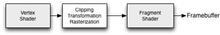
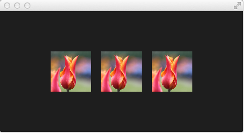
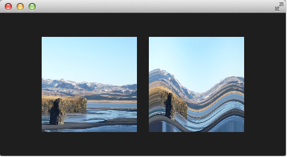
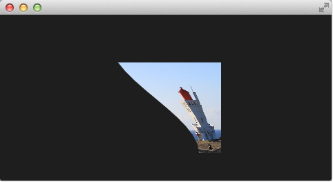
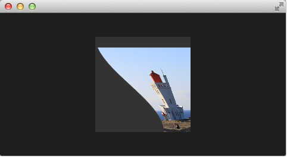
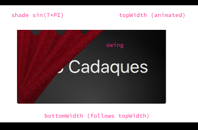
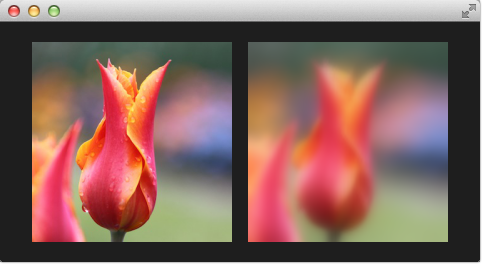

==============================
셰이더 이펙트 (Shader Effects)
==============================

.. sectionauthor:: `jryannel <https://github.com/jryannel>`_

.. issues:: ch09

.. note::

    Last Build: |today|

    이번 장의 소스 코드는 `assets 폴더 <../../assets>`_ 에서 확인할 수 있습니다.

.. topic:: 목표

    * http://doc.qt.io/qt-5/qml-qtquick-shadereffect.html
    * http://www.opengl.org/registry/doc/GLSLangSpec.4.20.6.clean.pdf
    * http://www.khronos.org/registry/gles/specs/2.0/GLSL_ES_Specification_1.0.17.pdf
    * http://www.lighthouse3d.com/opengl/glsl/
    * http://wiki.delphigl.com/index.php/Tutorial_glsl
    * :qt5:`qtquick-shaders`

    셰이더 이펙트에 대한 간략한 소개, 데모 그리고 사용법.

셰이더(shader)는 GPU 상에서 동작하는 OpenGL의 강력한 기능을 직접 활용해서 SceneGraph API 위에 멋진 렌더링 효과를 만들 수 있게 합니다. 셰이더는 ShaderEffect와 ShaderEffectSource를 사용하여 구현됩니다. 셰이더 알고리즘 그 자체는 OpenGL Shading Language를 사용해 구현됩니다.

실제 셰이더 코드는 QML 코드와 섞어서 사용됩니다. 실행 시에 셰이더 코드는 GPU로 전송되어 GPU에서 컴파일되고 실행됩니다. 셰이더 QML element는 element의 속성들을 OpenGL 셰이더 구현부와 상호작용할 수 있도록 해줍니다.

OpenGL 셰이더가 무엇인지 먼저 살펴봅시다.

OpenGL 셰이더
-------------

.. issues:: ch09

OpenGL은 스테이지(stage)로 분할된 렌더링 파이프라인(rendering pipeline)을 사용합니다. 단순화된 OpenGL 파이프라인은 vertex shader와 fragment shader를 가집니다.

Vertex shader는 vertex data를 받아서 해당 루틴이 끝날 때 *gl_Position* 에 그 값을 할당해야 합니다. 다음 스테이지에서 vertex들은 픽셀 출력을 위해 클리핑(clipped), 변환(transformed) 및 래스터화(rasterized) 됩니다. 이 때 fragment shader에 fragments(픽셀)가 부여되고 그 값이 적절하게 조작될 수도 있으며, 그 결과로 산출된 색상값이 *gl_FragColor* 에 할당되어야 합니다. Vertex shader는 다각형(polygon)의 각 모서리 (vertex = 3D 좌표상의 점)에 대해 호출되며, 이를 통해 이 점(point)들의 3D 좌표를 다룰 수 있습니다. Fragment shader (fragment = 픽셀)는 개별 픽셀에 대해 호출되고 각 픽셀의 색상값을 결정합니다.

셰이더 Elements
---------------

.. issues:: ch09

셰이더 프로그래밍을 위해 Qt Quick은 두 가지 element를 제공합니다. ShaderEffectSource와 ShaderEffect가 바로 그것들입니다. Shader effect는 사용자 정의 셰이터를 적용하고, shader effect source는 QML 아이템을 텍스쳐(texture)로 렌더링하고 실제 화면을 위해서는 렌더링된 텍스쳐를 전달합니다. Shader effect는 사용자 정의 셰이터를 사각형 객체에 적용할 수 있으며 셰이더를 적용하기 위한 소스(source)를 지정할 수 있습니다. 소스는 텍스쳐 형태로 사용되는 이미지가 될 수도 있고 shader effect source가 될 수도 있습니다.

기본 셰이더는 사용하는 소스를 수정하지 않은 상태로 렌더링합니다.

.. literalinclude:: src/effects/defaultshader.qml
    :start-after: M1>>
    :end-before: <<M1

위의 예제에 3개의 이미지가 나란히 있습니다. 첫번째는 실제 이미지입니다. 두번째는 기본 셰이더를 사용해 렌더링한 것이고, 세번째는 Qt5 소스 코드로부터 추출한 fragment와 vertex의 기본 셰이더 코드를 사용하여 렌더링한 것입니다.

.. note::

    소스 이미지는 표시하지 않고 효과를 준 이미지만 보이게 하고 싶다면, *Image* 를 보이지 않게 설정 (``visible : false``) 할 수 있습니다. 이 경우에도 셰이더 효과는 렌더링되지 않을 *Image* element의 이미지 데이터를 사용할 것입니다.

셰이더 코드를 좀 더 가까이 살펴봅시다.

.. code-block:: js

    vertexShader: "
        uniform highp mat4 qt_Matrix;
        attribute highp vec4 qt_Vertex;
        attribute highp vec2 qt_MultiTexCoord0;
        varying highp vec2 qt_TexCoord0;
        void main() {
            qt_TexCoord0 = qt_MultiTexCoord0;
            gl_Position = qt_Matrix * qt_Vertex;
        }"

두 개의 셰이더 코드는 Qt 측에서 *vertexShader* 와 *fragmentShader* 속성에 바인딩되는 문자열입니다. 모든 셰이더 코드는 GPU에서 수행되는 *main() { ... }* 함수를 가져야 합니다. *qt_* 로 시작하는 변수는 Qt에서 기본으로 제공되는 변수입니다.

변수에 대한 간단한 설명:

========== ==========================================
uniform     수행 중에 변경되지 않는 값
attribute   외부 데이터와의 연결
varying     셰이터 간 공유되는 값
highp       고정밀도 값 (high precision value)
lowp        저정밀도 값 (low precision value)
mat4        부동 소수점 (float) 값으로 구성된 4x4 행렬
vec2        2개의 부동 소수점 (float) 값으로 구성된 2차원 벡터
sampler2D   2D 텍스처
float       부동 수소점 (float) 상수
========== ==========================================

더 좋은 참고자료는 `OpenGL ES 2.0 API Quick Reference Card <http://www.khronos.org/opengles/sdk/docs/reference_cards/OpenGL-ES-2_0-Reference-card.pdf>`_ 입니다.

이제 아래 변수들이 무엇인지 좀 더 잘 이해할 수 있을 것입니다:

* qt_Matrix: 모델-뷰-프로젝션 행렬
* qt_Vertex: 현재 vertex의 위치
* qt_MultiTexCoord0: 텍스처 좌표
* qt_TexCoord0: 공유되는 텍스처의 좌표

우리는 프로젝션 행렬 및 현재 vertex와 텍스처의 좌표를 사용할 수 있습니다. 텍스처 좌표는 소스로 주어진 텍스처와 관련이 있습니다. *main()* 함수에서는 fragment shader에서 사용할 수 있도록 텍스처 좌표를 저장합니다. 모든 vertex shader는  *gl_Position* 을 할당해야 합니다. 여기에서는 프로젝션 행렬에 3차원 공간 상의 점인 vertex를 곱하는 것으로 해당 값을 계산합니다.

Fragment shader는 vertex shader로부터 텍스처의 좌표를 받고, QML 소스 속성으로부터 텍스처를 받습니다. 여기서 셰이더 코드와 QML 사이에 변수를 전달하는 것이 얼마나 쉬운지 주목할 필요가 있습니다. 정말 멋지죠. 그리고 셰이더 효과의 투명도를 부여할 때 사용할 수 있는 *qt_Opacity* 가 있습니다. 모든 fragment shader는 *gl_FragColor* 변수를 할당해야 합니다. 기본 셰이더 코드에서는 소스 텍스처에서 선택한 픽셀에 투명도를 곱하여 색상값을 할당했습니다.

.. code-block:: js

    fragmentShader: "
        varying highp vec2 qt_TexCoord0;
        uniform sampler2D source;
        uniform lowp float qt_Opacity;
        void main() {
            gl_FragColor = texture2D(source, qt_TexCoord0) * qt_Opacity;
        }"

다음 예제에서는 간단한 셰이더 코드를 이리저리 수정하면서 테스트해볼 예정입니다. 먼저 fragment shader를 집중해서 살펴보고 그 다음 vertex shader로 넘어가겠습니다.

Fragment Shaders
----------------

.. issues:: ch09

Fragment shader는 렌더링될 모든 픽셀에 대해 호출됩니다. 여기서는 이미지의 적색(red) 채널 값을 증가시키는 작은 빨간 렌즈를 개발해보겠습니다.

.. rubric:: Scene 설정하기

먼저 scene을 설정합니다. 배경화면의 중앙에 그리드를 배치하고 우리의 소스 이미지가 화면에 표시되도록 합니다.

.. literalinclude:: src/effects/redlense1.qml
    :start-after: M1>>
    :end-before: <<M1

.. rubric:: 적색 셰이더

그 다음 셰이더 코드를 추가합니다. 각각의 fragment에 적색(red color)을 할당해서 빨간 사각형이 표시되도록 합니다.

.. literalinclude:: src/effects/redlense2.qml
    :start-after: M1>>
    :end-before: <<M1

Fragment shader에서 우리는 단순히 개별 fragment의 *gl_FragColor* 에 대해 불투명한 (alpha=1.0) 빨간색을 나타내는 벡터값 *vec4(1.0, 0.0, 0.0, 1.0)* 을 할당합니다.

.. figure:: assets/redlense2.png

.. rubric:: 텍스처에 적용한 적색 셰이더

이제 빨간색을 텍스처의 각 픽셀에 적용하려고 합니다. 이를 위해 vertex shader에서 텍스처를 가져와야 합니다. Vertex shader에서 별다른 일을 하지 않을 것이기 때문에 셰이더 코드는 기본 vertex shader로 충분합니다.

.. literalinclude:: src/effects/redlense2.qml
    :start-after: M2>>
    :end-before: <<M2

이제 전체 셰이더는 variant 속성의 이미지 소스를 갖도록 되돌려 놓았습니다. 그리고 vertex shader를 지정하지 않으면 기본 vertex shader로 설정되기 때문에 생략했습니다.

Fragment shader에서 텍스처 fragment인 *texture2D(source, qt_TexCoord0)* 를 선택하고 해당 픽셀에 빨간색을 적용합니다.

.. rubric:: 적색 채널 속성 (red channel property)

적색 채널 값을 하드 코딩하는 것은 그렇게 좋은 생각이 아닙니다. 그래서 여기에서는 QML에서 그 값을 조절하고자 합니다. 이를 위해 셰이더 효과에 *redChannel* 속성을 추가하고 fragment shader 내부에 *uniform lowp float redChannel* 을 선언합니다. 이제 셰이더 코드 내부의 값을 QML에서 사용할 수 있습니다. 아주 간단하죠.

.. literalinclude:: src/effects/redlense2.qml
    :start-after: M3>>
    :end-before: <<M3

이 렌즈를 진짜 렌즈처럼 만들기 위해 *vec4* 색상을 *vec4(redChannel, 1.0, 1.0, 1.0)* 로 바꾸겠습니다. 그래서 다른 색상 채널에는 1.0을 곱하고 빨간 부분만 *redChannel* 변수값을 곱합니다.

.. rubric:: 애니메이션되는 적색 채널

*redChannel* 속성도 단지 하나의 속성에 불과하기 때문에 QML의 모든 속성처럼 애니메이션될 수 있습니다. 그래서 QML 속성을 사용해 GPU 상에서 수행되는 셰이더 코드에 영향을 줄 수 있습니다. 이것은 정말 멋진 기능입니다!

.. literalinclude:: src/effects/redlense2.qml
    :start-after: M4>>
    :end-before: <<M4

여기에 최종 결과물이 있습니다.

두번째 행의 셰이더 효과는 4초 동안 0.0에서 1.0으로 애니메이션됩니다. 그래서 이미지의 색상은 빨간색만 탈색된 상태(0.0 red)에서 정상 이미지(1.0 red)로 바뀝니다.

물결 효과
---------

.. issues:: ch09

이번에는 좀 더 복잡한 예제를 보여 드리려고 합니다. Fragment shader를 가지고 물결 효과를 만들어 보겠습니다. 파형은 사인 곡선(sine curve)을 기반으로 색상에 사용되는 텍스처 좌표에 영향을 주도록 구현합니다.

.. literalinclude:: src/effects/wave.qml
    :start-after: M1>>
    :end-before: <<M1

파형 계산은 pulse와 텍스처 좌표 조작을 기반으로 합니다. Pulse는 현재 시간과 사용된 텍스쳐 좌표를 입력값으로 하는 사인 곡선(sine wave)에 의해 계산됩니다::

    highp vec2 pulse = sin(time - frequency * qt_TexCoord0);

시간 요소가 없다면 이미지에 왜곡은 줄 수 있겠지만 물결 치듯 변화하는 효과는 줄 수 없을 것입니다.

색상값에 대해서는 다른 텍스처 좌표의 색상을 사용합니다::

    highp vec2 coord = qt_TexCoord0 + amplitude * vec2(pulse.x, -pulse.x);

이 때 텍스처 좌표는 pulse의 x값에 영향을 받습니다. 그 결과로 움직이는 물결이 만들어집니다.

또한 이 fragment shader에서 픽셀을 이동하지 않았다면 그 결과물은 마치 vertex shader를 통한 효과처럼 보였을 것입니다.

Vertex Shader
-------------

.. issues:: ch09

Vertex shader를 사용해서 셰이더 효과에 제공되는 vertex를 조작할 수 있습니다. 일반적인 경우에 셰이더 효과는 4개의 vertex(왼쪽 위, 오른쪽 위, 왼쪽 아래, 오른쪽 아래)를 가집니다. 각각의 vertex는 vec4 타입으로 제공됩니다. Vertex shader를 눈으로 체험해보기 위해 우리는 지니 효과(역자 주: genie effect, macOS에서 창을 최소화할 때 볼 수 있는 효과)를 만들어 보겠습니다. 이 효과는 직사각형 윈도우 영역을 하나의 점으로 사라지게 하는데 주로 사용됩니다.

.. rubric:: Scene 설정하기

이번에도 scene을 먼저 설정하겠습니다.

.. literalinclude:: src/effects/genie0.qml
    :start-after: M1>>
    :end-before: <<M1

여기서는 어두운 배경 화면과 셰이더 효과를 적용하기 위해 소스 텍스처로 사용할 이미지가 제공됩니다. 원본 이미지는 지니 효과를 위해 이미지 데이터만 제공할 뿐 화면에 표시되지는 않습니다. 그리고 셰이더 효과와 같은 위치와 크기의 어두운 사각형을 추가해서 효과를 반전시키기 위한 클릭 이벤트를 구분하기 쉽도록 했습니다.

효과는 이미지를 클릭하면 시작됩니다. 이러한 동작은 해당 효과를 감싸는 마우스 영역에 의해 정의됩니다. *onClicked* 핸들러에서 사용자 정의 속성인 *minimized* 값을 토글합니다. 뒤에서 우리는 이 속성을 사용하여 지니 효과를 전환할 예정입니다.

.. rubric:: Minimize와 normalize

Scene을 설정한 후에, *minimize* 라 불리는 real 타입 속성을 정의합니다. 이 속성은 현재 이미지가 얼마나 최소화되었는지를 나타냅니다. 해당 속성은 0.0과 1.0 사이의 값을 가지며 순차 애니메이션에 의해 제어됩니다.

.. literalinclude:: src/effects/genie1.qml
    :start-after: M1>>
    :end-before: <<M1

애니메이션은 *minimized* 속성을 토글하는 것에 의해 동작합니다. 자 이제 모든 주변 환경을 설정했으니, vertex shader를 살펴볼 차례입니다.

.. literalinclude:: src/effects/genie1.qml
    :start-after: M2>>
    :end-before: <<M2

이 예제의 경우에 vertex shader는 각각의 vertex에 대해 불립니다. 그래서 총 4번 호출됩니다. 이 때 다음과 같이 Qt에 의해 정의된 파라미터가 제공됩니다 - *qt_Matrix*, *qt_Vertex*, *qt_MultiTexCoord0*, *qt_TexCoord0*. 이 변수들에 대해서는 앞서 이미 논의한 바 있습니다. 추가적으로 셰이터 효과에 대한 element에서 *minimize* 와 *width*, *height* 변수를 vertex shader 코드로 링크합니다. main 함수에서 우리는 현재 텍스처 좌표를 *qt_TexCoord0* 에 저장해서 fragment shader에서 사용할 수 있게 합니다. 이제 현재 위치를 복사하고 vertex의 x와 y좌표를 변경합니다::

    highp vec4 pos = qt_Vertex;
    pos.y = mix(qt_Vertex.y, height, minimize);
    pos.x = mix(qt_Vertex.x, width, minimize);

*mix(...)* 함수는 처음 두 개의 파라미터 값 사이에서, 선형 보간에 기초하여 세번째 파라미터에 의해 지정되는 위치(0.0-1.0)에 해당하는 값을 선택합니다. 그래서 이 예제의 경우에는 현재 y 위치와 이미지의 높이값 사이에서 현재 minimize의 값만큼 떨어진 중간값이 할당되고, x 값도 동일한 방식으로 할당됩니다. minimize 값은 순차 애니메이션에 의해 변경되고, 그 값은 0.0과 1.0 사이를 움직인다는 것을 기억하세요.

그 결과물이 지니 효과와는 전혀 다르지만, 여러분은 이미 최종 결과물을 위한 큰 걸음을 내딛은 것입니다.

.. todo:: better explanation, maybe draw the 4 vertexes and their interpolation

.. rubric:: 기본적인 벤딩(bending) 효과

이제 vertex의 x와 y 좌표를 최소화할 수 있게 되었습니다. 이제 x값에 약간의 변형을 주고 싶습니다. 그래서 현재 y 좌표값에 영향을 받도록 수정하려고 합니다. 필요한 수정은 아주 작습니다. y-위치는 전과 같이 계산됩니다. Vertex의 x-위치는 이제 y-위치에 영향을 받습니다::

    highp float t = pos.y / height;
    pos.x = mix(qt_Vertex.x, width, t * minimize);

그 결과로 x-위치는 y-위치가 커질 때 width쪽에 가까운 값으로 할당됩니다. 다시 말해서 상단의 두 vertex는 y-위치값이 0이기 때문에 전혀 영향을 받지 않고, 하단의 두 vertex의 x-위치값은 둘 다 width 쪽으로 기울게 됩니다. 그래서 같은 x-위치값 쪽으로 기울어진 모양이 만들어집니다.

.. figure:: assets/geniebending.png

.. literalinclude:: src/effects/genie2.qml
    :start-after: M1>>
    :end-before: <<M1

.. rubric:: 개선된 벤딩(bending)

아직 벤딩(bending)이 만족스럽지 않기 때문에 이 상황을 개선하기 위해 여러 부분을 추가할 예정입니다. 먼저, 자체 벤딩 속성을 추가해서 애니메이션을 개선해보겠습니다. 이것은 벤딩이 즉시 일어나야 하고, y값 최소화에 약간의 지연을 주기 위해 필요합니다. 두 애니메이션은 같은 시간 동안 진행됩니다 (300+700+1000 와 700+1300).

.. literalinclude:: src/effects/genie3.qml
    :start-after: M1>>
    :end-before: <<M1

벤딩을 부드러운 곡선으로 만들어주기 위해 추가적으로 x-위치에 대한 y-값의 효과는 0..1 사이의 값에 대한 곡선 함수로 변형되는 것이 아니라 ``pos.x`` 가 새로운 bend 속성 애니메이션에 종속되도록 합니다::

    highp float t = pos.y / height;
    t = (3.0 - 2.0 * t) * t * t;
    pos.x = mix(qt_Vertex.x, width, t * bend);

이 곡선은 0.0 값에서는 부드럽게 시작해서 점차 커진다음, 1.0 값에 근접하면 부드럽게 멈춥니다. 아래는 애니메이션에 대한 곡선 그래프입니다. 우리의 관심 범위는 0..1 구간입니다.

가장 눈에 띄는 변화는 vertex 정점의 양을 늘린 것입니다. 사용된 vertex 정점은 mesh를 사용해 증가시킬 수 있습니다::

    mesh: GridMesh { resolution: Qt.size(16, 16) }

이제 셰이더 효과는 2x2 vertex 대신 균등하게 분포된 16x16 그리드 형태의 vertex를 가집니다. 이렇게 하면 vertex 사이의 보간이 훨씬 부드럽게 보입니다.

사용된 곡선의 영향으로 벤딩이 끝부분에서 멋지게 마무리되는 것을 볼 수 있을 것입니다. 이 부분이 벤딩에서 가장 강력한 효과를 발휘하는 지점입니다.

.. rubric:: 측면 선택하기

마지막으로 지니 효과가 마무리되는 측면 위치를 변경할 수 있도록 개선하려고 합니다. 지금까지 width 쪽으로 (우측으로) 사라졌습니다. 이제 *side* 속성을 추가해서 0과 width 사이의 위치로 변경할 수 있습니다.

.. code-block:: js

    ShaderEffect {
        ...
        property real side: 0.5

        vertexShader: "
            ...
            uniform highp float side;
            ...
            pos.x = mix(qt_Vertex.x, side * width, t * bend);
        "
    }

.. rubric:: 포장하기 (packaging)

마지막으로 할 일은 우리가 만드는 이 효과를 멋지게 포장하는 것입니다. 이를 위해 우리의 지니 효과를 *GenieEffect* 라는 자체 컴포넌트로 추출합니다. 이 컴포넌트는 root element로 셰이더 효과를 가집니다. 마우스 영역은 컴포넌트 안에 있는 것이 적절하지 않기 때문에 제거합니다. 효과는 *minimized* 속성을 변경하는 것에 의해 발동합니다.

.. literalinclude:: src/effects/GenieEffect.qml
    :start-after: M1>>
    :end-before: <<M1

이제 지니 효과를 아래와 같이 간단하게 사용할 수 있습니다:

.. literalinclude:: src/effects/geniedemo.qml
    :start-after: M1>>
    :end-before: <<M1

기존의 배경 사각형을 삭제하고, 별도의 이미지 element를 로드하는 것 대신에 직접 지니 효과에 이미지를 할당하는 방식으로 코드를 단순화했습니다.

커튼 효과
---------

.. issues:: ch09

셰이더 효과에 대한 마지막 예제로 커튼 효과를 소개하려고 합니다. 이 효과는 `Qt labs for shader effects <http://labs.qt.nokia.com/2011/05/03/qml-shadereffectitem-on-qgraphicsview/>`_ 의 일부로 2011년 5월에 공개되었습니다.

.. figure:: assets/curtain.png

그 때 당시 저는 이 효과들을 정말 좋아했고, 그 중 커튼 효과는 제가 가장 선호하는 것이었습니다. 커튼이 열리고 배경 오브젝트를 숨기는 그 방법에 매료되었습니다.

그 코드를 가져와서 Qt5에 맞게 수정했습니다. 그 과정은 직관적이었습니다. 그리고 쇼케이스에 잘 활용할 수 있도록 약간의 수정을 더했습니다. 전체 예제에 관심이 있다면 labs 블로그를 방문해보세요.

동작 원리에 대해 간략히 소개하자면, 커튼은 사실 *fabric.jpg* 라는 이름의 이미지이고 셰이더 효과의 소스로 사용됩니다. 셰이더 효과에서 vertex shader는 커튼을 흔드는 데에 사용되고, fragment shader는 음영을 주는데 사용됩니다. 다음은 코드에 대한 이해를 돕기 위한 간단한 다이어그램입니다.

커튼의 굴곡진 음영은 커튼의 가로 너비 위에 7개의 상/하 (7*PI=21.99...) 를 가진 사인(sin) 곡선을 통해 계산됩니다. 다른 중요한 부분은 커튼의 흔들림 효과입니다. 커튼의 *topWidth* 는 커튼이 열리거나 닫힐 때 애니메이션됩니다. *bottomWidth* 는 *SpringAnimation* 을 가진 *topWidth* 를 따라 변경됩니다. 이를 통해 커튼의 아랫 부분이 흔들리는 효과를 만듭니다. 계산된 *swing* 값은 vertex의 y값을 보간하여(interpolated) 흔들림의 강도를 제공합니다.

커튼 효과는 ``CurtainEffect.qml`` 컴포넌트에 구현되어 있고, 직물 이미지(fabric image)는 텍스처 소스로 지정되어 있습니다. 셰이더의 사용에 있어서 새로운 것은 없습니다. 단지 vertex shader에서 *gl_Position* 을 다루는 방법과 fragment shader에서 *gl_FragColor* 를 할당하는 방법이 다를 뿐입니다.

.. literalinclude:: src/effects/CurtainEffect.qml
    :start-after: M1>>
    :end-before: <<M1

이 효과는 ``curtaindemo.qml`` 파일에서 사용됩니다.

.. literalinclude:: src/effects/curtaindemo.qml
    :start-after: M1>>
    :end-before: <<M1

커튼은 커튼 효과의 사용자 속성인 *open* 을 통해 열립니다. 여기에서는 커튼을 열고 닫는 동작을 주기 위해 *MouseArea* 를 사용했습니다.

Qt GraphicsEffect 라이브러리
----------------------------

.. issues:: ch09

그래픽 효과 라이브러리(graphics effect library)는 Qt 개발자에 의해 미리 준비된(ready made) 셰이더 효과의 모음입니다. 이것은 여러분의 응용 프로그램에 사용할 수 있는 훌륭한 도구 모음이면서 동시에 셰이더를 작성하는 방법을 배울 수 있는 좋은 자료이기도 합니다.

그래픽 효과 라이브러리는 소위 manual testbed라 불리는 도구도 함께 제공합니다. 이것은 다양한 효과를 대화식으로(interactively) 발견할 수 있게 해주는 멋진 도구입니다.

이 testbed는 ``$QTDIR/qtgraphicaleffects/tests/manual/testbed`` 아래에 있습니다.

이 라이브러리에는 약 20개의 효과가 있습니다. 효과의 목록과 간략한 설명은 아래에서 확인할 수 있습니다.

.. rubric:: 그래픽 효과 리스트

.. csv-table:: 그래픽 효과 리스트
    :header: "Category", "Effect", "Description"
    :widths: 15, 10, 30
    :file: assets/graphicseffects.csv

아래는 *Blur* 항목에 있는 *FastBlur* 효과를 사용한 예제입니다:

.. literalinclude:: src/effects/fastblur.qml
    :start-after: M1>>
    :end-before: <<M1

왼쪽이 원본 이미지이고 오른쪽 이미지를 클릭하면 blurred 속성이 토글되면서 blur의 radius가 0에서 32로 1초 동안 변경됩니다. 이 때 왼쪽과 같았던 이미지에 blur 효과가 적용됩니다.

