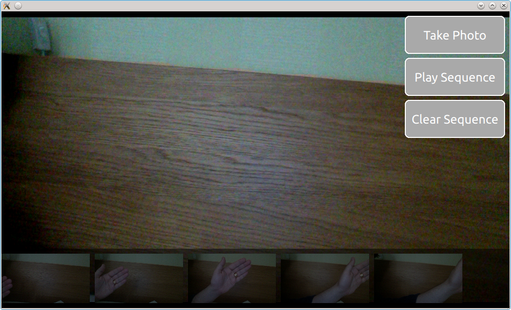

==========
멀티미디어
==========

.. sectionauthor:: `e8johan <https://bitbucket.org/e8johan>`_

.. issues:: ch10

.. note::

    Last Build: |today|

    이번 장의 소스 코드는 `assets 폴더 <../../assets>`_ 에서 확인할 수 있습니다.

Qt Multimedia의 멀티미디어 element들은 음악이나 비디오, 사진과 같은 미디어를 재생하고 녹화하는 기능을 제공합니다. 미디어에 대한 디코딩(decoding)과 인코딩(encoding)은 각 플랫폼에 특화된 백엔드(backend)를 통해 이루어집니다. 예를 들어 Linux에서는 많이 쓰이는 gstreamer를 백엔드로 하고, Windows에서는 DirectShow, OS X에서는 QuickTime이 사용됩니다.

멀티미디어 element들은 Qt Quick의 핵심 API에 속해있지 않습니다. 대신 아래와 같이 QtMultimedia 5.6를 임포트(import)하면 해당 패키지에서 제공하는 별도의 API를 사용할 수 있습니다::

    import QtMultimedia 5.6

미디어 재생하기
---------------

.. issues:: ch10

QML 애플리케이션에서 멀티미디어 통합의 가장 기본은 미디어 재생일 것입니다. 미디어 재생은 ``MediaPlayer`` element를 통해 수행됩니다. 소스가 이미지나 비디오인 경우에는 ``VideoOutput`` element와 연계되어야 합니다. ``MediaPlayer`` element는 재생할 미디어를 가리키는 ``source`` 속성을 가지고 있습니다. 미디어 소스가 바인딩(binding) 되면 간단하게 ``play`` 함수를 호출하여 재생을 시작할 수 있습니다.

이미지나 비디오처럼 화면 상에 출력되는 미디어를 재생하려면 ``VideoOutput`` element도 설정해주어야 합니다. 미디어를 재생하는 ``MediaPlayer`` 는 ``source`` 속성을 통해 video output과 바인딩됩니다.

아래 예제를 보시면, ``MediaPlayer`` 의 ``source`` 에 비디오 컨텐츠를 가진 파일이 주어집니다. ``VideoOutput`` 을 생성하고 media player를 바인딩합니다. 최상위 컴포넌트가 완전히 초기화되는 시점( ``Component.onCompleted`` 핸들러)에 player의 ``play`` 함수가 호출됩니다.

.. literalinclude:: src/basic-playback/main.qml
    :start-after: M1>>
    :end-before: <<M1

미디어 재생시 볼륨 변경과 같은 기본적인 동작은 ``MediaPlayer`` element의 ``volume`` 속성을 통해 제어됩니다. 그 외에 다른 유용한 속성도 있습니다. 예를 들어 ``duration`` 과 ``position`` 속성은 재생시간 표시줄(progress bar)를 만드는 데 사용할 수 있습니다. ``seekable`` 속성이 ``true`` 라면, 재생시간 표시줄의 특정 위치를 선택했을 때 ``position`` 을 업데이트하는 것도 가능합니다. 아래 예제는 이러한 동작을 위의 기본 재생 예제에 어떻게 추가하는지 보여줍니다.

.. literalinclude:: src/progressbar/main.qml
    :start-after: M1>>
    :end-before: <<M1

기본적으로 ``position`` 속성은 1초에 한 번씩 업데이트됩니다. 미디어의 전체 재생시간이 길지 않다면, 긴 재생시간 표시줄에서 막대가 큰 폭으로 갱신될 것입니다. 하지만 이러한 동작은 ``mediaObject`` 속성과 ``notifyInterval`` 속성을 통해 변경 가능합니다. 재생 위치의 업데이트 주기를 1/1000 초 단위로 설정하여 부드러운 사용자 인터페이스를 제공할 수 있습니다.

.. literalinclude:: src/progressbar/main.qml
    :start-after: M2>>
    :end-before: <<M2

.. todo:: The code above does not have any effect on the update interval! There seems to be no media object...

``MediaPlayer`` 를 사용하여 미디어 플레이어를 만들 때, 플레이어의 ``status`` 속성을 확인하는 것이 좋습니다. 해당 속성은 ``MediaPlayer.Buffered`` 에서 ``MediaPlayer.InvalidMedia`` 까지 미디어의 상태를 나타내는 enum 타입 속성입니다. 가능한 값들은 아래 리스트에 나열되어 있습니다:

* ``MediaPlayer.UnknownStatus``. 알 수 없는 상태입니다.
* ``MediaPlayer.NoMedia``. 플레이어에 미디어 소스가 할당되지 않았습니다. 재생은 멈춰 있습니다.
* ``MediaPlayer.Loading``. 플레이어가 미디어를 로드하고 있습니다.
* ``MediaPlayer.Loaded``. 미디어가 로드되었습니다. 재생은 멈춰 있습니다.
* ``MediaPlayer.Stalled``. 미디어가 로드되는 중에 진행이 멈췄습니다.
* ``MediaPlayer.Buffering``. 미디어가 버퍼링 중입니다.
* ``MediaPlayer.Buffered``. 미디어의 버퍼링이 완료되었고, 이는 플레이어가 미디어 재생을 시작할 수 있음을 의미합니다.
* ``MediaPlayer.EndOfMedia``. 미디어의 끝부분에 도달했습니다. 재생은 멈춰 있습니다.
* ``MediaPlayer.InvalidMedia``. 미디어가 재생될 수 없습니다. 재생은 멈춰 있습니다.

위 리스트에 언급된 것처럼, 재생 상태는 시간이 지남에 따라 바뀔 수 있습니다. ``play`` 나 ``pause``, ``stop`` 과 같은 함수 호출에 의해 상태가 변경되고, 미디어 그 자체가 영향을 미칠 수도 있습니다. 예를 들어 재생이 끝났거나 미디어가 유효하지 않아 재생이 멈출 수 있습니다. 현재 재생 상태는 ``playbackState`` 속성을 통해 추적할 수 있습니다. 그 값은 ``MediaPlayer.PlayingState``, ``MediaPlayer.PausedState``, ``MediaPlayer.StoppedState`` 등이 될 수 있습니다.

``autoPlay`` 속성을 사용해서 ``MediaPlayer`` 의 ``source`` 속성이 바뀌자마자 재생하도록 설정할 수 있습니다. 비슷한 속성으로 ``autoLoad`` 가 있는데, 이 속성은 ``source`` 속성이 변경되었을 때 바로 미디어를 로드합니다. 이 속성은 기본적으로 활성화되어 있습니다.

``MediaPlayer`` 가 미디어를 반복 재생하도록 설정하는 것도 가능합니다. ``loops`` 속성은 ``source`` 가 몇 번 재생될 지를 제어합니다. 해당 속성을 ``MediaPlayer.Infinite`` 로 설정하면 재생은 무한 반복됩니다. 이 속성은 앞뒤가 이어지는 애니메이션이나 배경 음악을 반복 재생하는데 적합하겠습니다.

사운드 효과
-------------

.. issues:: ch10

사운드 효과를 재생할 때는 재생 요청으로부터 실제 재생까지의 반응 시간이 중요합니다. 이런 상황에서는 ``SoundEffect`` element가 유용합니다. ``source`` 속성이 설정되어 있었다면, ``play`` 함수를 호출하는 즉시 재생을 시작합니다.

이러한 기능은 아래 예처럼 화면 선택에 대한 오디오 피드백을 주는데 이용할 수 있습니다.

.. literalinclude:: src/sound-effects/main.qml
    :start-after: M1>>
    :end-before: <<M1

이 element는 transition에 오디오를 결합할 때도 사용할 수 있습니다. Transition 중간에 재생을 시작하기 위해 ``ScriptAction`` element가 사용됩니다.

.. literalinclude:: src/sound-effects/main.qml
    :start-after: M2>>
    :end-before: <<M2

``play`` 함수 외에도 ``MediaPlayer`` 에서 제공하는 것과 유사한 속성들이 사용 가능합니다. 예를 들어 ``volume`` 과 ``loops`` 속성이 바로 그것들입니다. 사운드 효과를 무한 반복하려면 ``loops`` 속성을 ``SoundEffect.Infinite`` 로 설정합니다. 재생을 멈추기 위해서는 ``stop`` 함수를 호출합니다.

.. note:: PulseAudio 백엔드가 사용될 때는 ``stop`` 함수 호출 시, 재생이 즉시 멈추는 것이 아니라 다음 루프(loop)로의 진행이 중단됩니다. 이러한 동작성은 백엔드 API의 제한과 관련 있습니다.

비디오 스트림
-------------

.. issues:: ch10

``VideoOutput`` element가 항상 ``MediaPlayer`` element와 함께 사용되어야 하는 것은 아닙니다. 라이브 비디오 스트림을 재생하기 위해 비디오 소스와 직접 연결하여 사용될 수도 있습니다. ``Camera`` element를 ``source`` 속성으로 사용하는 것이 하나의 예입니다. ``Camera`` 로부터 출력되는 비디오 스트림은 사용자에게 라이브 스트림을 제공합니다. 이 스트림은 사진을 찍을 때 미리 보기 화면처럼 동작합니다.

.. literalinclude:: src/video-stream/main.qml
    :start-after: M1>>
    :end-before: <<M1

이미지 캡쳐하기
----------------

.. issues:: ch10

``Camera`` element의 핵심 기능 중 하나는 비디오 스트림을 캡쳐하는 것입니다. 우리는 이 기능을 간단한 스톱-모션 애플리케이션을 구현하는데 사용할 것입니다. 이 예제를 통해서 어떻게 뷰 파인더를 표시하고, 스냅 사진을 찍고, 찍은 사진은 어떻게 처리하는지 배우게 됩니다.

사용자 인터페이스는 아래와 같이 3개의 주요 부분으로 구성됩니다. 배경에는 뷰 파인더가 있고, 우측에는 버튼이, 하단에는 촬영한 사진 목록이 있습니다. 아이디어는 일련의 사진을 찍고, Play Sequence 버튼을 클릭하면 촬영한 이미지가 다시 재생되면서 간단한 스톱-모션 영화가 만들어지는 것입니다.

카메라의 퓨 파인더 부분은 단순히 ``Camera`` element이고 이것은 ``VideoOutput`` 의 ``source`` 로 사용됩니다. 이러한 코드는 사용자가 카메라로부터 전달되는 라이브 비디오 스트림을 볼 수 있게 해줍니다.

.. literalinclude:: src/camera/main.qml
    :start-after: M1>>
    :end-before: <<M1

사진 목록은 이미지를 수평으로 나열하는 ``ListView`` 이며, 이미지의 소스는 ``ListModel`` 을 통해 ``imagePaths`` 라는 이름으로 전달됩니다. 배경은 ``Rectangle`` 을 사용한 반투명의 검정색 사각형입니다.

.. literalinclude:: src/camera/main.qml
    :start-after: M2>>
    :end-before: <<M2

사진을 찍으려면 ``Camera`` element에 다양한 작업을 위한 하위 element들이 있다는 것을 알아야 합니다. 스틸 사진을 캡쳐하기 위해 ``Camera.imageCapture`` element가 사용됩니다. ``capture`` 함수를 호출하면 사진이 찍힙니다. 그 결과로 ``Camera.imageCapture`` 에서 ``imageCaptured`` 시그널이 먼저 발생하고 그 다음 ``imageSaved`` 시그널이 발생합니다.

.. literalinclude:: src/camera/main.qml
    :start-after: M4>>
    :end-before: <<M4

하위 element의 시그널을 가로채려면 ``Connections`` element가 필요합니다. 예제의 경우에는 미리보기 이미지를 표시할 필요 없이 단순히 결과 이미지를 화면 하단의 ``ListView`` 에 추가하면 됩니다. 아래 예제에서 볼 수 있듯이 저장된 이미지의 경로는 시그널의 인자인 ``path`` 로 전달됩니다.

.. literalinclude:: src/camera/main.qml
    :start-after: M3>>
    :end-before: <<M3

미리보기를 표시하기 위해 ``imageCaptured`` 시그널을 연결하고 시그널을 통해 전달되는 ``preview`` 인자를 ``Image`` element의 ``source`` 로 사용합니다. ``requestId`` 시그널 인자는 ``imageCaptured`` 와 ``imageSaved`` 시그널을 통해 전달됩니다. 이 값은 ``capture`` 함수로부터 리턴되는 값입니다. 이 값을 통해 캡쳐된 이미지의 처리 과정을 추적할 수 있습니다. 이를 통해 처음에는 미리보기를 사용한 다음, 이미지가 문제 없이 저장되었을 때 해당 이미지로 바꾸는 것도 가능합니다. 하지만 우리의 예제에서 그러한 동작은 구현하지 않을 예정입니다.

애플리케이션의 마지막 부분은 실제 미디어 재생입니다. 이것은 ``Timer`` element와 약간의 JavaScript 코드에 의해 구동됩니다. ``_imageIndex`` 변수는 현재 보여지는 이미지를 추적하는데 사용됩니다. 마지막 이미지가 표시되면 재생은 멈춥니다. 예제에서 ``root.state`` 는 시퀀스를 재생할 때 사용자 인터페이스 부분을 숨기는데 사용됩니다.

.. literalinclude:: src/camera/main.qml
    :start-after: M5>>
    :end-before: <<M5

고급 테그닉
-------------------

.. issues:: ch10

.. todo:: The Camera API of Qt 5 is really lacking in documentation right now. I would love to cover more advanced camera controls such as exposure and focusing, but there are no ranges or values, nor clear guides to how to use the APIs in the reference docs right now.

재생 목록 구현하기
=======================

.. issues:: ch10

Qt5 multimedia에서 재생 목록을 위한 API를 제공하지는 않습니다. 하지만 기존 API로 쉽게 구성할 수 있습니다. 아이디어는 재생할 아이템의 모델을 생성하고 아래 보이는 것처럼 ``MediaPlayer`` element 아이템에 지정하는 것입니다. ``Playlist`` element는 player에서 재생 상태가 바뀔 때, ``MediaPlayer`` 의 ``source`` 를 설정해주는 역할을 합니다.

.. literalinclude:: src/playlist/main.qml
    :start-after: M1>>
    :end-before: <<M1

아래 보이는 ``Playlist`` element의 앞부분은 ``setIndex`` 함수에서 주어진 index에 대해 ``source`` element를 설정합니다. 그리고 뒷부분에서는 목록을 탐색할 때 호출되는 ``next`` 와 ``previous`` 함수를 구현합니다.

.. literalinclude:: src/playlist/Playlist.qml
    :start-after: M1>>
    :end-before: <<M1

재생 목록의 각 element 끝에서 다음 element로 이어지도록 만드는 비법은 ``MediaPlayer`` 의 ``status`` 속성을 모니터링하는 것입니다. ``MediaPlayer.EndOfMedia`` 상태가 되자마자 index를 증가시키고 재생을 다시 시작하거나, 목록의 끝에 왔을 때 재생을 멈추도록 합니다.

.. literalinclude:: src/playlist/Playlist.qml
    :start-after: M2>>
    :end-before: <<M2

요약
-------

.. issues:: ch10

Qt에서 제공하는 미디어 API는 비디오와 오디오를 재생하고 기록하는 메커니즘을 제공합니다. ``VideoOutput`` element를 통해 비디오 소스를 사용자 인터페이스와 함께 표시할 수 있습니다. ``MediaPlayer`` element를 통해서는 대부분의 재생 동작을 제어할 수 있고, 빠른 반응속도를 가져야 하는 소리를 재생하기 위해서는 ``SoundEffect`` 를 사용할 수 있습니다. 라이브 비디오 스트림을 캡쳐하거나 재생만 하고자 한다면 ``Camera`` element를 사용할 수 있습니다.
