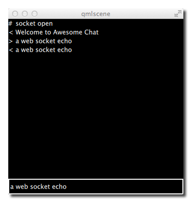

========
네트워킹
========

.. sectionauthor:: `jryannel <https://github.com/jryannel>`_

.. issues:: ch11

.. note::

    Last Build: |today|

    이번 장의 소스 코드는 `assets 폴더 <../../assets>`_ 에서 확인할 수 있습니다.

Qt 5는 C++로 작성된 풍부한 네트워크 관련 클래스를 제공합니다. 예를 들어 ``QNetworkRequest`` 와 ``QNetworkReply``, ``QNetworkAccessManager`` 와 같이 요청-응답 방식으로 HTTP 프로토콜 계층에서 동작하는 상위 레벨 클래스가 존재합니다. 그리고 ``QTcpSocket`` 과 ``QTcpServer``, ``QUdpSocket`` 와 같이 TCP/IP나 UDP 프로토콜 계층을 위한 하위 레벨의 클래스도 있습니다. 또한 프록시와 네트워크 캐시(network cache), 시스템 네트워크 설정 등을 관리하기 위한 클래스도 제공합니다.

이 장은 C++ 네트워킹에 대한 내용은 아니며, Qt Quick과 네트워킹에 대한 내용을 다루고 있습니다. 그러면 QML/JS 사용자 인터페이스를 네트워크 서비스에 직접 연결하거나 네트워크 서비스를 통해 사용자 인터페이스를 제공하려면 어떻게 해야 할까요. Qt/C++을 통한 네트워크 프로그래밍을 다룬 좋은 책과 참고 자료가 있습니다. 그 다음 C++과의 통합을 다룬 챕터(역자 주: 15장과 16장)를 읽고 여러분의 데이터를 Qt Quick 세상으로 전달하는 통합 레이어를 만드는 것이 좋겠습니다.

HTTP를 통해 UI 제공하기
=======================

.. issues:: ch11

HTTP를 통해 간단한 사용자 인터페이스를 로드하려면 UI 문서를 제공하는 웹서버가 있어야 합니다. 우리는 일단 python 커맨드로 실행하는 간단한 웹서버를 가지고 시작하겠습니다. 하지만 그 전에 데모 UI가 필요합니다. 이를 위해 프로젝트 폴더에 작은 ``main.qml`` 파일을 생성하고 그 안에 빨간 사각형을 추가하겠습니다.

.. literalinclude:: src/http_v1/main.qml
    :start-after: M1>>
    :end-before: <<M1

이 파일을 웹서버에서 제공하기 위해 간단한 python 스크립트를 실행합니다::

    $ cd <PROJECT>
    # python -m SimpleHTTPServer 8080

이제 우리의 파일은 ``http://localhost:8080/main.qml`` 을 통해 접근이 가능해졌습니다. 아래와 같이 테스트해 볼 수 있습니다::

    $ curl http://localhost:8080/main.qml

또는 웹브라우저에 해당 주소를 입력할 수도 있습니다. 여러분의 브라우저는 QML을 인식하지 못하기 때문에 문서를 렌더링할 수 없을 것입니다. 이제 QML 문서를 위한 일종의 브라우저를 만들 차례입니다. 문서를 렌더링하기 위해서는 ``qmlscene`` 도구가 해당 위치를 가리키도록 해야 합니다. 하지만 아쉽게도 ``qmlscene`` 은 로컬 파일만 적용 가능합니다. 이러한 제약을 극복하기 위해서 ``qmlscene`` 을 대체할 우리만의 도구를 구현하고, QML을 사용해서 해당 파일을 간단하게 동적으로 로드할 수 있습니다. 이 예제에서는 동작만 잘 하면 되기 때문에 우리는 동적 로딩을 선택하겠습니다. 이를 위해 loader element를 이용해서 원격 문서를 가져옵니다.

.. literalinclude:: src/http_v1/remote.qml
    :start-after: M1>>
    :end-before: <<M1

이제 우리는 ``qmlscene`` 에게 로컬 파일인 ``remote.qml`` 문서를 로드하라고 요청할 수 있습니다. 여기에 아직 한가지 결점이 있습니다. 로더는 로드된 item의 크기를 재조정할 것입니다. 그래서 우리의 ``qmlscene`` 이 그 크기에 맞추도록 조정할 필요가 있습니다. 이를 위해 ``qmlscene`` 실행 시에 ``--resize-to-root`` 옵션을 추가합니다::

    $ qmlscene --resize-to-root remote.qml

Resize to root는 qmlscene에게 창의 크기를 root element의 크기로 맞추라고 요청하는 옵션입니다. remote는 이제 로컬 서버에서 ``main.qml`` 를 로드하고 창의 크기는 로드된 사용자 인터페이스에 맞게 조정됩니다. 깔끔하고 단순하죠.

.. note::

    로컬 서버를 실행하고 싶지 않다면 GitHub의 gist 서비스를 활용할 수도 있습니다. Gist는 PasteBin과 같은 일종의 온라인 클립보드 서비스입니다. https://gist.github.com 에서 해당 서비스를 이용할 수 있습니다. 저는 이 예제를 https://gist.github.com/jryannel/7983492 와 같은 URL에 작은 gist를 만들었습니다. 이 파일을 로드하면 녹색 사각형이 나타날 것입니다. gist 주소는 HTML 코드로 이루어진 웹페이지를 제공하기 때문에 HTML 코드가 아닌 원시 파일을 가져오기 위해서는 URL에 ``/raw`` 를 추가해야 합니다.

    .. literalinclude:: src/http_v1/remote2.qml
        :start-after: M1>>
        :end-before: <<M1

네트워크 상의 다른 파일을 로드하려면 단지 component의 이름을 참조하기만 하면 됩니다. 예를 들어 ``Button.qml`` 라는 파일이 같은 원격 폴더에 있다면 평상시처럼 Button이란 이름으로 접근할 수 있습니다.

.. todo:: Is this true? What are the rules?

Networked Components
--------------------

간단한 테스트를 해봅시다. 재사용가능한 component인 작은 버튼을 서버에 추가합니다.

::

    - src/main.qml
    - src/Button.qml

이 버튼을 사용하도록 ``main.qml`` 을 수정하고 ``main2.qml`` 이라는 이름으로 저장합니다::

    import QtQuick 2.5

    Rectangle {
        width: 320
        height: 320
        color: '#ff0000'

        Button {
            anchors.centerIn: parent
            text: 'Click Me'
            onClicked: Qt.quit()
        }
    }

그리고 웹서버를 다시 실행합니다::

    $ cd src
    # python -m SimpleHTTPServer 8080

그 다음 리모트 로더(remote loader)는 HTTP를 통해 main QML을 다시 로드합니다::

    $ qmlscene --resize-to-root remote.qml

그러면 다음과 같은 에러를 만나게 됩니다::

    http://localhost:8080/main2.qml:11:5: Button is not a type

원격으로 로드된 QML에서는 버튼 component를 인지할 수 없습니다. 만약 코드가 ``qmlscene src/main.qml`` 과 같이 로컬에서 로드되었다면 아무 이슈도 없었을 것입니다. 로컬에서 Qt가 디렉토리를 탐색해서 어느 component가 사용가능한 지 알아낼 수 있었을 것입니다. 하지만 리모트에서는 HTTP를 위한 "list-dir" 과 같은 기능이 없습니다. 대신 ``main.qml`` 안에 import 구문을 사용하여 로드할 element를 임의로 지정할 수 있습니다::

    import "http://localhost:8080" as Remote

    ...

    Remote.Button { ... }

이제 ``qmlscene`` 을 다시 실행하면 문제 없이 동작할 것입니다::

    $ qmlscene --resize-to-root remote.qml

전체 코드는 아래와 같습니다:

.. literalinclude:: src/http_v1/main2.qml
    :start-after: M1>>
    :end-before: <<M1

더 좋은 방법은 서버 측에서 export할 파일을 제어하도록 ``qmldir`` 파일을 사용하는 것입니다.

.. literalinclude:: src/http_v1/qmldir

그 다음 ``main.qml`` 파일을 업데이트합니다::

    import "http://localhost:8080" 1.0 as Remote

    ...

    Remote.Button { ... }

.. note:: Loading

로컬 파일 시스템에서 component를 사용할 때 해당 component는 지연 없이 즉시 생성됩니다. 하지만 네트워크를 통해 로드될 때는 비동기적으로 생성됩니다. 이 때문에 component의 생성 시간은 예측하기 힘들고 다른 element가 이미 로딩을 끝난 상태임에도 어떤 element는 아직 완전히 로드되지 않있을지도 모릅니다. 네트워크를 통해 로드되는 component를 다룰 때는 이러한 점에 유의하세요.

Templating
==========

.. issues:: ch11

HTML 프로젝트와 함께 작업할 때, 종종 템플릿 중심의 개발을 해야할 경우가 있습니다. 작은 HTML 코드는 템플릿을 통해 서버 측에서 생성된 코드와 함께 확장됩니다. 예를 들어 사진 목록에 대해서 리스트의 헤더는 HTML로 작성하고 이미지의 리스트는 템플릿을 사용해 동적으로 생성됩니다. 일반적으로 이러한 방식은 QML을 통해서도 가능하지만, 여기에 몇 가지 이슈가 있습니다.

먼저 이러한 방법 자체가 필요치 않습니다. HTML 개발자가 이러한 방식을 사용하는 이유는 HTML 백엔드의 제약을 극복하기 위함입니다. HTML에는 아직 component 모델이 없습니다. 그래서 컨텐츠의 동적인 생성은 이러한 템플릿 메커니즘을 사용하거나 클라이언트 측에서 동작하는 자바스크립트 프로그래밍을 통해 대응합니다. 많은 자바스크립트 프레임워크(jQuery, dojo, backbone, angular, ...)가 이러한 이슈를 해결하기 위해 존재하고, 네트워크 서비스와 연결하여 클라이언트 측 브라우저에 더 많은 로직을 넣을 수 있도록 해줍니다. 그런 다음 클라이언트는 서버에 접속해서 (JSON이나 XML 데이터를 제공하는) 웹서비스 API를 사용합니다. 이러한 접근은 QML에 더 적합한 방식입니다.

두번째 이슈는 QML의 component 캐쉬(cache)입니다. QML이 어떤 component를 접근하면 렌더-트리(render-tree) 캐쉬에 저장하고, 렌더링을 위해서는 캐쉬된 버전만 로드합니다. 디스크나 리모트에서 발생한 변경사항은 클라이언트를 재시작하기 전에는 알 수 없습니다. 이를 극복하기 위한 한가지 트릭은 있습니다. URL fragment를 사용하여 URL을 로드하는 것입니다. (예, http://localhost:8080/main.qml#1234) 여기서 '#1234' 가 fragment입니다. HTTP 서버는 항상 같은 문서를 제공합니다. 하지만 QML은 fragment를 포함한 전체 URL을 사용해서 이 문서를 저장하기 때문에, 내용이 변경되었을 때 fragment을 바꾸어 접근함으로써 QML 캐쉬의 효과를 무력화할 수 있습니다. 이 때 fragment로는 1/1000초 단위의 현재 시각을 사용할 수 있고, 무작위 숫자를 사용할 수도 있습니다.

::

    Loader {
        source: 'http://localhost:8080/main.qml#' + new Date().getTime()
    }

요약하면, 템플릿은 사용 가능합니다. 하지만 추천되는 방법은 아니며 QML의 장점을 보여주지 못합니다. 더 좋은 접근 방법은 JSON이나 XML 데이터를 제공하는 웹 서비스를 사용하는 것입니다.

HTTP 요청
=========

.. issues:: ch11

Qt에서 HTTP 요청은 일반적으로 C++ 단의 ``QNetworkRequest`` 와 ``QNetworkReply`` 를 사용하여 처리됩니다. 그리고 해당 요청에 대한 회신은 Qt/C++ 연동을 통해 QML 세계로 보내집니다. 여기서 우리는 네트워크 엔드포인트(endpoint)와의 통신을 위해 Qt Quick이 제공하는 기본적인 도구를 이용해보고, 그와 관련된 약간의 부가적인 작업들을 소개하려고 합니다. 이를 위해 HTTP 요청을 만들고 응답을 처리하는 일련의 과정을 도와줄 객체를 사용합니다. 그것은 자바스크립트 ``XMLHttpRequest`` 객체의 형태로 제공됩니다.

``XMLHttpRequest`` 객체는 사용자가 응답을 처리할 함수와 URL을 등록할 수 있게 해줍니다. 요청은 HTTP 메소드 (get, post, put, delete, ...) 중 하나를 사용하여 보내집니다. 회신이 도착하면 등록된 함수가 호출됩니다. 이 때 해당 함수는 응답 상태가 변경될 때마다 호출됩니다 (예를 들어, 헤더가 도착했거나 요청이 완료되었을 때).

여기에 간단한 예가 있습니다::

    function request() {
        var xhr = new XMLHttpRequest();
        xhr.onreadystatechange = function() {
            if (xhr.readyState === XMLHttpRequest.HEADERS_RECEIVED) {
                print('HEADERS_RECEIVED');
            } else if(xhr.readyState === XMLHttpRequest.DONE) {
                print('DONE');
            }
        }
        xhr.open("GET", "http://example.com");
        xhr.send();
    }

응답의 형식으로 XML 포맷 혹은 원시 텍스트(raw text)를 받을 수 있습니다. 회신받은 XML을 순회하며 값을 얻어내는 것도 가능하지만, 요즘은 JSON 형식의 원시 텍스트를 사용하는 것이 더 일반적입니다. JSON 문서는 ``JSON.parse(text)`` 를 통해 텍스트를 JS 객체로 변환하여 사용됩니다.

::

    ...
    } else if(xhr.readyState === XMLHttpRequest.DONE) {
        var object = JSON.parse(xhr.responseText.toString());
        print(JSON.stringify(object, null, 2));
    }

응답 핸들러에서 우리는 원시 응답 텍스트에 접근하고 그것을 자바스크립트 객체로 변환합니다. 이 JSON 객체는 이제 유효한 JS 객체가 됩니다 (자바스크립트에서 하나의 객체는 객체 또는 배열이 될 수 있습니다).

.. note::

    ``toString()`` 변환은 코드를 좀 더 안정적으로 만들어줄 수 있습니다. 명시적인 변환이 없었다면 여러번의 구문 오류를 겪어야 했을겁니다. 무엇이 원인인지 모르는 체 말이죠.

Flickr 호출
-----------

좀 더 실용적인 예제를 살펴봅시다. 전형적인 예는 Flickr와 같은 서비스를 통해 새로 업로드된 공개 사진 피드를 가져오는 것입니다. 이를 위해 우리는 ``http://api.flickr.com/services/feeds/photos_public.gne`` URL을 사용할 수 있습니다. 아쉽게도 해당 피드는 기본적으로 XML 스트림을 반환합니다. 하지만 이 경우에도 QML의 ``XmlListModel`` 를 통해 쉽게 파싱할 수 있습니다. 이 예제에서는 그보다 JSON 데이터에 초점을 맞추려고 합니다. 깨끗한 JSON 응답을 얻기 위해서는 해당 요청에 몇 가지 파라미터를 추가해야 합니다: ``http://api.flickr.com/services/feeds/photos_public.gne?format=json&nojsoncallback=1`` 이제 JSON 콜백이 없는 JSON 응답이 반환될 것입니다.

.. note::

    JSON 콜백은 JSON 응답을 함수 호출로 감싸줍니다. 이것은 JSON 요청을 위해 스크립트 태그가 사용되는 HTML 프로그래밍에 편의를 주기 위한 것입니다. 이러한 응답은 콜백에 정의된 로컬 함수를 호출할 것입니다. QML에는 JSON 콜백과 함께 작동하는 매커니즘이 없습니다.

먼저 curl을 사용해 응답을 확인해봅시다:

::

    curl "http://api.flickr.com/services/feeds/photos_public.gne?format=json&nojsoncallback=1&tags=munich"

응답은 아래와 같을 것입니다:

::

    {
        "title": "Recent Uploads tagged munich",
        ...
        "items": [
            {
            "title": "Candle lit dinner in Munich",
            "media": {"m":"http://farm8.staticflickr.com/7313/11444882743_2f5f87169f_m.jpg"},
            ...
            },{
            "title": "Munich after sunset: a train full of \"must haves\" =",
            "media": {"m":"http://farm8.staticflickr.com/7394/11443414206_a462c80e83_m.jpg"},
            ...
            }
        ]
        ...
    }

반환된 JSON 문서는 정의된 구조를 가지고 있습니다. 하나의 객체는 title와 items 속성을 가지고 있습니다. 이 때 title은 문자열이고 items는 객체의 배열입니다. 이 텍스트를 JSON 문서로 변환하면 개별 항목을 JS 객체/배열과 동일하게 사용할 수 있습니다.

::

    // JS code
    obj = JSON.parse(response);
    print(obj.title) // => "Recent Uploads tagged munich"
    for(var i=0; i<obj.items.length; i++) {
        // iterate of the items array entries
        print(obj.items[i].title) // title of picture
        print(obj.items[i].media.m) // url of thumbnail
    }

유효한 JS 배열이라면 리스트뷰를 위한 모델로 ``obj.items`` 배열을 사용할 수 있습니다. 이것이 정말 가능한지 지금 테스트해 보겠습니다. 먼저, 응답을 받아오고 그것을 유효한 JS 객체로 변환해야 합니다. 그 다음엔 리스트뷰에 대한 모델로 ``response.items`` 속성을 설정해주기만 하면 됩니다.

::

    function request() {
        var xhr = new XMLHttpRequest();
        xhr.onreadystatechange = function() {
            if(...) {
                ...
            } else if(xhr.readyState === XMLHttpRequest.DONE) {
                var response = JSON.parse(xhr.responseText.toString());
                // set JS object as model for listview
                view.model = response.items;
            }
        }
        xhr.open("GET", "http://api.flickr.com/services/feeds/photos_public.gne?format=json&nojsoncallback=1&tags=munich");
        xhr.send();
    }

여기에 전체 소스 코드가 있습니다. Component가 로드되면 요청을 생성합니다. 그리고 요청에 대한 응답은 예의 간단한 리스트뷰의 모델로 사용됩니다.

.. literalinclude:: src/httprequest/httprequest.qml

문서가 완전히 로드되었을 때 ( ``Component.onCompleted`` ), Flickr로부터 최신 피드를 요청합니다. JSON 응답이 도착하면 파싱하고 ``items`` 를 뷰의 모델로 설정합니다. 리스트뷰는 하나의 행에 썸네일 아이콘과 title 텍스트를 표시하는 delegate를 가지고 있습니다.

다른 옵션은 placeholder로 ``ListModel`` 를 사용하고 각각의 아이템을 리스트 모델에 추가하는 것입니다. 더 큰 모델을 지원하려면 페이지 넘김(예: 10 페이지 중 1)과 동적 컨텐츠 로딩이 필요합니다.

로컬 파일
=========

.. issues:: ch11

XMLHttpRequest를 사용하여 로컬 파일 (XML/JSON) 을 로드하는 것도 가능합니다. 예를 들어 "colors.json" 이란 이름의 로컬 파일은 아래와 같이 로드될 수 있습니다:

::

	xhr.open("GET", "colors.json");

이 파일에서 색상 테이블을 읽고 그것을 그리드로 표시하려고 합니다. Qt Quick에서 파일을 수정하는 것은 불가능합니다. 데이터를 다시 원본 소스에 저장하려면 HTTP 서버에 간단한 REST API를 만들거나 파일 접근을 위한 Qt Quick 확장을 구현해야 합니다.

.. literalinclude:: src/localfiles/localfiles.qml

``XMLHttpRequest`` 를 사용하는 대신 로컬 파일에 접근하기 위해 XmlListModel을 사용하는 것도 가능합니다.

::

    import QtQuick.XmlListModel 2.0

    XmlListModel {
        source: "http://localhost:8080/colors.xml"
        query: "/colors"
        XmlRole { name: 'color'; query: 'name/string()' }
        XmlRole { name: 'value'; query: 'value/string()' }
    }

XmlListModel은 XML 파일을 읽는 것만 가능합니다. JSON 파일에는 사용할 수 없습니다.

REST API
========

.. issues:: ch11

웹서비스를 이용하려면 먼저 웹서비스를 만들어야 합니다. 우리는 Flask (http://flask.pocoo.org) 를 사용해서 색상 테이블을 제공하는 python 기반의 간단한 웹서비스를 만들어 보겠습니다. 여러분은 JSON 데이터를 주고 받을 수 있는 다른 웹서버도 사용할 수 있습니다. 아이디어는 웹서비스를 통해 관리될 수 있는 이름을 가진 색상 리스트를 만드는 것입니다. 이 경우에 관리된다는 것은 CRUD (create-read-update-delete)를 의미합니다.

Flask에서 간단한 웹서비스는 파일 하나로 작성할 수 있습니다. ``server.py`` 라는 이름의 빈 파일에서 시작해보겠습니다. 이 파일 안에 기본적인 기반 코드를 추가하고 외부 JSON 파일로부터 초기 색상들을 불러옵니다. 자세한 내용은 Flask `quickstart <http://flask.pocoo.org/docs/quickstart/>`_ 문서를 참고하세요.

.. code-block:: py

    from flask import Flask, jsonify, request
    import json

    colors = json.load(file('colors.json', 'r'))

    app = Flask(__name__)

    # ... service calls go here

    if __name__ == '__main__':
        app.run(debug = True)

이 스크립트를 실행하면 http://localhost:5000 에 웹서버가 구동됩니다. 아직은 웹서버를 통해 아무것도 제공하지 않는 상태입니다.

이제 우리의 CRUD (Create,Read,Update,Delete) 엔드포인트(endpoint)를 이 작은 웹서비스에 추가해보겠습니다.

읽기 요청 (Read Request)
------------------------

웹서버로부터 데이터를 읽기 위해 모든 색상을 위한 GET 메소드를 제공합니다.

.. code-block:: py

    @app.route('/colors', methods = ['GET'])
    def get_colors():
        return jsonify( { "colors" :  colors })

이 스크립트는 '/colors' 엔드포인트 아래에 있는 색상들을 반환합니다. 이 함수를 테스트하기 위해 HTTP 요청을 생성하는 curl 명령을 사용할 수 있습니다.

::

    curl -i -GET http://localhost:5000/colors

그러면 JSON 데이터로 색상 목록이 반환될 것입니다.

항목 읽기 (Read Entry)
----------------------

이름으로 개별 색상을 읽어오기 위해 '/colors/<name>' 아래 위치한 세부 정보 엔드포인트를 제공합니다. 이 때 이름은 개별 색상을 식별하는 엔드포인트에 대한 파라미터입니다.

.. code-block:: py

    @app.route('/colors/<name>', methods = ['GET'])
    def get_color(name):
        for color in colors:
            if color["name"] == name:
                return jsonify( color )

그리고 다시 curl을 사용해 테스트할 수 있습니다. 예를 들어 빨간색 항목을 가져와봅시다.

.. code-block:: sh

    curl -i -GET http://localhost:5000/colors/red

JSON 데이터 형태로 한가지 색상 항목이 반환될 것입니다.

항목 만들기 (Create Entry)
--------------------------

지금까지 우리는 HTTP GET 메소드를 사용해왔습니다. 이제 서버 측에 항목을 생성하기 위해 POST 메소드를 사용해서 POST 데이터와 함께 새로운 색상 정보를 전달하려고 합니다. 엔드포인트의 위치는 모든 색상을 가져오는 곳과 동일합니다. 하지만 다른 점은 POST 요청으로 전달된다는 것입니다.

.. code-block:: py

    @app.route('/colors', methods= ['POST'])
    def create_color():
        color = {
            'name': request.json['name'],
            'value': request.json['value']
        }
        colors.append(color)
        return jsonify( color ), 201

Curl을 통해 POST 요청 안에 새로운 항목으로 JSON 데이터를 제공하는 것도 가능합니다.

.. code-block:: sh

    curl -i -H "Content-Type: application/json" -X POST -d '{"name":"gray1","value":"#333"}' http://localhost:5000/colors

항목 갱신하기 (Update Entry)
----------------------------

개별 항목을 업데이트하기 위해 PUT HTTP 메소드를 사용합니다. 엔드포인트는 개별 색상 항목을 가져오는 것과 같습니다. 해당 색상이 성공적으로 업데이트되면 갱신된 색상을 JSON 데이터로 반환합니다.

.. code-block:: py

    @app.route('/colors/<name>', methods= ['PUT'])
    def update_color(name):
        for color in colors:
            if color["name"] == name:
                color['value'] = request.json.get('value', color['value'])
                return jsonify( color )

Curl 요청에서 JSON 데이터로 업데이트될 값과 해당 색상을 식별하기 위한 엔드포인트 이름만 전달합니다.

.. code-block:: sh

    curl -i -H "Content-Type: application/json" -X PUT -d '{"value":"#666"}' http://localhost:5000/colors/red

항목 삭제하기 (Delete Entry)
----------------------------

항목을 삭제하는 것은 DELETE HTTP 메소드를 통해 이루어집니다. 이 경우에도 개별 색상에 대한 엔드포인트를 사용합니다. 대신 이번엔 DELETE HTTP 메소드를 사용합니다.

.. code-block:: py

    @app.route('/colors/<name>', methods=['DELETE'])
    def delete_color(name):
        success = False
        for color in colors:
            if color["name"] == name:
                colors.remove(color)
                success = True
        return jsonify( { 'result' : success } )

이 요청은 개별 색상에 대한 GET 요청과 유사해보입니다.

.. code-block:: sh

    curl -i -X DELETE http://localhost:5000/colors/red

이제 우리는 모든 색상을 읽을 수 있고, 개별 색상도 읽어올 수 있으며, 새로운 색상을 생성하고, 색상을 업데이트하고 삭제할 수도 있습니다. 또한 우리의 API에 대한 HTTP 엔드포인트를 알고 있습니다.

.. list-table::
    :widths: 40 20 40
    :header-rows: 1

    *   - Action
        - HTTP
        - Endpoint
    *   - Read All
        - GET
        - http://localhost:5000/colors
    *   - Create Entry
        - POST
        - http://localhost:5000/colors
    *   - Read Entry
        - GET
        - http://localhost:5000/colors/<name>
    *   - Update Entry
        - PUT
        - http://localhost:5000/colors/<name>
    *   - Delete Entry
        - DELETE
        - http://localhost:5000/colors/<name>

우리의 작은 REST 서버가 완성되었고 이제 QML과 클라이언트 측 코드에 집중할 수 있게 되었습니다. 사용하기 쉬운 API를 만들기 위해서는 각각의 동작을 개별 HTTP 요청에 매핑하고 사용자에게 간단한 API를 제공해야 합니다.

클라이언트 REST
---------------

REST 클라이언트를 시연하기 위해 작은 색상표를 작성합니다. 색상표는 HTTP 요청을 통해 웹서비스로부터 가져온 색상을 표시합니다. 사용자 인터페이스는 아래와 같은 명령을 제공합니다:

* 색상 목록 가져오기
* 색상 추가하기
* 마지막 색상 읽어오기
* 마지막 색상 갱신하기
* 마지막 색상 삭제하기

우리는 API를 ``colorservice.js`` 라는 JS 파일에 묶고 그것을 UI 코드에 ``Service`` 라는 이름으로 import합니다. 서비스 모듈 내부에서는 HTTP 요청을 만드는 도우미 함수를 작성합니다:

::

    // colorservice.js
    function request(verb, endpoint, obj, cb) {
        print('request: ' + verb + ' ' + BASE + (endpoint?'/' + endpoint:''))
        var xhr = new XMLHttpRequest();
        xhr.onreadystatechange = function() {
            print('xhr: on ready state change: ' + xhr.readyState)
            if(xhr.readyState === XMLHttpRequest.DONE) {
                if(cb) {
                    var res = JSON.parse(xhr.responseText.toString())
                    cb(res);
                }
            }
        }
        xhr.open(verb, BASE + (endpoint?'/' + endpoint:''));
        xhr.setRequestHeader('Content-Type', 'application/json');
        xhr.setRequestHeader('Accept', 'application/json');
        var data = obj?JSON.stringify(obj):''
        xhr.send(data)
    }

이 함수는 4개의 인자를 받습니다. ``verb`` 는 사용될 HTTP 메소드 (GET, POST, PUT, DELETE) 를 정의합니다. 두번째 파라미터는 BASE 주소 (예, 'http://localhost:5000/colors') 뒤에 추가할 접미사처럼 사용되는 엔드포인트입니다. 세번째 파라미터는 서비스에 JSON 데이터 형식으로 전달할 객체입니다. 마지막 파라미터는 응답이 도착했을 때 호출 될 콜백 함수를 정의합니다. 이 콜백 함수는 응답 데이터를 가진 객체를 전달 받습니다. 요청을 보내기 전에는 요청 헤더를 수정해서 JSON 데이터를 주고 받았다는 것을 나타냅니다.

이 함수를 사용해서 우리는 앞에서 정의한 간단한 명령 (create, read, update, delete) 들을 구현할 수 있습니다:

::

    // colorservice.js
    function get_colors(cb) {
        // GET http://localhost:5000/colors
        request('GET', null, null, cb)
    }

    function create_color(entry, cb) {
        // POST http://localhost:5000/colors
        request('POST', null, entry, cb)
    }

    function get_color(name, cb) {
        // GET http://localhost:5000/colors/<name>
        request('GET', name, null, cb)
    }

    function update_color(name, entry, cb) {
        // PUT http://localhost:5000/colors/<name>
        request('PUT', name, entry, cb)
    }

    function delete_color(name, cb) {
        // DELETE http://localhost:5000/colors/<name>
        request('DELETE', name, null, cb)
    }

이 코드는 서비스 구현부에 위치합니다. UI에서는 우리가 정의한 명령들을 구현하기 위해 이 서비스를 사용합니다. ``GridView`` 의 데이터 공급자로서 ``gridModel`` 라는 id를 가진 ``ListModel`` 을 정의합니다. 각 명령들은 ``Button`` UI element를 사용하여 표시합니다.

서버로부터 색상 목록을 읽어오기.

::

    // rest.qml
    import "colorservice.js" as Service
    ...
    // read colors command
    Button {
        text: 'Read Colors';
        onClicked: {
            Service.get_colors( function(resp) {
                print('handle get colors resp: ' + JSON.stringify(resp));
                gridModel.clear();
                var entries = resp.data;
                for(var i=0; i<entries.length; i++) {
                    gridModel.append(entries[i]);
                }
            });
        }
    }

서버에 새로운 색상 항목을 생성하기.

::

    // rest.qml
    import "colorservice.js" as Service
    ...
    // create new color command
    Button {
        text: 'Create New';
        onClicked: {
            var index = gridModel.count-1
            var entry = {
                name: 'color-' + index,
                value: Qt.hsla(Math.random(), 0.5, 0.5, 1.0).toString()
            }
            Service.create_color(entry, function(resp) {
                print('handle create color resp: ' + JSON.stringify(resp))
                gridModel.append(resp)
            });
        }
    }

이름으로 색상 읽어오기.

::

    // rest.qml
    import "colorservice.js" as Service
    ...
    // read last color command
    Button {
        text: 'Read Last Color';
        onClicked: {
            var index = gridModel.count-1
            var name = gridModel.get(index).name
            Service.get_color(name, function(resp) {
                print('handle get color resp:' + JSON.stringify(resp))
                message.text = resp.value
            });
        }
    }

색상 이름으로 서버의 색상 항목에 접근하여 정보 갱신하기.

::

    // rest.qml
    import "colorservice.js" as Service
    ...
    // update color command
    Button {
        text: 'Update Last Color'
        onClicked: {
            var index = gridModel.count-1
            var name = gridModel.get(index).name
            var entry = {
                value: Qt.hsla(Math.random(), 0.5, 0.5, 1.0).toString()
            }
            Service.update_color(name, entry, function(resp) {
                print('handle update color resp: ' + JSON.stringify(resp))
                var index = gridModel.count-1
                gridModel.setProperty(index, 'value', resp.value)
            });
        }
    }

색상 이름으로 지정된 항목 삭제하기.

::

    // rest.qml
    import "colorservice.js" as Service
    ...
    // delete color command
    Button {
        text: 'Delete Last Color'
        onClicked: {
            var index = gridModel.count-1
            var name = gridModel.get(index).name
            Service.delete_color(name)
            gridModel.remove(index, 1)
        }
    }

이것으로 REST API를 사용한 CRUD (create, read, update, delete) 작업은 마칩니다. 웹서비스를 생성하는 다른 방법들이 존재합니다. 그 중 하나는 모듈 기반이면서 각각의 모듈이 하나의 엔드포인트를 가지는 것입니다. 그리고 API는 JSON RPC (http://www.jsonrpc.org/) 를 이용해 정의할 수 있습니다. 물론 XML 기반의 API 또한 가능합니다. 하지만 JSON 접근방식은 파싱 과정이 자바스크립트의 일부분으로 QML/JS에 포함되어 있기 때문에 큰 장점을 가집니다.

OAuth를 사용한 인증
===================

.. issues:: ch11

OAuth는 웹과 모바일, 데스크탑 애플리케이션에서 간단하고 표준적인 방법으로 보안 인증을 할 수 있게 해주는 개방형 프로토콜입니다. OAuth는 Google, Facebook 그리고 Twitter와 같은 일반적인 웹서비스에 대해 클라이언트를 인증하는 데 사용됩니다.

.. note::

	개인 웹서비스(custom web-service)의 경우에는 표준 HTTP 인증을 사용할 수도 있습니다. 예를 들어 ``XMLHttpRequest`` 를 사용해서 GET 메소드에 사용자 이름과 암호를 전달하여 인증할 수 있습니다. (예, ``xhr.open(verb, url, true, username, password)``)

OAuth는 현재 QML/JS API의 일부가 아닙니다. 그래서 약간의 C++ 코드를 작성해야 하고 QML/JS로 인증을 내보내야 합니다. 또다른 이슈는 액세스 토큰(access token)을 위한 안전한 저장소입니다.

아래는 우리가 찾은 유용한 웹문서의 링크입니다:

* http://oauth.net/
* http://hueniverse.com/oauth/
* https://github.com/pipacs/o2
* http://www.johanpaul.com/blog/2011/05/oauth2-explained-with-qt-quick/

Engin IO
========

.. issues:: ch11

Engin.IO는 DIGIA가 운영하는 웹서비스입니다. (역자 주: Engin.IO 서비스는 2016년에 중단되었습니다 - http://blog.qt.io/blog/2016/01/26/notification-for-all-qt-cloud-services-users/) Engine.IO 서비스는 Qt/QML 애플리케이션에서 접근할 수 있는 NoSQL 저장소를 제공합니다. 이것은 Qt/QML API와 관리자 콘솔을 통해 쉽게 접근할 수 있는 클라우드 기반의 객체 저장소입니다. QML 애플리케이션에서 클라우드에 어떤 데이터를 저장하려는 경우에 이 서비스는 QML/JS에 특화된 편리한 방안 중 하나가 될 것입니다.

자세한 안내는 `EnginIO <http://engin.io>`_ 문서를 참고해주세요.

웹 소켓 (Web Sockets)
=====================

.. issues:: ch11

WebSockets 모듈은 WebSockets 클라이언트와 서버를 위한 WebSockets 프로토콜을 제공합니다. 제공되는 QML type은 해당 모듈의 Qt C++ API를 기반으로 합니다. 이를 통해 양방향 통신 채널을 사용하여 문자열과 바이너리 메시지를 보낼 수 있습니다. 웹 소켓은 일반적으로 서버와의 HTTP 연결을 통해 설정되고 서버는 해당 연결을 WebSocket 연결로 "업그레이드"합니다.

Qt/QML에서 여러분은 단순히 `WebSocket` 과 `WebSocketServer` 객체를 사용해서 직접 웹 소켓 연결을 생성할 수 있습니다. 웹 소켓 프로토콜은 "ws" URL 스키마 혹은 보안 연결을 위한 "wss"를 사용합니다.

먼저 웹 소켓 QML 모듈을 import하고 사용해봅시다.

::

    import Qt.WebSockets 1.0

    WebSocket {
        id: socket
    }

웹 소켓을 테스트하기 위해 http://websocket.org 에서 제공하는 에코 서버(echo server)를 사용합니다.

.. literalinclude:: src/wsecho/wsecho.qml

우리가 보낸 ping 메시지 ``socket.sendTextMessage("ping")`` 에 대한 응답을 텍스트 필드에서 확인할 수 있습니다.

.. figure:: images/ws_echo.png

WS 서버
-------

Qt WebSocket의 C++ 부분이나 다른 WS 구현 라이브러리를 이용하여 여러분의 WS 서버를 쉽게 만들 수 있습니다. 이것은 매우 흥미로운 부분입니다. 왜냐하면 이를 통해 QML의 놀라운 렌더링 품질과 확장성이 뛰어난 웹 애플리케이션 서버를 연결할 수 있기 때문입니다. 이 예제에서 우리는 `ws <https://npmjs.org/package/ws>`_ 모듈을 사용한 Node JS 기반의 웹 소켓 서버를 사용할 예정입니다. 이를 위해 여러분은 먼저 `node js <http://nodejs.org/>`_ 를 설치해야 합니다. 그리고 나서 ``ws_server`` 폴더를 만들고 node 패키지 매니저 (npm) 를 사용해서 ws 패키지를 설치해주세요.

NodeJS로 QML 클라이언트로 메시지를 다시 보내 줄 간단한 에코 서버를 만들어야 합니다.

.. code-block:: sh

    $ cd ws_server
    $ npm install ws

npm 도구는 로컬 폴더에 ws 패키지와 의존 파일들을 다운로드해서 설치합니다.

``server.js`` 은 우리의 서버 구현체가 될 것입니다. 서버 코드는 포트 3000에 웹 소켓 서버를 만들고 들어오는 연결 요청을 수신합니다. 들어오는 연결 요청에 인사말을 보내고 클라이언트의 메시지를 기다립니다. 클라이언트가 보내는 각 메시지는 클라이언트에게로 다시 전송됩니다.

.. literalinclude:: src/ws/ws_server/server.js

여러분은 자바스크립트와 함수 콜백의 표기법에 익숙해져야 합니다.

WS 클라이언트
-------------

클라이언트 측에서는 메시지를 표시할 리스트뷰가 필요하고 사용자가 새로운 대화 메시지를 입력할 TextInput이 필요합니다.

우리는 이 예제에서 흰색의 label을 사용합니다.

.. literalinclude:: src/ws/ws_client/Label.qml

ChatView는  리스트뷰이며 텍스트는 리스트 모델에 추가됩니다. 각 항목은 접두사와 메시지 label을 사용해 표시됩니다. 셀 너비를 24로 나눈 ``cw`` 를 사용하여 각 열의 너비를 설정합니다.

.. literalinclude:: src/ws/ws_client/ChatView.qml

ChatInput은 색상이 있는 테두리로 둘러싸인 단순한 텍스트 입력 상자입니다.

.. literalinclude:: src/ws/ws_client/ChatInput.qml

웹 소켓이 메시지를 받으면 ChatView에 메시지를 추가합니다. 상태 변경에 대해서도 동일하게 적용됩니다. 또한 사용자가 채팅 메시지를 입력하면 클라이언트 측의 ChatView에도 사본이 추가되고 메시지는 서버로 전송됩니다.

.. literalinclude:: src/ws/ws_client/ws_client.qml

여러분은 서버를 먼저 구동하고 클라이언트를 실행해야 합니다. 우리의 간단한 클라이언트에는 연결을 재시도하는 메커니즘이 없습니다.

서버 구동하기

.. code-block:: js

    $ cd ws_server
    $ node server.js

클라이언트 실행하기

.. code-block:: js

    $ cd ws_client
    $ qmlscene ws_client.qml

텍스트를 입력하고 엔터키를 눌렀을 때 아래와 같은 화면을 볼 수 있습니다.

요약
====

이것으로 QML 네트워킹과 관련된 장(chapter)을 마칩니다. Qt의 네이티브 단에서는 QML 단에서 제공하는 것보다 훨씬 풍부한 네트워킹 API를 가지고 있다는 점을 명심해주세요. 하지만 이번 장의 주된 아이디어는 QML 네트워킹의 한계를 넓히고 어떻게 클라우드 기반의 서비스와 통합하는지 보여드리고자 함이었습니다.

