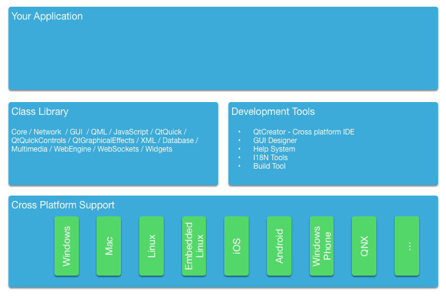

========
Qt와 C++
========

.. sectionauthor:: `jryannel <https://github.com/jryannel>`_

.. issues:: ch15

.. note::

    Last Build: |today|

    이번 장의 소스 코드는 `assets 폴더 <../../assets>`_ 에서 확인할 수 있습니다.

Qt는 QML과 Javascript에 대한 확장성을 가진 C++ 툴킷입니다. Qt에 대한 다양한 프로그래밍 언어의 바인딩이 존재하지만, Qt는 C++로 개발되었기 때문에 C++의 정신은 클래스 전체에서 찾을 수 있습니다. 이번 장에서는 C++로 개발된 네이티브 플러그인(native plugin)을 통해 QML의 기능을 확장하는 방법에 대한 이해를 돕기 위해, 먼저 Qt를 C++ 언어의 관점에서 살펴보고자 합니다. C++를 통해 QML이 제공하는 실행 환경을 확장하고 제어할 수 있습니다.

이번 장은 Qt와 마찬가지로 여러분에게 C++에 대한 기본적인 지식을 요구합니다. Qt는 C++의 고급 기능에 의존하지 않으며, 개인적으로 Qt 스타일의 C++ 코드는 가독성이 매우 좋다고 생각합니다. 그러니 C++ 지식이 완전하지 않아도 걱정할 필요 없습니다.

C++ 라이브러리라는 측면에서 Qt를 보면, Qt는 여러 가지 현대적인 프로그래밍 언어의 기능을 활용하여 인트로스펙션 데이터(역자 주: introspection data, 오브젝트의 타입이나 속성을 런타임에 확인할 수 있는 특성)가 가능하도록 C++를 확장한 것이라고 볼 수 있습니다. 이러한 기능은 ``QObject`` 라는 기본 클래스를 통하여 동작합니다. 인트로스펙션 데이터, 즉 메타 데이터는 런타임 시에 클래스의 정보를 유지합니다. 일반적인 C++는 이러한 기능을 제공하지 않습니다. 이를 통해 오브젝트의 속성과 사용 가능한 메서드와 같은 세부 정보에 동적으로 접근할 수 있습니다.

Qt는 이러한 메타 정보를 사용해서 시그널(signal)과 슬롯(slot)이라고 하는 매우 느슨하게 연결된 콜백 개념을 제공합니다. 각 시그널은 임의의 슬롯에 연결될 수 있고, 다른 시그널에 연결될 수도 있습니다. 오브젝트의 인스턴스에서 어떤 시그널이 발생(emit)하면 그것과 연결된 슬롯이 호출됩니다. 시그널을 발생시키는 객체는 연결된 슬롯을 소유한 객체에 대해 아무것도 알 필요가 없고, 반대의 경우도 마찬가지입니다. 그렇기 때문에 이러한 메커니즘은 컴포넌트 간의 매우 적은 종속성을 가진 재사용성이 높은 컴포넌트를 만드는데 유용하게 활용됩니다.

인스토스펙션 기능은 동적인 언어 바인딩을 생성하는 데에도 사용됩니다. 예를 들어 C++ 오브젝트 인스턴스를 QML에 노출하고 C++ 함수를 Javascript에서 호출할 수 있게 해줍니다. Qt C++에 대한 다른 바인딩도 존재하고, 표준 Javascript에 대한 바인딩 외에 Python 바인딩으로 유명한 `PyQt <http://www.riverbankcomputing.co.uk/software/pyqt/intro>`_ 도 있습니다.

이러한 핵심 개념 외에, Qt는 C++로 크로스 플랫폼 응용 프로그램을 개발하는 것을 가능하게 해줍니다. Qt C++는 다양한 운영체제에 대한 플랫폼 추상화를 제공하기 때문에 개발자는 서로 다른 운영체제에서 파일 여는 방법과 같은 지엽적인 문제가 아닌 실제 개발해야 하는 작업에 집중할 수 있습니다. 즉, Windows, OS X, 리눅스에서 동일한 소스 코드를 다시 컴파일할 수 있으며, OS 마다 다르게 처리해야 하는 특정한 작업들은 Qt가 담당한다는 의미입니다. 최종 결과물은 타겟 플랫폼의 외양과 느낌(look and feel)을 가진 네이티브 애플리케이션이 됩니다. 이제 모바일 환경이 데스크탑을 대체해가고 있기 때문에, 새로운 Qt 버전에서는 동일한 소스 코드를 사용하여 iOS, Android, Jolla, BlackBerry, Ubuntu Phone, Tizen 등과 같은 여러 모바일 플랫폼에 대응할 수 있습니다.

재사용의 관점에서, 단지 소스 코드만 재사용할 수 있는 것이 아니라 개발자의 기술 또한 재사용됩니다. Qt에 익숙한 팀은 하나의 플랫폼에 종속된 팀보다 훨씬 더 많은 플랫폼에 대응할 수 있고, Qt의 유연성 덕분에 그러한 팀은 하나의 기술을 사용하여 다양한 시스템의 구성 요소를 만들어 낼 수 있습니다.

모든 플랫폼에 대해 Qt는 유니코드를 지원하는 문자열, 리스트, 벡터, 버퍼 등과 같은 기본적인 자료 구조를 제공합니다. 또한 타겟 플랫폼의 메인 루프(main loop)와 쓰레드(cross platform threading), 네트워크 지원 등에 대한 공통적인 추상화를 제공합니다. Qt에 내재되어 있는 기본적인 철학은 애플리케이션 개발자가 필요로 하는 모든 필수적인 기능을 포함한다는 것입니다. 여러분만의 네이티브 라이브러리와 인터페이스해야 하는 도메인 특화된(domain specific) 작업에 대해서는 여러 가지 도우미 클래스(helper classes)의 도움을 받을 수 있습니다.

상용구 코드
===========

.. issues:: ch15

Qt를 이해하는 가장 좋은 방법은 작은 데모 애플리케이션을 실행하고 살펴보는 것입니다. 아래 애플리케이션은 간단한 ``"Hello World!"`` 문자열을 생성하고, 유니코드 문자를 사용하여 파일에 기록합니다.

.. literalinclude:: src/coreapp/main.cpp
    :language: cpp

이 간단한 예제는 파일을 액세스하는 방법과 텍스트 스트림을 통해 텍스트 코덱을 사용하여 텍스트를 파일에 기록하는 올바른 방법을 보여줍니다. 바이너리 데이터의 경우에는 ``QDataStream`` 이라는 크로스 플랫폼 바이너리 스트림이 있습니다. 우리가 사용하는 다른 클래스는 해당 클래스의 이름으로 include됩니다. ``#include <QtCore/QFile>`` 와 같이 모듈과 클래스 이름을 사용할 수도 있습니다. 비효율적이지만 ``#include <QtCore>`` 와 같이 모듈 전체를 include하는 것도 가능합니다. ``QtCore`` 는 여러분이 애플리케이션 개발할 때 UI에 종속되지 않은 가장 기본적인 클래스들을 가지고 있습니다. `QtCore 클래스 리스트 <http://doc.qt.io/qt-5/qtcore-module.html>`_ 나 `QtCore 개요 <http://doc.qt.io/qt-5/qtcore-index.html>`_ 를 참고하세요.

애플리케이션은 qmake와 make를 이용하여 빌드합니다. QMake는 프로젝트 파일을 읽은 다음, make를 사용해 호출할 수 있는 Makefile을 생성합니다. 프로젝트 파일은 플랫폼 독립적이며, qmake는 생성된 makefile에 플랫폼 특화된 설정을 적용하기 위한 몇가지 규칙을 가지고 있습니다. 플랫폼 별로 필요한 규칙이 있다면 프로젝트 파일이 해당 내용을 포함할 수도 있습니다. 아래에 간단한 프로젝트 파일의 예시가 있습니다.

.. literalinclude:: src/coreapp/coreapp.pro
    :language: cpp

이 주제에 깊이 들어가지는 않을 것입니다. Qt는 프로젝트를 위한 프로젝트 파일을 사용하고 qmake가 이 프로젝트 파일로부터 플랫폼에 맞는 makefile을 생성한다는 것만 기억해주세요.

위의 간단한 코드 예제는 텍스트를 쓰고 프로그램을 종료합니다. 커맨드 라인 도구(command line tool)라면 이러한 기능만으로도 충분합니다. 사용자 인터페이스가 필요한 경우에는 사용자의 입력을 기다리고 UI를 갱신하는 동작을 스케쥴링할 이벤트 루프(event loop)이 필요할 것입니다. 이제 위의 예제에 파일 기록을 수행하도록 명령하는 버튼을 추가해보겠습니다.

우리의 ``main.cpp`` 파일은 놀랍게도 더 작아졌습니다. 버튼 클릭과 같은 사용자 입력에 시그널/슬롯을 사용할 수 있도록 구현한 코드를 자체 클래스로 옮겼습니다. 곧 확인할 수 있겠지만, 시그널/슬롯 메커니즘은 일반적으로 객체의 인스턴스를 필요로 합니다.

.. literalinclude:: src/uiapp/main.cpp
    :language: cpp

``main`` 함수에서 우리는 단순히 애플리케이션의 객체를 만들고 ``exec()`` 를 사용하여 이벤트 루프를 시작합니다. 이제 애플리케이션은 이벤트 루프에 앉아 사용자의 입력을 기다립니다.

.. code-block:: cpp

    int main(int argc, char** argv)
    {
        QApplication app(argc, argv); // init application

        // create the ui

        return app.exec(); // execute event loop
    }

Qt는 여러 가지 UI 기술을 제공합니다. 이 예제에서는 Qt C++를 사용한 Desktop Widgets 사용자 인터페이스 라이브러리를 사용합니다. 기능을 동작시킬 푸시 버튼(push button)을 포함할 메인 윈도우(main window)를 생성하고 메인 윈도우는 앞선 예제에서 우리가 알고 있는 핵심 기능을 제공할 것입니다.

.. figure:: images/storecontent.png

메인 윈도우 그 자체는 하나의 widget입니다. 부모 widget을 가지고 있지 않기 때문에 최상위 윈도우가 됩니다. 이러한 동작은 Qt가 사용자 인터페이스를 구성하는 UI element들을 하나의 트리 구조로 바라보는 것에서 기인합니다. 이 경우에 메인 윈도우는 root element이기 때문에 하나의 윈도우가 되고, 푸시 버튼은 메인 윈도우의 자식이기 때문에 윈도우 내부의 widget이 됩니다.

.. literalinclude:: src/uiapp/mainwindow.h
    :language: cpp

추가로 우리는 ``storeContent()`` 라 불리는 public 슬롯을 정의합니다. 이 슬롯은 버튼이 클릭되었을 때 호출되어야 합니다. 슬롯은 C++ 함수이고, Qt meta object system과 함께 등록되어 동적으로 호출될 수 있습니다.

.. literalinclude:: src/uiapp/mainwindow.cpp
    :language: cpp

메인 윈도우에서 우리는 먼저 푸시 버튼을 생성하고 connect 함수를 사용해서 ``clicked()`` 시그널을 ``storeContent()`` 슬롯에 연결합니다. 이러한 단순한 코드에 의해 객체들은 느슨한 연결(loose coupling)을 가지고 시그널과 슬롯을 통해 통신합니다.

The QObject
===========

.. issues:: ch15

서두에 기술한 것처럼 ``QObject`` 는 Qt의 인스토스펙션(introspection)을 가능하게 해주는 클래스입니다. 이 클래스는 Qt에서 제공하는 클래스 대부분의 부모 클래스입니다. 예외는 ``QColor`` 와 ``QString``, ``QList`` 와 같은 value type의 클래스들입니다.

하나의 Qt 오브젝트는 표준 C++ 오브젝트이지만, 좀 더 많은 기능을 가지고 있습니다. 이러한 기능들은 인트로스펙션과 메모리 관리로 구분지을 수 있습니다. 전자의 측면에서 하나의 Qt 오브젝트는 클래스 이름과 다른 클래스와의 관계, 그리고 메소드와 프로퍼티까지 런타임에 알 수 있습니다. 메모리 관리 측면에서 각각의 Qt 오브젝트는 자식 오브젝트의 부모가 될 수 있습니다. 부모는 자식을 *소유* 하고 있으며, 부모가 소멸될 때 자식 오브젝트들을 소멸시켜야 할 의무를 가집니다.

``QObject`` 의 이러한 기능들이 하나의 클래스에 어떻게 영향을 미치는 지 이해하는 가장 좋은 방법은 Qt가 표준 C++ 클래스를 어떻게 확장하는지 살펴보는 것입니다. 아래 제시된 클래스가 그러한 일반적인 사례를 보여주고 있습니다.

Person 클래스는 이름과 성(gender)에 대한 속성을 가진 데이터 클래스입니다. Person 클래스는 C++ 클래스에 메타 정보를 추가하기 위해 Qt의 오브젝트 시스템(object system)을 사용합니다. 그것은 person 오브젝트의 사용자가 슬롯(slot)을 연결하고 해당 속성이 바뀌었을때 그 사실을 알 수 있도록 해줍니다.

.. code-block:: cpp

    class Person : public QObject
    {
        Q_OBJECT // enabled meta object abilities

        // property declarations required for QML
        Q_PROPERTY(QString name READ name WRITE setName NOTIFY nameChanged)
        Q_PROPERTY(Gender gender READ gender WRITE setGender NOTIFY genderChanged)

        // enables enum introspections
        Q_ENUMS(Gender)

    public:
        // standard Qt constructor with parent for memory management
        Person(QObject *parent = 0);

        enum Gender { Unknown, Male, Female, Other };

        QString name() const;
        Gender gender() const;

    public slots: // slots can be connected to signals
        void setName(const QString &);
        void setGender(Gender);

    signals: // signals can be emitted
        void nameChanged(const QString &name);
        void genderChanged(Gender gender);

    private:
        // data members
        QString m_name;
        Gender m_gender;
    };

생성자는 부모 오브젝트를 상위 클래스(super class)에 전달하고 멤버 변수들을 초기화합니다. Qt의 value 클래스는 자동으로 초기화됩니다. 이 예제의 경우에 ``QString`` 은 빈 문자열(``QString::isNull()``)로 초기화될 것입니다. 그리고 enum 타입인 gender 멤버 변수는 명시적으로 unknown gender로 초기화될 것입니다.

.. code-block:: cpp

    Person::Person(QObject *parent)
        : QObject(parent)
        , m_gender(Person::Unknown)
    {
    }

Getter 함수는 속성 뒤에 명시되고, 일반적으로는 단순한 ``const`` 함수의 형태를 가집니다. Setter 함수는 해당 속성이 실제로 변경되었을 때 변경되었다는 시그널(signal)을 발생시킵니다. 이를 위해 현재 값과 새로운 값을 비교하는 일종의 방어 코드를 추가합니다. 그래서 값이 달라졌을 때에만 멤버 변수에 할당하고 시그널을 발생시킵니다.

.. code-block:: cpp

    QString Person::name() const
    {
        return m_name;
    }

    void Person::setName(const QString &name)
    {
        if (m_name != name) // guard
        {
            m_name = name;
            emit nameChanged(m_name);
        }
    }

``QObject`` 를 상속받은 클래스는 ``metaObject()`` 메소드를 통해 더 많은 메타 오브젝트 관련 기능들을 활용할 수 있습니다. 예를 들어 오브젝트에서 클래스 이름을 가져올 수 있습니다.

.. code-block:: cpp

    Person* person = new Person();
    person->metaObject()->className(); // "Person"
    Person::staticMetaObject.className(); // "Person"

``QObject`` 클래스와 메타 오브젝트를 통해 접근할 수 있는 다른 많은 정보와 기능들이 있습니다. ``QMetaObject`` 문서를 참고해보세요.

빌드 시스템
===========

.. issues:: ch15

여러 플랫폼에서 소프트웨어를 안정적으로 빌드하는 것은 어려운 일입니다. 플랫폼마다 다른 컴파일러와 경로, 라이브러리들을 가진 상이한 환경과 마주하게 될 것입니다. Qt의 목적은 애플리케이션 개발자가 이러한 크로스 플랫폼 이슈로부터 자유로워지도록 하는데 있습니다. 이를 위해 Qt는 ``qmake`` 라는 빌드 파일 생성도구를 고안했습니다. ``qmake`` 는 ``.pro`` 로 끝나는 프로젝트 파일에서 동작합니다. 이 프로젝트 파일은 애플리케이션과 사용되는 소스에 대한 지침(instructions)을 포함하고 있습니다. 이 프로젝트 파일에 대해 qmake를 수행하면 유닉스와 맥 환경, 혹은 윈도우에서 mingw 컴파일러를 사용하는 경우에 ``Makefile`` 을 생성할 것입니다. 다른 경우라면 Visual Studio 프로젝트를 생성하거나 Xcode 프로젝트를 생성할 수도 있습니다.

Qt의 일반적인 빌드 순서는 다음과 같습니다::

    $ edit myproject.pro
    $ qmake // generates Makefile
    $ make

Qt는 shadow build도 가능하게 해줍니다. Shadow build는 소스 코드가 위치한 곳과 다른 곳에서 빌드하는 것을 뜻합니다. myproject라는 폴더에 ``myproject.pro`` 라는 프로젝트 파일이 있다고 가정해봅시다. 이 때, 빌드 흐름은 다음과 같습니다::

    $ mkdir build
    $ cd build
    $ qmake ../myproject/myproject.pro

여기서 우리는 build 폴더를 만들고 build 폴더 안에서 우리의 프로젝트 폴더에 있는 프로젝트 파일을 가리키며 qmake를 호출합니다. 이러한 명령은 소스 코드가 있는 폴더 내부가 아닌 build 폴더 아래에 모든 빌드 관련 파일과 결과물이 생성되도록 makefile을 설정해줍니다. 이것은 서로 다른 Qt 버전을 사용한 빌드를 구성하여 동시에 빌드 설정을 할 수 있게 해주고, 소스 코드 폴더를 항상 깨끗하게 유지할 수 있도록 도와줍니다.

Qt Creator를 사용하고 있다면, 이러한 동작은 여러분 모르게 뒤에서 수행되며 보통은 이러한 단계에 대해 걱정할 필요가 없습니다. 큰 프로젝트를 구성해야 하거나 빌드 흐름에 대한 깊은 이해가 필요하다면, 명령행 기반으로 Qt 프로젝트를 빌드하는 방법을 배우시길 추천합니다.

QMake
-----

.. issues:: ch15

QMake는 프로젝트 파일을 읽고 빌드 파일을 생성하는 도구입니다. 프로젝트 파일은 프로젝트 설정과 외부 종속성, 소스 파일에 대한 간략한 명세입니다. 가장 단순한 프로젝트 파일은 아마도 아래와 같을 것입니다::

    // myproject.pro

    SOURCES += main.cpp

여기서 우리는 프로젝트 파일 이름과 같은 ``myproject`` 라는 이름을 가진 애플리케이션 실행 파일을 빌드합니다. 이 빌드는 ``main.cpp`` 소스 파일만 포함합니다. 그리고 기본적으로 이 프로젝트에서는 QtCore와 QtGui 모듈을 사용할 것입니다. 프로젝트가 QML 애플리케이션인 경우에는 QtQuick과 QtQml 모듈을 리스트에 추가해야 합니다::

    // myproject.pro

    QT += qml quick

    SOURCES += main.cpp

이제 빌드 파일은 QtQml과 QtQuick 모듈을 연결해야 한다는 것을 알고 있습니다. QMake는 ``=`` 와 ``+=``, ``-=`` 의 개념을 사용하여 옵션 목록에 요소를 할당, 추가, 제거합니다. UI가 없는 순수 콘솔 애플리케이션을 빌드한다면 QtGui 모듈을 제거합니다::

    // myproject.pro

    QT -= gui

    SOURCES += main.cpp

애플리케이션 대신 라이브러리를 빌드하기 원한다면, 빌드 템플릿을 바꿀 필요가 있습니다::

    // myproject.pro
    TEMPLATE = lib

    QT -= gui

    HEADERS += utils.h
    SOURCES += utils.cpp

이제 프로젝트는 UI 의존성이 없는 라이브러리를 빌드하고 ``utils.h`` 헤더 파일과 ``utils.cpp`` 소스 파일을 사용하게 됩니다. 라이브러리 파일의 형식은 여러분이 프로젝트를 빌드하고 있는 OS에 따라 달라집니다.

경우에 따라 복잡한 설정과 프로젝트의 집합을 빌드해야 할 수도 있습니다. 이를 위해 qmake는 ``subdirs`` 템플릿을 제공합니다. mylib 프로젝트와 myapp 프로젝트가 있다고 가정합시다. 그러면 아래와 같이 빌드 설정을 할 수 있습니다::

    my.pro
    mylib/mylib.pro
    mylib/utils.h
    mylib/utils.cpp
    myapp/myapp.pro
    myapp/main.cpp

mylib.pro와 myapp.pro 파일이 어떤 모습일 지는 이미 알고 있습니다. 아래와 같이 전체를 관장하는 my.pro 프로젝트 파일을 작성합니다::

    // my.pro
    TEMPLATE = subdirs

    subdirs = mylib \
        myapp

    myapp.depends = mylib

이 프로젝트는 ``mylib`` 과 ``myapp`` 두 개의 하위 프로젝트를 선언하고 ``myapp`` 은 ``mylib`` 에 종속성을 가지고 있음을 알립니다. 여러분이 이 프로젝트 파일에 대해 qmake를 실행하면 해당 폴더의 각 프로젝트에 대한 빌드 파일을 생성합니다. ``my.pro`` 에 대한 makefile을 실행하면, 모든 하위 프로젝트 또한 빌드됩니다.

때로는 여러분의 설정 내용을 바탕으로 어떤 플랫폼에는 특정 동작을 해야하고, 다른 플랫폼에는 다른 동작을 수행해야 할 경우가 있습니다. 이를 위해 qmake에서는 scope의 개념이 있습니다. 어떤 설정 옵션이 true로 설정되면 하나의 scope이 적용됩니다.

예를 들어 유닉스에 특화된 utils 구현을 사용해야 한다면 아래와 같이 기술할 수 있습니다::

    unix {
        SOURCES += utils_unix.cpp
    } else {
        SOURCES += utils.cpp
    }

CONFIG 변수가 unix 옵션을 포함한다면 해당 scope의 내용이 사용되고, 포함하지 않는다면 else 경로의 내용이 사용됩니다. 예를 들어 mac에서 application bundling을 제거하기 위해 아래와 같이 적용할 수 있습니다::

    macx {
        CONFIG -= app_bundle
    }

이렇게 하면 mac에서 애플리케이션을 생성할 때 애플리케이션 설치에 사용되는 ``.app`` 폴더에 결과물을 묶지 않고, 일반 실행 파일을 생성하게 됩니다.

QMake 기반의 프로젝트는 일반적으로 Qt 애플리케이션 개발을 시작할 때 선택하는 첫번째 옵션입니다. 이밖에 다른 옵션들도 있고, 모두 장점과 단점이 있습니다. 이러한 다른 옵션에 대해서는 뒤에 짧게 다룰 예정입니다.

.. rubric:: 참고

* :qt5:`QMake Manual <qmake-manual>` - qmake 매뉴얼의 목차

* :qt5:`QMake Language <qmake-language>` - 변수 할당과 scope 등등

* :qt5:`QMake Variables <qmake-variable-reference>` - 여기서 설명한 TEMPLATE, CONFIG, QT와 같은 변수들

CMake
-----

.. issues:: ch15

CMake는 Kitware에서 제작한 빌드 도구입니다. Kitware는 3D 시각화 소프트웨어인 VTK와 크로스 플랫폼 makefile 생성 도구인 CMake로 유명합니다. CMake는 ``CMakeLists.txt`` 파일을 사용하여 플랫폼 별 makefile을 생성합니다. CMake는 KDE 프로젝트에서 사용하기 때문에 Qt 커뮤니티와도 특별한 관계를 가지고 있습니다.

``CMakeLists.txt`` 는 프로젝트 설정을 담고 있는 파일입니다. 예를 들어 QtCore를 사용하는 간단한 hello world 애플리케이션에 대한 프로젝트 파일은 아래와 같습니다::

    // cmake 버전은 3.0 이상이어야 함
    cmake_minimum_required(VERSION 3.0)
    // include path에 소스와 빌드 위치를 추가
    set(CMAKE_INCLUDE_CURRENT_DIR ON)
    // Qt의 MOC 도구가 자동으로 수행되어야 함
    set(CMAKE_AUTOMOC ON)
    // Qt5Core 모듈을 사용함
    find_package(Qt5Core)
    // main.cpp를 사용하는 helloworld 실행 파일을 생성
    add_executable(helloworld main.cpp)
    // helloworld는 Qt5Core를 링크함
    target_link_libraries(helloworld Qt5::Core)

이렇게 하면 main.cpp를 사용해서 helloworld 실행 파일을 빌드하고 Qt5Core 라이브러리를 링크합니다. 이 빌드 파일은 좀 더 일반적인 형태로 수정될 수 있습니다::

    // PROJECT_NAME 변수 설정
    project(helloworld)
    cmake_minimum_required(VERSION 3.0)
    set(CMAKE_INCLUDE_CURRENT_DIR ON)
    set(CMAKE_AUTOMOC ON)
    find_package(Qt5Core)

    // SRC_LIST 변수를 생성하고 main.cpp를 추가
    set(SRC_LIST main.cpp)
    // 프로젝트 이름과 소스 목록을 바탕으로 실행 파일 추가
    add_executable(${PROJECT_NAME} ${SRC_LIST})
    // 프로젝트 실행 파일에 Qt5Core를 링크
    target_link_libraries(${PROJECT_NAME} Qt5::Core)

CMake는 강력한 빌드 도구입니다. 문법에 익숙해지려면 약간의 시간은 필요합니다. 일반적으로 CMake는 크고 복잡한 프로젝트에 더 적합한 도구로 알려져 있습니다.

.. rubric:: 참고

* `CMake Help <http://www.cmake.org/documentation/>`_ - available online but also as QtHelp format
* `Running CMake <http://www.cmake.org/runningcmake/>`_
* `KDE CMake Tutorial <https://techbase.kde.org/Development/Tutorials/CMake>`_
* `CMake Book <http://www.kitware.com/products/books/CMakeBook.html>`_
* `CMake and Qt <http://www.cmake.org/cmake/help/v3.0/manual/cmake-qt.7.html>`_

일반 Qt 클래스
==============

.. issues:: ch15

``QObject`` 클래스가 Qt의 기초를 형성하지만 프레임워크에는 더 많은 클래스들이 있습니다. QML로 돌아가서 기능 확장에 대한 내용을 살펴보기 전에, 알아두면 유용한 몇가지 Qt 기본 클래스를 살펴 보겠습니다.

이 장의 예제 코드들은 Qt Test 라이브러리를 사용해 작성 되었습니다. Qt Test는 Qt API를 탐색하고 나중에 참조할 수 있도록 저장할 수 있는 좋은 방법을 제공해줍니다. ``QVERIFY`` 와 ``QCOMPARE`` 는 특정 조건의 만족 여부를 확인하는 기능을 제공합니다. 우리는 ``{}`` 를 사용해서 이름 충돌을 피할 것입니다. 그러니 일반 코드와의 혼동을 걱정할 필요는 없습니다.

QString
-------

일반적으로 Qt의 텍스트 처리는 유니코드 기반입니다. 이를 위해 여러분은 ``QString`` 클래스를 사용합니다. 여러분이 이러한 최신의 프레임워크(framework)에서 기대하는 다양하고 훌륭한 함수들을 제공합니다. 8비트 데이터의 경우에는 일반적으로 ``QByteArray`` 클래스를 사용하고 ASCII 문자열에 대해서는 메모리를 절약하기 위해 ``QLatin1String`` 를 사용합니다. 문자열의 리스트를 담기 위해 ``QList<QString>`` 나 단순히 ``QStringList`` (``QList<QString>`` 에서 파생된)를 사용할 수 있습니다.

여기에 ``QString`` 클래스를 사용하는 방법에 대한 몇가지 예제가 있습니다. QString은 스택(stack)에 생성될 수 있지만 실제 데이터는 heap에 저장됩니다. 그리고 한 문자열을 다른 문자열에 할당할 때, 데이터는 복사되지 않으며 참조만 복사됩니다. 그래서 이러한 과정은 빠르게 처리되고 개발자는 메모리 관리가 아닌 코드에 집중할 수 있습니다. ``QString`` 은 참조 카운터(reference counter)를 사용하여 언제 데이터를 안전하게 삭제할 수 있는지 알 수 있습니다. 이러한 기능은 :qt5:`Implicit Sharing <implicit-sharing>` 이라 불리며 많은 Qt 클래스에서 사용됩니다.

.. literalinclude:: src/qtfoundation/tst_foundation.cpp
    :language: cpp
    :start-after: M1>>
    :end-before:  M1<<

여기서는 숫자를 문자열로, 문자열을 숫자로 변환하는 방법을 보여줍니다. float이나 double 혹은 다른 타입에 대한 변환 함수도 있습니다. 여기에 사용된 함수들을 Qt 문서에서 찾아보면 다른 타입에 대한 함수들도 함께 발견할 수 있을 것입니다.

.. literalinclude:: src/qtfoundation/tst_foundation.cpp
    :language: cpp
    :start-after: M2>>
    :end-before:  M2<<

가끔은 매개변수화 된(parameterized) 텍스트를 만들어야 할 때가 있습니다. 한가지 옵션은 ``QString("Hello" + name)`` 와 같은 구문을 사용하는 것이지만, 좀 더 유연한 방법은 ``arg`` 표시자를 사용하는 방식입니다. 이 방법은 변환 과정에서 입력받은 문자열의 순서를 유지합니다.

.. literalinclude:: src/qtfoundation/tst_foundation.cpp
    :language: cpp
    :start-after: M3>>
    :end-before:  M3<<

코드에서 유니코드 문자를 직접 사용해야 할 때도 있습니다. 이를 위해 여러분은 ``QChar`` 와 ``QString`` 클래스에 유니코드를 표기하는 방법을 기억할 필요가 있습니다.

.. literalinclude:: src/qtfoundation/tst_foundation.cpp
    :language: cpp
    :start-after: M4>>
    :end-before:  M4<<

여기서는 Qt에서 유니코드 텍스트를 손쉽게 다루는 방법을 예제와 함께 살펴 보았습니다. 유니코드가 아닌 경우에는 ``QByteArray`` 클래스가 변환을 위한 많은 도우미 함수를 제공하고 있으니 해당 클래스를 참고하는 것이 좋겠습니다. 그리고 ``QString`` 에 대한 Qt 문서에 좋은 예제가 많이 있기 때문에 해당 문서를 읽어볼 것을 추천합니다.

순차적 컨테이너 (Sequential Containers)
---------------------------------------

리스트(list), 큐(queue), 링크드 리스트(linked-list)와 같은 자료 구조를 순차적 컨테이너(sequential container)라고 합니다. 주로 사용되는 순차적 컨테이너는 ``QList`` 클래스입니다. 템플릿 기반 클래스이며 특정한 타입으로 초기화되어야 합니다. 데이터는 묵시적으로 공유되며(implicit shared), 내부적으로 heap에 저장됩니다. 모든 컨테이너 클래스는 스택에 만들어져야 합니다. 일반적으로 ``new QList<T>()`` 와 같은 방식으로는 사용되지 않습니다. 이는 컨테이너에 대해 ``new`` 연산자를 사용하지 않는다는 것을 의미합니다.

``QList`` 는 ``QString`` 클래스처럼 데이터를 탐색하기 위한 다양한 API를 제공합니다. 아래는 몇가지 새로운 C++ 11 기능을 사용하여 리스트를 사용하고 순회하는 방법을 보여주는 예제입니다.

.. literalinclude:: src/qtfoundation/tst_foundation.cpp
    :language: cpp
    :start-after: M5>>
    :end-before:  M5<<

연관 컨테이너 (Associative Containers)
--------------------------------------

맵(map), 딕셔너리(dictionary), 집합(set)과 같은 자료 구조를 연관 컨테이너(associative containers)라고 합니다. 키(key)를 사용하여 값(value)을 저장합니다. 이러한 자료 구조는 빠른 탐색을 제공합니다. 가장 많이 사용되는 연관 컨테이너인 ``QHash`` 를 사용해서 새로운 C++ 11의 기능을 보여 드리겠습니다.

.. literalinclude:: src/qtfoundation/tst_foundation.cpp
    :language: cpp
    :start-after: M6>>
    :end-before:  M6<<

파일 IO
-------

종종 파일을 읽고 쓰는 작업이 필요할 때가 있습니다. ``QFile`` 클래스는 실제로는 ``QObject`` 이지만 대부분의 경우에 스택 상에 생성됩니다. ``QFile`` 은 데이터를 읽어갈 수 있을 때 사용자에게 그 사실을 알려주는 시그널을 가지고 있습니다. 이러한 시그널은 전체 파일을 읽어들일 때까지 데이터 묶음(chunk)을 비동기적으로 읽을 수 있도록 해줍니다. 편의를 위해 blocking mode로 데이터를 읽게 할 수도 있습니다. 이 방법은 대용량 파일이 아닌 작은 데이터에 대해서만 사용해야 합니다. 다행히 이 예제에서는 소량의 데이터만 사용합니다.

원시 데이터(raw data)는 ``QByteArray`` 로 읽을 수 있고, ``QDataStream`` 이나 유니코드 문자열의 경우에는 ``QTextStream`` 클래스를 사용해 읽을 수도 있습니다. 어떻게 사용하는지 보여드리겠습니다.

.. literalinclude:: src/qtfoundation/tst_foundation.cpp
    :language: cpp
    :start-after: M7>>
    :end-before:  M7<<

그 외의 클래스들
----------------

.. issues:: ch15

Qt는 애플리케이션 개발의 편의를 위해 개발된 프레임워크(framework)입니다. 그렇기 때문에 그 안에는 수천 개의 클래스가 존재합니다. 이러한 클래스 전체에 익숙해지고 어떻게 사용하는지 익히는 데에는 일정 시간이 필요할 것입니다. 다행히 Qt는 많은 유용한 예제가 포함된 매우 훌륭한 문서를 가지고 있습니다. 여러분이 어떤 클래스에 대해 검색한다면 가장 일반적인 사용 사례가 이미 코드 조각의 형태로 제공되어 있을 것입니다. 여러분은 이 코드 조각을 가져와 응용할 수 있겠습니다. Qt 소스 코드 내의 예제 또한 큰 도움이 됩니다. 개발의 효율성을 높이기 위해 이러한 소스 코드를 가까이 두고 언제든 검색 가능하도록 준비해놓으세요. 다른 곳에서 시간을 낭비하지 마시구요. Qt 커뮤니티는 언제나 도움이 됩니다. 질문을 할 때는 정확한 내용을 문의하고 여러분이 필요로 하는 것을 보여 줄 간단한 예제를 제공하는 것이 매우 중요합니다. 이렇게 하면 다른 사람들로부터 응답받는 시간을 크게 줄여줄 것입니다. 이것은 다르게 표현하면, 여러분을 도와주고 싶어하는 다른 사람들을 좀 더 편하게 해주기 위해 약간의 시간을 투자하는 것입니다 :-).

다음은 저자가 꼭 읽어야 한다고 생각하는 문서에 해당하는 클래스들입니다: :qt5:`QObject <qobject>`, :qt5:`QString <qstring>`, :qt5:`QByteArray <qbytearray>`, :qt5:`QFile <qfile>`, :qt5:`QDir <qdir>`, :qt5:`QFileInfo <qfileinfo>`, :qt5:`QIODevice <qiodevice>`, :qt5:`QTextStream <qtextstream>`, :qt5:`QDataStream <qdatastream>`, :qt5:`QDebug <qdebug>`, :qt5:`QLoggingCategory <qloggingcategory>`, :qt5:`QTcpServer <qtcpserver>`, :qt5:`QTcpSocket <qtcpsocket>`, :qt5:`QNetworkRequest <qnetworkrequest>`, :qt5:`QNetworkReply <qnetworkreply>`, :qt5:`QAbstractItemModel <qabstractitemmodel>`, :qt5:`QRegExp <qregexp>`, :qt5:`QList <qlist>`, :qt5:`QHash <qhash>`, :qt5:`QThread <qthread>`, :qt5:`QProcess <qprocess>`, :qt5:`QJsonDocument <qjsondocument>`, :qt5:`QJSValue <qjsvalue>`.

처음 시작하는 분들께는 충분한 내용의 문서들입니다.

C++로 모델 구현하기
===================

QML에서 모델(model)은 ``ListViews`` 나 ``PathViews``, 혹은 모델을 취하는 다른 뷰에게 데이터를 제공하고 모델의 각 엔트리(entry)에 대한 delegate의 인스턴스를 생성할 목적으로 만들어졌습니다. 이 때 뷰는 지능적으로 화면에 보여질 부분에 해당하는 인스턴스만 생성하거나 일정 영역의 캐시(cache)에 해당하는 인스턴스까지 생성합니다. 이를 통해 수만개의 항목을 가진 대형 모델이더라도 매끄러운 사용자 인터페이스를 유지할 수 있습니다. Delegate는 모델의 엔트리 데이터를 받아 렌더링하는 일종의 템플릿처럼 동작합니다. 요약하면, 하나의 뷰는 모델로부터 받은 엔트리를 렌더링합니다. 이 때 delegate는 각 엔트리를 렌더링하는 템플릿입니다. 그리고 모델은 뷰에 대한 데이터 공급자(data provider)입니다.

C++를 사용하길 원치 않는다면 순수하게 QML만을 사용해서 모델을 정의할 수도 있습니다. 뷰에 모델을 제공하는 여러 가지 방법이 있습니다. C++ 코드를 통해 데이터가 들어오거나 다량의 데이터를 처리할 경우에는 QML 접근 방식보다 C++ 모델이 더 적합합니다. 단지 몇 개의 엔트리만 필요하다면 QML 모델이 적합합니다.

.. code-block:: qml

    ListView {
        // using a integer as model
        model: 5
        delegate: Text { text: 'index: ' + index }
    }

    ListView {
        // using a JS array as model
        model: ['A', 'B', 'C', 'D', 'E']
        delegate: Text { 'Char['+ index +']: ' + modelData }
    }

    ListView {
        // using a dynamic QML ListModel as model
        model: ListModel {
            ListElement { char: 'A' }
            ListElement { char: 'B' }
            ListElement { char: 'C' }
            ListElement { char: 'D' }
            ListElement { char: 'E' }
        }
        delegate: Text { 'Char['+ index +']: ' + model.char }
    }

QML 뷰는 이러한 여러 가지 모델을 처리하는 방법을 알고 있습니다. C++ 세계에서 온 모델에 대해서, 뷰는 특정 프로토콜을 따를 것을 기대합니다. 이 프로토콜은 API로 정의되어 있고(``QAbstractItemModel``), 동적인 동작에 대한 문서도 함께 정리되어 있습니다. 이 API는 데스크탑 위젯을 위해 개발되었고, 리스트 뿐만 아니라 트리 구조나 테이블 형태의 모델에 대한 기본 클래스로 사용하기 충분할만큼 유연성을 가지고 있습니다. QML에서는 대부분 해당 API (``QAbstractListModel``)의 리스트 버전만 사용합니다. 이 API에는 필수로 구현해야 하는 함수와 선택적으로 구현하는 함수가 있습니다. 선택적인 부분은 데이터의 추가 혹은 삭제에 대한 동적 처리를 주로 다룹니다.

간단한 모델
-----------

QML에서 사용되는 일반적인 C++ 모델은 ``QAbstractListModel`` 을 상속받아 최소한 ``data`` 와 ``rowCount`` 함수를 구현해야 합니다. 이 예제에서 우리는 ``QColor`` 클래스에 의해 제공되는 일련의 SVG 색상 이름들을 사용하고 그것들을 모델을 사용해서 표시할 예정입니다. 데이터는 ``QList<QString>`` 데이터 컨테이너에 저장됩니다.

우리의 ``DataEntryModel`` 클래스는 ``QAbstractListModel`` 을 상속받아, 필수 함수를 구현합니다. ``rowCount`` 의 파라미터인 parent는 트리 구조의 모델에서만 사용되므로 여기서는 무시할 수 있습니다. ``QModelIndex`` 클래스는, 뷰가 필요로 하는 데이터 셀의 행과 열에 대한 정보를 제공합니다. 뷰는 행/열 그리고 role을 기반으로 모델로부터 정보를 가져옵니다. ``QAbstractListModel`` 은 ``QtCore`` 에 정의되어 있지만, ``QColor`` 는 ``QtGui`` 에 정의되어 있습니다. 이 때문에 헤더에 ``QtGui`` 를 추가한 것입니다. QML 애플리케이션이 ``QtGui`` 에 의존성을 갖는 것은 무방하지만, 일반적으로 ``QtWidgets`` 에 대한 의존성은 없어야 합니다.

.. literalinclude:: src/modelview/dataentrymodel.h
    :language: cpp

구현 측면에서 가장 복잡한 부분은 data 함수입니다. 우선, 범위 검사(range check)를 해야 합니다. 그리고 나서 display role을 확인합니다. ``Qt::DisplayRole`` 은 뷰가 요청하는 기본적인 text role입니다. 사용 가능한 작은 default role의 집합이 Qt에 정의되어 있지만, 일반적으로 하나의 모델은 명확성을 위해 자체적인 role을 정의합니다. Display role을 포함하지 않는 모든 호출은 호출 시점에 무시되고 기본값인 ``QVariant()`` 를 반환합니다.

.. literalinclude:: src/modelview/dataentrymodel.cpp
    :language: cpp

다음 단계는 ``qmlRegisterType`` 을 호출해서 QML에 해당 모델을 등록하는 것입니다. 이것은 QML 파일이 로드되기 전에 ``main.cpp`` 안에서 수행됩니다.

.. code-block:: cpp

    #include <QtGui>
    #include <QtQml>

    #include "dataentrymodel.h"

    int main(int argc, char *argv[])
    {
        QGuiApplication app(argc, argv);

        // register the type DataEntryModel
        // under the url "org.example" in version 1.0
        // under the name "DataEntryModel"
        qmlRegisterType<DataEntryModel>("org.example", 1, 0, "DataEntryModel");

        QQmlApplicationEngine engine;
        engine.load(QUrl(QStringLiteral("qrc:/main.qml")));

        return app.exec();
    }

이제 여러분은 QML의 import 구문 ``import org.example 1.0`` 을 사용해서 ``DataEntryModel`` 에 접근할 수 있고, 다른 QML 아이템처럼 ``DataEntryModel {}`` 과 같은 형태로 사용할 수 있습니다.

이 예제에서는 간단한 색상 항목의 리스트를 표시합니다.

.. code-block:: qml

    import org.example 1.0

    ListView {
        id: view
        anchors.fill: parent
        model: DataEntryModel {}
        delegate: ListDelegate {
            // use the defined model role "display"
            text: model.display
        }
        highlight: ListHighlight { }
    }

``ListDelegate`` 는 텍스트를 표시하는 커스텀 타입(custom type)입니다. ``ListHighlight`` 는 단순한 사각형입니다. 예제를 통해 설명하고자 하는 내용만 간략하게 보여드리기 위해 다른 코드들은 생략했습니다.

뷰는 이제 C++ 모델과 모델의 display 속성을 사용해 문자열의 리스트를 표시할 수 있습니다. 간단하면서도 QML에 유용하게 활용할 수 있는 방법입니다. 일반적으로 데이터는 모델 외부에서 제공되고 모델은 뷰와 인터페이스하는 역할을 담당합니다.

복잡한 데이터
-------------

실전에서 모델 데이터는 훨씬 더 복잡합니다. 그렇기 때문에 뷰가 속성을 통해 다른 데이터를 쿼리할 수 있도록 커스텀 role을 정의할 필요가 있습니다. 예를 들어 모델이 색상값을 제공할 때 hex 문자열 뿐만 아니라 HSV 색상 모델의 색조(hue), 채도(saturation), 밝기(brightness)를 QML에서 "model.hue", "model.saturation", "model.brightness" 로도 제공할 수 있습니다.

.. literalinclude:: src/modelview/roleentrymodel.h
    :language: cpp

헤더에서 QML에 사용될 role 매핑을 추가했습니다. QML이 모델로부터 어떤 속성에 접근하려고 할 때 (예: "model.name"), listview는 "name" 에 대한 매핑을 찾고, 모델에게 ``NameRole`` 을 사용하는 데이터를 요청할 것입니다. 사용자가 정의한 role은 ``Qt::UserRole`` 로 시작해야 하고 각 모델마다 고유해야 합니다.

.. literalinclude:: src/modelview/roleentrymodel.cpp
    :language: cpp

이제 두 곳만 수정하면 됩니다. 첫번째는 초기화 부분입니다. 이제 우리는 데이터 리스트를 QColor 타입으로 초기화합니다. 추가로 우리의 role name map이 QML에서 액세스 가능하도록 정의합니다. 이 맵은 나중에 ``::roleNames`` 함수에서 반환됩니다.

두번째는 ``::data`` 함수입니다. 여기서는 다른 role (예: hue, saturation, brightness) 을 포함하도록 switch 문을 확장합니다. 색상은 사용가능한 값의 조합으로 정의할 수 있지만 SVG 이름은 제한적입니다. 그렇기 때문에 하나의 색상에 대해 SVG 이름을 반환할 방법은 없습니다. 그래서 이 부분은 건너뜁니다. 이름을 저장하려면 이름을 가진 색상을 구별할 수 있도록 ``struct { QColor, QString }`` 와 같은 형태의 구조체를 만들어야 합니다.

타입을 등록하면 사용자 인터페이스에서 모델과 해당 값들을 사용할 수 있습니다.

.. code-block:: qml

    ListView {
        id: view
        anchors.fill: parent
        model: RoleEntryModel {}
        focus: true
        delegate: ListDelegate {
            text: 'hsv(' +
                  Number(model.hue).toFixed(2) + ',' +
                  Number(model.saturation).toFixed() + ',' +
                  Number(model.brightness).toFixed() + ')'
            color: model.name
        }
        highlight: ListHighlight { }
    }

우리는 반환된 값을 고정 소수점 표기법(fixed-point notation)을 사용해서 숫자의 서식을 지정할 수 있도록 JS의 number 타입으로 변환합니다. 이 코드는 Number 호출 없이도 동작합니다 (예: ``model.saturation.toFixed(2)``). 어떤 형식을 선택할지는 들어오는 데이터를 얼마나 신뢰할 수 있는지에 달려 있습니다.

동적 데이터
-----------

동적 데이터는 모델에서 데이터의 추가, 삭제와 관련된 주제를 다룹니다. ``QAbstractListModel`` 은 항목이 제거되거나 추가될 때 특정한 동작을 기대합니다. 그러한 동작은 데이터의 조작 전후에 호출되어야 하는 시그널로 표현됩니다. 예를 들어 모델에 하나의 행을 추가하려면 먼저 ``beginInsertRows`` 시그널을 발생시켜야 하고, 데이터를 업데이트한 다음에는 ``endInsertRows`` 를 발생시켜야 합니다.

헤더 파일에 다음과 같은 함수를 추가합니다. 이 함수들은 QML에서 호출할 수 있도록 ``Q_INVOKABLE`` 을 사용해서 선언됩니다. Public slot으로 선언하는 것도 가능한 다른 방법입니다.

.. code-block:: cpp

    // 주어진 index에 색상값을 추가 (0은 처음, count-1는 끝을 뜻함)
    Q_INVOKABLE void insert(int index, const QString& colorValue);
    // insert 함수를 사용해서 끝에 색상값을 추가
    Q_INVOKABLE void append(const QString& colorValue);
    // 주어진 index의 색상값을 삭제
    Q_INVOKABLE void remove(int index);
    // 전체 모델을 초기화 (예: reset)
    Q_INVOKABLE void clear();

추가로 우리는 모델의 크기를 얻기 위한 ``count`` 속성을 정의하고, 주어진 index에 해당하는 색상값을 얻기 위한 ``get`` 함수를 정의합니다. 이것은 QML에서 model의 내용을 순회하며 탐색할 때 유용합니다.

.. code-block:: cpp

    // 모델의 크기
    Q_PROPERTY(int count READ count NOTIFY countChanged)
    // 주어진 index의 색상값 가져오기
    Q_INVOKABLE QColor get(int index);

Insert 함수를 구현할 때는 먼저 경계값을 검사하고 주어진 값이 유효한지 확인합니다. 검사를 통과한 후에만 데이터를 추가하는 과정을 시작합니다.

.. code-block:: cpp

    void DynamicEntryModel::insert(int index, const QString &colorValue)
    {
        if(index < 0 || index > m_data.count()) {
            return;
        }
        QColor color(colorValue);
        if(!color.isValid()) {
            return;
        }
        // view protocol (begin => manipulate => end]
        emit beginInsertRows(QModelIndex(), index, index);
        m_data.insert(index, color);
        emit endInsertRows();
        // update our count property
        emit countChanged(m_data.count());
    }

Append는 아주 간단합니다. 모델의 크기를 얻어오고 insert 함수를 재사용합니다.

.. code-block:: cpp

    void DynamicEntryModel::append(const QString &colorValue)
    {
        insert(count(), colorValue);
    }

Remove는 insert와 유사하지만 삭제 동작에 해당하는 함수들을 호출합니다.

.. code-block:: cpp

    void DynamicEntryModel::remove(int index)
    {
        if(index < 0 || index >= m_data.count()) {
            return;
        }
        emit beginRemoveRows(QModelIndex(), index, index);
        m_data.removeAt(index);
        emit endRemoveRows();
        // do not forget to update our count property
        emit countChanged(m_data.count());
    }

도우미 함수 ``count`` 의 구현은 직관적입니다. 데이터의 갯수를 반환하면 됩니다. ``get`` 함수 역시 매우 간단합니다.

.. code-block:: cpp

    QColor DynamicEntryModel::get(int index)
    {
        if(index < 0 || index >= m_data.count()) {
            return QColor();
        }
        return m_data.at(index);
    }

주의할 점은 QML이 이해할 수 있는 값만 반환해야 한다는 것입니다. QML의 기본 타입이나 QML에 알려진 타입이 아닌 경우에는 ``qmlRegisterType`` 이나 ``qmlRegisterUncreatableType`` 으로 해당 타입을 등록해야 합니다. 사용자가 QML에서 자신의 객체를 인스턴스화 할 수 없다면 ``qmlRegisterUncreatableType`` 을 사용합니다.

이제 여러분은 QML에서 이 모델을 사용할 수 있고, 모델에서 항목을 추가, 삭제할 수 있습니다. 여기에 작은 예제가 있습니다. 이 예제에서 사용자는 색상 이름이나 hex 값을 입력할 수 있고, 해당 색상은 모델에 추가되어 리스트뷰에 표시됩니다. 사용자는 delegate의 빨간색 원을 통해 해당 항목을 모델에서 삭제할 수 있습니다. 항목이 삭제된 후에 리스트뷰는 모델을 통해 내용이 갱신되었음을 통보 받습니다.

.. figure:: images/modelview.png
    :scale: 50%

|

여기에 QML 코드가 있습니다. 전체 소스 코드는 이 장의 assets에서 찾을 수 있습니다. 이 예제는 코드를 좀 더 간략하게 만들기 위해 QtQuick.Controls와 QtQuick.Layout 모듈을 사용했습니다. Controls 모듈은 QtQuick으로 구현된 데스크탑 관련 UI 요소를 제공하고, layouts 모듈은 유용한 레이아웃 관리자들을 제공합니다.

.. literalinclude:: src/modelview/main.qml
    :language: qml

모델/뷰 프로그래밍은 Qt에서 가장 어려운 작업 중 하나입니다. 일반 애플리케이션 개발자가 인터페이스를 구현해야 하는 몇 안되는 클래스 중 하나이기 때문입니다. 일반적으로 다른 모든 클래스들은 그저 사용하기만 하면 됩니다. 모델을 구상할 때는 항상 QML 측면에서 시작해야 합니다. 사용자가 QML에서 여러분의 모델을 어떻게 사용할지 미리 생각해보아야 합니다. 이를 위해 ``ListModel`` 을 사용해 프로토타입을 먼저 작성하고 QML에서 어떻게 동작하는 것이 최선일지 생각해보는 것이 때로는 좋은 방법입니다. 이러한 방법은 QML API를 정의할 때도 마찬가지로 도움이 됩니다. C++에서 QML로 데이터를 가져오는 것은 기술적인 경계를 넘어가는 것일 뿐만 아니라, 프로그래밍의 패러다임을 명령형 프로그래밍에서 선언적 프로그래밍으로 전환하는 것을 의미하기도 합니다. 몇 번의 시행착오 후에 찾아올 깨달음의 순간을 즐기세요 :-).

고급 기술
---------

