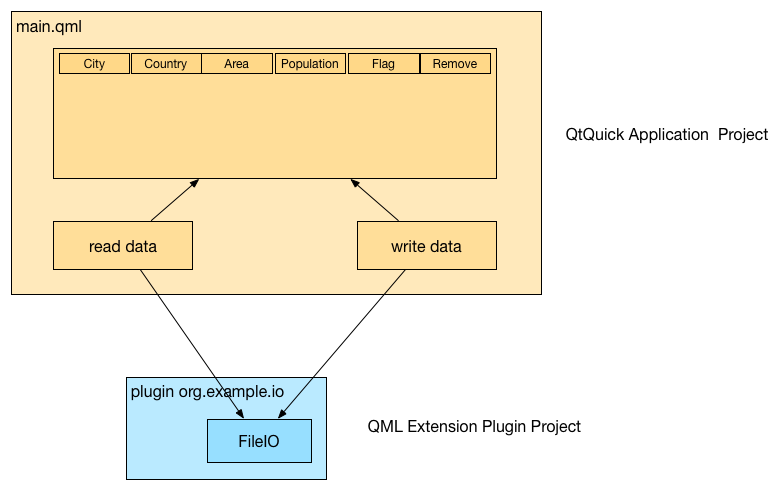
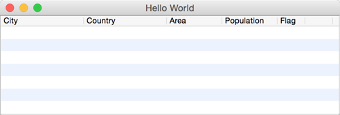
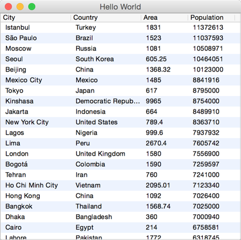
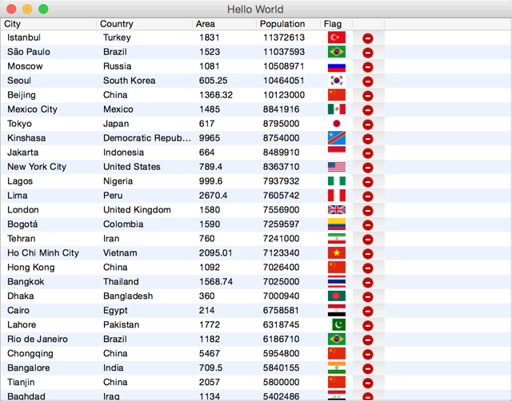

==================
C++로 QML 확장하기
==================

.. sectionauthor:: `jryannel <https://github.com/jryannel>`_

.. issues:: ch16

.. note::

    Last Build: |today|

    이번 장의 소스 코드는 `assets 폴더 <../../assets>`_ 에서 확인할 수 있습니다.

하나의 언어로서 QML은 보편적으로 사용될만한 기능을 제공해야 하기 때문에, 때로는 기능상의 부족함을 느낄 수 있습니다. 하지만 C++로 작성된 네이티브 코드를 통해 QML 런타임을 확장할 수 있기 때문에, 애플리케이션은 기반이 되는 플랫폼에서 최대한의 성능과 기능을 자유롭게 활용할 수 있습니다.

QML 런타임 이해하기
===================

.. issues:: ch16

QML을 실행하면 해당 파일은 런타임(runtime) 환경에서 수행됩니다. 런타임은 ``QtQml`` 모듈 안에 C++로 구현되어 있으며, QML의 수행을 담당하는 엔진, 개별 컴포넌트에 접근할 수 있는 속성을 가지고 있는 컨텍스트(context), 그리고 인스턴스화된 QML element인 컴포넌트로 구성됩니다.

.. literalinclude:: src/basicmain/main.cpp
    :language: cpp

이 예제에서 ``QGuiApplication`` 은 애플리케이션의 인스턴스와 관련된 모든 것 (예: 애플리케이션 이름, 명령행 인자, 이벤트 루프 관리) 을 캡슐화(encapsulate)합니다. ``QQmlApplicationEngine`` 은 컨텍스트와 컴포넌트의 계층적인 순서를 관리합니다. 일반적으로 QML 파일은 애플리케이션의 시작 시점에 로드되어야 합니다. 예제의 경우에는 window와 text를 포함하는 ``main.qml`` 이 처음 로드되는 파일입니다.

.. note::

    ``QmlApplicationEngine`` 을 통해 로드하는 ``main.qml`` 파일이 root type으로 단순히 ``Item`` 을 가지고 있다면 화면에 아무것도 보이지 않을 것입니다. 렌더링을 위한 surface를 관리할 윈도우가 없기 때문입니다. 엔진은 사용자 인터페이스가 없는 (예: 간단한 objects) QML 코드를 로드할 수도 있습니다. 이 때문에 명시적으로 선언하지 않으면 윈도우를 만들지 않습니다. ``qmlscene`` 과 ``qml`` 런타임은 내부적으로 먼저 main QML 파일이 root item으로 윈도우를 가지고 있는지 확인하고, 없는 경우에는 윈도우를 생성하고 이 윈도우의 child로 root item을 설정해줍니다.

.. literalinclude:: src/basicmain/main.qml
    :language: qml

QML 파일에서 필요로 하는 모듈을 선언해줍니다. 여기서는 ``QtQuick`` 과 ``QtQuick.Window`` 를 선언했습니다. 이러한 선언은 import 경로에서 이들 모듈을 탐색하도록 하고, 성공하면 엔진에서 해당 플러그인을 로드합니다. 새로이 로드된 type은 qmldir에 명시된 QML 파일에서 사용 가능하게 됩니다.

우리가 만든 플러그인을 하나의 type으로 엔진에 직접 등록하는 것도 가능합니다. ``QObject`` 기반 클래스인 ``CurrentTime`` 가 있다고 가정해봅시다.

.. code-block:: cpp

    QQmlApplicationEngine engine;

    qmlRegisterType<CurrentTime>("org.example", 1, 0, "CurrentTime");

    engine.load(source);

이렇게 하면 우리의 QML 파일에서 ``CurrentTime`` 도 사용할 수 있습니다.

.. code-block:: qml

    import org.example 1.0

    CurrentTime {
        // access properties, functions, signals
    }

컨텍스트 속성을 통한 좀 더 직접적인 방법도 있습니다.

.. code-block:: qml

    QScopedPointer<CurrentTime> current(new CurrentTime());

    QQmlApplicationEngine engine;

    engine.rootContext().setContextProperty("current", current.value())

    engine.load(source);

.. note::

    ``setContextProperty()`` 와 ``setProperty()`` 를 섞어서 사용하지 마십시오. ``setContextProperty()`` 는 컨텍스트 속성을 QML 컨텍스트 상에 설정하고, ``setProperty()`` 는 ``QObject`` 의 속성을 동적으로 설정하기 때문에 도움이 되지 않습니다.

이제 여러분은 애플리케이션 어느 곳에서든 현재 속성값을 사용할 수 있습니다. 컨텍스트의 상속 덕분입니다.

.. code-block:: qml

    import QtQuick 2.5
    import QtQuick.Window 2.0

    Window {
        visible: true
        width: 512
        height: 300

        Component.onCompleted: {
            console.log('current: ' + current)
        }
    }

다음은 QML을 확장하는 일반적인 방법입니다:

* Context 속성 설정 - ``setContextProperty()``

* 엔진에 type 등록하기 - 여러분의 main.cpp에서 ``qmlRegisterType`` 호출

* QML 확장 플러그인 - 뒤에 논의할 예정

**Context 속성** 은 작은 애플리케이션에서 쉽게 사용할 수 있습니다. 많은 노력을 들이지 않아도 일종의 글로벌 오브젝트(global objects) 형태로 여러분의 시스템 API를 노출시킬 수 있습니다. 이 때 이름이 충돌되지 않도록 하는 것이 좋습니다 (예: ``$.currentTime`` 와 같은 형태로 사용하기 위해 특별한 문자 (``$``) 를 사용하는 것). ``$`` 는 JS 변수에 유효한 문자입니다.

**QML type 등록하기** 는 사용자가 C++ 오브젝트의 생성과 소멸을 QML에서 제어할 수 있도록 해줍니다. 이러한 기능은 context 속성으로는 불가능합니다. 또한 전역 네임스페이스(global namespace)를 지저분하게 만들지도 않습니다. 하지만 여전히 모든 type은 시작 시점에 등록되어야 하며, 이로 인해 애플리케이션 시작 때 모든 라이브러리가 링크되어야 합니다.

가장 유연한 시스템은 **QML 확장 플러그인** 을 통해 제공하는 것입니다. 이는 플러그인에서 type을 등록할 수 있게 해주며, 이를 사용하는 첫번째 QML 파일이 import 구문에 의해 요청할 때 로드됩니다. 또한 QML singleton을 사용하면 더 이상 전역 네임스페이스를 오염시키지 않고 동일한 기능을 제공할 수 있습니다. 플러그인은 프로젝트 간에 모듈을 재사용할 수 있게 해주며, 이는 Qt로 두 개 이상의 프로젝트를 수행할 때 매우 편리한 기능입니다.

이 장의 나머지 부분에서는 QML 확장 플러그인에 초점을 맞출 것입니다. 이 플러그인은 멋진 유연성과 재사용성을 제공해줍니다.

플러그인 컨텐츠
===============

플러그인은 정의된 인터페이스를 가진 라이브러리입니다. 그리고 필요에 따라 로드됩니다. 이것이 애플리케이션이 시작될 때 링크되고 로드되는 라이브러리와 다른 점입니다. QML의 경우에 인터페이스는 ``QQmlExtensionPlugin`` 이라 불립니다. 해당 플러그인에서 우리가 관심을 가져야 할 함수는 ``initializeEngine()`` 와 ``registerTypes()`` 입니다. 플러그인이 처음 로드되면 ``initializeEngine()`` 이 호출되고, 이 때 엔진에 접근해서 플러그인 오브젝트를 root context에 노출할 수 있습니다. 대부분의 경우에는 ``registerTypes()`` 함수만 사용합니다. 이 함수는 엔진에 여러분의 커스텀 QML type을 주어진 url로 등록할 수 있도록 해줍니다.

한걸음 뒤로 물러서서 우리가 구현해 볼 파일 IO type에 대해 생각해봅시다. 이 type은 QML 상에서 작은 텍스트 파일을 읽고 쓸 수 있게 해줄 것입니다. 첫번째 단계는 QML로 모형(mock-up)을 구현해보는 것입니다.

.. code-block:: qml

    // FileIO.qml (good)
    QtObject {
        function write(path, text) {};
        function read(path) { return "TEXT"}
    }

QML로 구현해보는 것은 C++ 기반의 QML API를 탐색해보기 위합니다. 우리는 읽고 쓰는 함수가 있어야 한다는 것을 알 수 있습니다. 쓰기 함수는 경로와 텍스트를 인자로 받고, 읽기 함수는 경로를 인자로 받아 텍스트를 반환합니다. 경로와 텍스트는 공통적인 파라미터로 보이기 때문에 아마도 우리는 이들을 속성(property)으로 추출하는 것이 좋겠습니다.

.. code-block:: qml

    // FileIO.qml (better)
    QtObject {
        property url source
        property string text
        function write() { // open file and write text };
        function read() { // read file and assign to text };
    }

그렇습니다. 이제 좀 더 QML API에 가까워졌습니다. 속성을 사용해서 환경을 속성에 bind하고 속성값의 변화에 반응하도록 할 수 있습니다.

이러한 API를 C++로 만들기 위해서는 다음과 같은 인터페이스를 만들어야 합니다.

.. code-block:: cpp

    class FileIO : public QObject {
        ...
        Q_PROPERTY(QUrl source READ source WRITE setSource NOTIFY sourceChanged)
        Q_PROPERTY(QString text READ text WRITE setText NOTIFY textChanged)
        ...
    public:
        Q_INVOKABLE void read();
        Q_INVOKABLE void write();
        ...
    }

이 ``FileIO`` type은 QML 엔진에 등록되어야 합니다. 우리는 이 type을 "org.example.io" 모듈 아래에서 사용하길 원합니다.

.. code-block:: qml

    import org.example.io 1.0

    FileIO {
    }

하나의 플러그인은 동일한 모듈에서 여러개의 type을 노출할 수 있습니다. 하지만 하나의 플러그인에서 여러개의 모듈을 노출할 수는 없습니다. 따라서 모듈과 플러그인 사이에는 일대일 관계가 성립합니다. 이러한 관계는 모듈 식별자(module identifier)로 표현됩니다.

플러그인 만들기
===============

Qt Creator는 쉽게 **QtQuick 2 QML Extension Plugin** 을 생성하는 마법사(wizard) 메뉴를 가지고 있습니다. 우리는 **"org.example.io"** 모듈 내에 ``FileIO`` 오브젝트를 사용하는 ``fileio`` 플러그인을 생성해보겠습니다.

플러그인 클래스는 ``QQmlExtensionPlugin`` 을 상속받아 ``registerTypes()`` 함수를 구현합니다. ``Q_PLUGIN_METADATA`` 는 플러그인을 QML 확장 플러그인으로 식별하기 위해 반드시 명시되어야 합니다. 이보다 더 간단할 수는 없겠죠.

.. code-block:: cpp

    #ifndef FILEIO_PLUGIN_H
    #define FILEIO_PLUGIN_H

    #include <QQmlExtensionPlugin>

    class FileioPlugin : public QQmlExtensionPlugin
    {
        Q_OBJECT
        Q_PLUGIN_METADATA(IID "org.qt-project.Qt.QQmlExtensionInterface")

    public:
        void registerTypes(const char *uri);
    };

    #endif // FILEIO_PLUGIN_H

``registerTypes`` 의 구현부에서는 단순히 ``qmlRegisterType`` 함수를 사용하여 우리의 ``FileIO`` 클래스를 등록합니다.

.. code-block:: cpp

    #include "fileio_plugin.h"
    #include "fileio.h"

    #include <qqml.h>

    void FileioPlugin::registerTypes(const char *uri)
    {
        // @uri org.example.io
        qmlRegisterType<FileIO>(uri, 1, 0, "FileIO");
    }

흥미롭게도 여기에 모듈의 URI (예: **org.example.io**) 가 보이지 않습니다. 아마도 외부에서 설정될 것입니다.

프로젝트 디렉토리를 살펴보면 qmldir 파일을 찾을 수 있을 것입니다. 이 파일은 QML 플러그인의 내용을 지정하거나 플러그인과 함께 포함하는 QML 파일들을 나열합니다. 이 파일은 아래와 같은 형태입니다.

.. code-block:: qml

    module org.example.io
    plugin fileio

여기서 module은 여러분의 플러그인을 다른 사람이 사용하기 위해 명시해야 할 URI를 의미하며, plugin은 플러그인의 파일 이름과 일치해야 합니다. (Mac에서 실제 파일 시스템 상의 플러그인은 *libfileio_debug.dylib* 이고 *qmldir* 에서는 *fileio* 로만 명시합니다.) 이러한 파일들은 Qt Creator가 주어진 정보를 기반으로 생성한 파일입니다. 모듈 uri는 .pro 파일에서도 사용 가능하고, 설치할 디렉토리를 생성할 때도 사용됩니다.

.. code-block:: ini

    libfileio_debug.dylib
    qmldir

"org.example.io" 라는 모듈을 import할 때, QML 엔진은 import 경로 중에서 qmldir 파일을 가진 "org/example/io" 경로를 찾습니다. 그런 다음 qmldir은 엔진에게 이 모듈 URI에 해당하는 라이브러리가 어떤 파일인지 알려주어 QML 확장 플러그인으로 로드할 수 있도록 합니다. 동일한 URI를 가진 두개의 모듈이 서로를 재정의할 것입니다.

FileIO 구현
===========

``FileIO`` 구현은 직관적입니다. 만들어야 하는 API는 다음과 같아야 한다는 점을 기억하세요.

.. code-block:: cpp

    class FileIO : public QObject {
        ...
        Q_PROPERTY(QUrl source READ source WRITE setSource NOTIFY sourceChanged)
        Q_PROPERTY(QString text READ text WRITE setText NOTIFY textChanged)
        ...
    public:
        Q_INVOKABLE void read();
        Q_INVOKABLE void write();
        ...
    }

속성에 대한 함수는 단순한 setter와 getter이기 때문에 생략하겠습니다.

read 함수는 읽기 모드로 파일을 열어서 text stream을 이용해 데이터를 읽습니다.

.. code-block:: cpp

    void FileIO::read()
    {
        if(m_source.isEmpty()) {
            return;
        }
        QFile file(m_source.toLocalFile());
        if(!file.exists()) {
            qWarning() << "Does not exits: " << m_source.toLocalFile();
            return;
        }
        if(file.open(QIODevice::ReadOnly)) {
            QTextStream stream(&file);
            m_text = stream.readAll();
            emit textChanged(m_text);
        }
    }

텍스트가 변경되었을 때는 ``emit textChanged(m_text)`` 를 사용하여 변경 사항을 다른 오브젝트에게 알려야 합니다. 그렇지 않으면 속성의 binding이 동작하지 않을 것입니다.

write 함수도 동일합니다. 다만 파일을 쓰기 모드로 열고 stream을 사용하여 컨텐츠를 파일에 기록합니다.

.. code-block:: cpp

    void FileIO::write()
    {
        if(m_source.isEmpty()) {
            return;
        }
        QFile file(m_source.toLocalFile());
        if(file.open(QIODevice::WriteOnly)) {
            QTextStream stream(&file);
            stream << m_text;
        }
    }

마지막에 ``make install`` 을 호출하는 것을 잊지 마세요. 그렇지 않으면 플러그인 파일들은 QML 폴더로 복사되지 않을 것이고, QML 엔진은 모듈을 찾을 수 없을 것입니다.

여기서 파일은 블로킹(blocking) 모드로 읽고 쓰기 때문에 ``FileIO`` 는 작은 텍스트에 대해서만 사용해야 합니다. 그렇지 않으면 Qt의 UI 쓰레드를 멈추게 할 수 있습니다. 주의하세요!

FileIO 사용하기
===============

이제 새로 만든 파일을 사용하여 데이터에 접근할 수 있습니다. 이 예제에서는 도시 데이터를 JSON 형식으로 읽고 테이블에 표시하려고 합니다. 우리는 두 개의 프로젝트를 사용할 예정입니다. 하나는 파일로부터 텍스트를 읽고 쓰는 방법을 제공할 (``fileio`` 라 불리는) 확장 플러그인이고, 다른 하나는 file io를 사용하여 파일을 읽고 써서 테이블 (``CityUI``) 에 데이터를 표시합니다. 이 예제에서 사용되는 데이터는 ``cities.json`` 파일에 있습니다.

JSON은 유효한 JS 객체/배열로 변환될 수 있도록 형식화된 텍스트입니다. 우리는 ``FileIO`` 를 사용하여 JSON 형식의 데이터를 읽고 ``JSON.parse()`` 를 통해 그것을 JS 객체로 변환합니다. 데이터는 뒤에 table view를 위한 model로 사용됩니다. 이상이 우리의 read 함수에 관한 대략적인 내용입니다. 파일에 저장하기 위해 데이터를 다시 텍스트 형식으로 변환해야 할 것이고 이를 위해 write 함수를 사용합니다.

도시 데이터가 담긴 JSON 파일은 세계 각국의 도시 리스트와 각 도시의 흥미로운 정보를 담고 있는 텍스트 파일입니다.

.. code-block:: js

    [
        {
            "area": "1928",
            "city": "Shanghai",
            "country": "China",
            "flag": "22px-Flag_of_the_People's_Republic_of_China.svg.png",
            "population": "13831900"
        },
        ...
    ]

Application Window
------------------

우리는 Qt Creator의 ``QtQuick Application`` 마법사를 사용하여 Qt Quick controls 기반의 애플리케이션을 만듭니다. *ui.qml* 파일을 사용한 form 기반의 새로운 접근 방법이 있지만, 이 책에서 다루기에는 다소 어려운 내용이기에 여기에서는 사용하지 않을 것입니다. 그렇기 때문에 지금은 form 파일을 삭제할 수 있습니다.

기본 설정은 툴바와 메뉴바, 상태바를 포함할 수 있는 ``ApplicationWindow`` 입니다. 우리는 문서를 열고 저장하기 위한 메뉴 항목을 만들기 위해 메뉴바를 사용할 예정입니다. 기본 설정은 단순히 빈 창을 표시합니다.

.. code-block:: qml

    import QtQuick 2.5
    import QtQuick.Controls 1.3
    import QtQuick.Window 2.2
    import QtQuick.Dialogs 1.2

    ApplicationWindow {
        id: root
        title: qsTr("City UI")
        width: 640
        height: 480
        visible: true
    }

Actions 사용하기
----------------

우리의 명령을 좀 더 잘 활용/재사용하기 위해, QML의 ``Action`` type을 사용합니다. 이렇게 하면 잠재적인 툴바에서도 같은 action을 활용할 수 있습니다. open과 save에 대한 action을 정의하고 exit action은 quit 함수와 연결합니다. open과 save action은 아직 로직을 포함하지 않은 상태입니다. 이 부분은 나중에 채울 예정입니다. 메뉴바는 파일 메뉴와 이들 3개의 action 항목으로 생성됩니다. 추가로 도시 리스트가 담긴 문서를 선택할 수 있도록 해줄 파일 다이얼로그(file dialog)를 준비했습니다. 이 다이얼로그는 선언할 당시에는 보이지 않지만, ``open()`` 함수를 호출하여 화면에 나타나게 할 수 있습니다.

.. code-block:: qml

    ...
    Action {
        id: save
        text: qsTr("&Save")
        shortcut: StandardKey.Save
        onTriggered: { }
    }

    Action {
        id: open
        text: qsTr("&Open")
        shortcut: StandardKey.Open
        onTriggered: {}
    }

    Action {
        id: exit
        text: qsTr("E&xit")
        onTriggered: Qt.quit();
    }

    menuBar: MenuBar {
        Menu {
            title: qsTr("&File")
            MenuItem { action: open }
            MenuItem { action: save }
            MenuSeparator { }
            MenuItem { action: exit }
        }
    }

    ...

    FileDialog {
        id: openDialog
        onAccepted: { }
    }

테이블 꾸미기
-------------

도시 데이터의 컨텐츠는 테이블 형식으로 화면에 표시되어야 합니다. 이를 위해 ``TableView`` 컨트롤을 사용하고 4개의 열(column)을 선언합니다: 도시, 국가, 면적, 인구수. 각각의 열은 일반적인 ``TableViewColumn`` 입니다. 뒤에서 우리는 국기를 위한 열을 추가하고 사용자 정의 delegate를 필요로 하는 remove 동작을 구현해보겠습니다.

.. code-block:: qml

    TableView {
        id: view
        anchors.fill: parent
        TableViewColumn {
            role: 'city'
            title: "City"
            width: 120
        }
        TableViewColumn {
            role: 'country'
            title: "Country"
            width: 120
        }
        TableViewColumn {
            role: 'area'
            title: "Area"
            width: 80
        }
        TableViewColumn {
            role: 'population'
            title: "Population"
            width: 80
        }
    }

이제 애플리케이션은 파일 메뉴를 가진 메뉴바와 4개의 헤더를 가진 빈 테이블을 화면 상에 표시합니다. 다음 단계는 우리의 *FileIO* 확장을 사용하여 테이블을 유용한 데이터로 채우는 것입니다.

``cities.json`` 문서는 도시 정보의 리스트입니다. 다음은 그 예입니다.

.. code-block:: js

    [
        {
            "area": "1928",
            "city": "Shanghai",
            "country": "China",
            "flag": "22px-Flag_of_the_People's_Republic_of_China.svg.png",
            "population": "13831900"
        },
        ...
    ]

우리가 할 일은 사용자가 파일을 선택하면, 그것을 읽고 변환해서 table view 위에 표시하는 것입니다.

데이터 읽기
-----------

이를 위해 open action이 파일 다이얼로그를 열도록 합니다. 사용자가 파일을 선택했을 때 파일 다이얼로그의 ``onAccepted`` 함수가 호출됩니다. 여기서 우리는 ``readDocument()`` 함수를 호출합니다. ``readDocument()`` 함수는 파일 다이얼로그로부터 가져온 url을 우리의 ``FileIO`` 오브젝트에 설정하고 ``read()`` 함수를 호출합니다. 그런 다음 ``FileIO`` 로부터 로드된 텍스트는 ``JSON.parse()`` 함수를 사용하여 파싱되고 결과로 반환된 오브젝트는 table view의 model로 바로 설정됩니다. 아주 편리하죠.

.. code-block:: qml

    Action {
        id: open
        ...
        onTriggered: {
            openDialog.open()
        }
    }

    ...

    FileDialog {
        id: openDialog
        onAccepted: {
            root.readDocument()
        }
    }

    function readDocument() {
        io.source = openDialog.fileUrl
        io.read()
        view.model = JSON.parse(io.text)
    }

    FileIO {
        id: io
    }

데이터 쓰기
-----------

문서에 저장하기 위해 save action을 ``saveDocument()`` 와 연결합니다. 이 save document 함수는 view에서 model을 취해 ``JSON.stringify()`` 함수를 사용하여 JS 오브젝트를 문자열로 변환합니다. 변환된 문자열은 ``FileIO`` 오브젝트의 text 속성으로 설정되고 디스크에 이 데이터를 저장하기 위해 ``write()`` 를 호출합니다. ``stringify`` 함수에서 "null" 과 "4" 인자는 리턴되는 JSON 데이터에 대해 4개의 공백 문자로 들여쓰기하여 가독성을 높여줄 것을 요청합니다.

.. code-block:: qml

    Action {
        id: save
        ...
        onTriggered: {
            saveDocument()
        }
    }

    function saveDocument() {
        var data = view.model
        io.text = JSON.stringify(data, null, 4)
        io.write()
    }

    FileIO {
        id: io
    }

이상은 JSON 문서를 읽고, 쓰고, 표시하는 기본적인 애플리케이션에 대한 내용이었습니다. XML 리더(reader)와 작성기(writer)를 만드느라 소모했던 시간들을 생각해보세요. JSON을 사용하면 텍스트 파일을 읽고 쓰거나 텍스트 버퍼를 주고 받는 방법만 있으면 됩니다.

마무리
------

애플리케이션은 아직 완전히 준비되지 않았습니다. 국기를 표시하고 사용자가 model에서 도시를 삭제해서 문서를 수정할 수 있었으면 합니다.

이 예제에서 국기는 ``main.qml`` 문서에 대한 상대 경로로 *flags* 폴더에 저장되어 있습니다. 이들 이미지를 테이블의 열(column)에 보여주기 위해 국기 이미지를 렌더링할 사용자 정의 delegate를 구현합니다.

.. code-block:: qml

    TableViewColumn {
        delegate: Item {
            Image {
                anchors.centerIn: parent
                source: 'flags/' + styleData.value
            }
        }
        role: 'flag'
        title: "Flag"
        width: 40
    }

위 코드만으로도 충분합니다. JS model로부터 ``styleData.value`` 의 형태로 delegate에 국기에 대한 속성을 노출합니다. 그 다음 delegate는 이미지 경로 앞에 약속된 ``'flags/'`` 문자열을 붙이고 화면에 표시합니다.

삭제 버튼을 표시하기 위해 유사한 기법을 사용합니다.

.. code-block:: qml

    TableViewColumn {
        delegate: Button {
            iconSource: "remove.png"
            onClicked: {
                var data = view.model
                data.splice(styleData.row, 1)
                view.model = data
            }
        }
        width: 40
    }

데이터 제거 작업을 위해 우리는 view model를 유지한 다음 JS의 ``splice`` 함수를 사용하여 항목 하나를 제거합니다. 이 함수는 model이 JS 배열 형식인 경우에 사용될 수 있습니다. splice 함수는 기존 요소를 제거하거나 새로운 요소를 추가하여 배열의 컨텐츠를 변경합니다.

JS 배열은 아쉽게도 ``QAbstractItemModel`` 과 같은 Qt model만큼 똑똑하지 못해서 행(row)이나 데이터 변경 사실을 view에게 알려주지 못합니다. 이러한 변경사항은 view로 전혀 통보되지 않기 때문에 지금까지 업데이트된 데이터를 표시하지 않습니다. ``view.model = data`` 를 사용하여 다시 model을 설정하는 것만이 view에게 데이터 변경을 알릴 수 있는 방법입니다.

요약
====

생성된 플러그인은 매우 단순한 플러그인이지만, 애플리케이션 내에서 재사용할 수 있으며 다른 애플리케이션에서 다른 type으로 확장될 수도 있습니다. 플러그인을 사용하여 매우 유연한 솔루션을 만들 수 있습니다. 예를 들어 여러분은 ``qmlscene`` 을 사용하여 UI 개발을 바로 시작할 수 있습니다. 여러분의 ``CityUI`` 프로젝트가 있는 폴더를 열고 ``qmlscene main.qml`` 을 실행해서 UI를 시작합니다. 저는 여러분이 애플리케이션을 개발할 때 ``qmlscene`` 과 함께 작업할 것을 강력 권장합니다. 이것은 UI 개발자의 구현/확인 주기를 효율적으로 증가시켜주며 UI와 로직을 명확하게 분리하도록 유지하기 위한 좋은 습관입니다.

플러그인을 사용하는 것은 한가지 단점이 있는데, 간단한 애플리케이션에 대한 배포가 어려워지는 점입니다. 여러분은 플러그인을 애플리케이션과 함께 배포해야 합니다. 이것이 문제가 된다면 ``qmlRegisterType`` 을 사용하여 여러분의 ``main.cpp`` 에 동일한 ``FileIO`` 오브젝트를 직접 등록하는 방법을 사용할 수 있습니다.

대형 프로젝트에서는 각각의 응용마다 애플리케이션을 만드는 경우가 그렇게 많지 않습니다. ``qmlscene`` 과 유사한 QML 런타임(runtime)을 가지고 모든 네이티브 기능이 플러그인 형태로 제공됩니다. 그리고 프로젝트는 이들 QML 확장 플러그인을 사용하는 간단한 순수 QML 프로젝트입니다. 이는 큰 유연성을 제공하고 UI 변경에 의한 컴파일 단계를 제거합니다. 하나의 QML 파일을 편집한 후에 여러분은 그저 UI를 실행만 하면 됩니다. 이러한 구조는 UI 개발자가 유연성을 유지할 수 있도록 해주고, 변경사항을 기민하게 반영할 수 있도록 합니다.

플러그인은 C++ 백엔드(backend) 개발과 QML 프론트엔드(frontend) 개발을 우아하고 명확하게 분리할 수 있도록 해줍니다. QML 플러그인을 개발할 때 항상 QML의 측면을 염두에 두고 C++로 개발하기에 앞서 QML mockup으로 여러분의 API를 검증하는 것을 주저하지 마세요. API가 C++로 작성된 경우 사람들은 종종 API 변경하기를 주저하거나 재작성해야 하는 상황을 숨길 경우가 있습니다. QML로 API에 대한 mockup을 만드는 것은 더 많은 유연성을 제공하고 초기 투자비용을 줄여줍니다. 실제 API를 제공하는 플러그인과 QML mockup 간의 전환은 QML 런타임에서 import 경로를 바꾸는 것만으로도 가능합니다.
